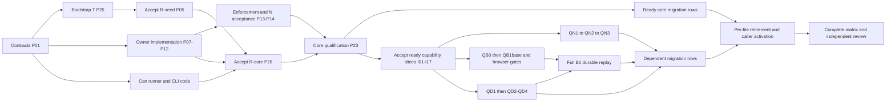

# Native Can testing implementation plan

Status: **planned, not started**. Executor: Codex. This is the implementation
checklist requested after the [design review](../syntax-taste/native-can-test-design-review-2026-09-30.md),
not authorization to start implementation, broad builds, browser sessions or
measurements in this planning round. No replacement coverage or harness deletion
is accepted yet.

## Authority and supporting contracts

- [Completion contract](../syntax-taste/native-can-tests-completion-contract-2026-09-30.md): ordinary Can helpers, Can-owned scenarios/oracles, coverage and cleanup.
- [Architecture](../syntax-taste/native-can-test-architecture-2026-09-30.md) and [prerequisites](../syntax-taste/native-can-test-prerequisites-2026-09-30.md): separate R, N, suite and C identities; reference acceptance is work in this plan.
- [Capabilities](../syntax-taste/native-can-test-capabilities-2026-09-30.md) and [lifecycle](../syntax-taste/native-can-test-lifecycle-2026-09-30.md): operation semantics, observation scopes, resource limits, receipts and correction chains.
- [Agent authoring](../syntax-taste/native-can-test-authoring-2026-09-30.md): complete canonical typed packages, explicit checks and attached assertions, no restricted testing DSL.
- [Migration ledger](../syntax-taste/native-can-tests-migration-ledger-2026-09-30.md): all 292 obligations, 224 tracked test files, 30 delegated runtime oracle suites and external callers.
- [Integrated gate register](../syntax-taste/preparation/native-can-test-hard-cases-2026-09-30/experiments.md) and [preparatory results](../syntax-taste/native-can-test-preparatory-results-2026-09-30.md): all 14 integrated gates remain unrun; PM-N1/N2/F1 are narrow support and PM-B1 failed host isolation.

This plan applies the already reviewed architecture and Jev decisions. It makes
implementation ownership and sequencing concrete; it does not reopen the backend
or invent compatibility requirements. New consequential design decisions discovered
during implementation follow AGENTS.md, including three fresh Jev consultations.

## How to execute and record progress

Each task has a stable ID, prerequisites, one writing owner, concrete output,
acceptance checks and a commit suggestion in the checklist below. Dependencies
mean **accepted task completion**, not merely a branch or file existing. A code
task can complete on its declared bounded checks while its separate integrated
qualification gate remains pending. That distinction allows parallel authoring
without using provisional infrastructure as a trusted judge.

For every task, record `planned | active | blocked | complete`, executor, exact
commit SHA(s), changed paths, commands and their bounded outcomes, identities of
R/N/C/suite/host profile where applicable, positive/control evidence, resource
receipts, remaining limits and reviewer disposition. Keep compact evidence under
this plan's evidence directory. Do not mark a task complete without its acceptance
evidence. Record a genuine blocker and continue independent ready tasks.

All new paths below are proposed ownership boundaries until their defining task
lands. Existing files remain with their current owners until an explicit handoff.
No task may hand-edit generated catalogue mirrors or pinned vendor files.

### Break the bootstrap cycle explicitly

Use separately recorded scopes: **R-seed** for the initial reviewed language
features, **N-core** for accepted generic process/workspace/transport ownership,
then **R-core** for the initial live entry and Can policy library. Later native,
browser and database capability slices refresh the reference only after their
own source, binding and negative-control acceptance. These labels describe
capability receipts, not a permanent ABI or a requirement to retain multiple
full distributions forever.

The first R/N acceptance uses an independently identified bounded bootstrap
parent/witness T and reviewed fixed/native controls. Do not require the still
unimplemented Can runner to be its sole oracle. T stays outside tested child
death controls and has finite cleanup authority over an explicit owned graph.
Its temporary scenario/assertion scripts are transitional evidence, not a new
permanent suite. Once accepted R/N exist, an intact outer Can judge can test a
subordinate runner/owner without asking the process being killed to certify itself.

The reference owner publishes each accepted generation in a separate commit and
receipt; another lane cannot promote it merely because its branch compiles.
Qualify only the capabilities needed by the ready slice, then add reviewed
capabilities incrementally. An added binding may require reference refresh;
do not postpone all core migration until every browser/database feature exists.
Compiler/runtime source hashes alone are not acceptance, and C never recompiles
or replaces the authoritative judge during a run.

Suite authority evolves separately too. Every new Can helper, case or expected
vector requires reviewed source closure, mandatory offline checks, an R-built
artifact identity and an explicit S/A acceptance delta. I tasks accept helper
deltas; Q and migration tasks review their case/vector snapshots before credit.
P23’s first accepted suite cannot silently authorize later source additions.

### Commit early and often

1. Commit the baseline/contract record first; then each coherent checked schema,
   binding, helper, case slice or acceptance control. Do not wait for a lane or
   the entire migration to finish.
2. Split implementation, qualification evidence and harness retirement when they
   have different readiness. A useful code commit must remain honest about an
   unrun integrated gate. Do not disguise a failing control as a passing feature.
3. Use small Conventional Commits such as `feat(testing): add owned process handles`,
   `test(testing): reject missing case evidence`, or `refactor(tests): retire qualified codec harness`.
   Add only the task's explicit paths; preserve unrelated user changes.
4. Serialize commits in a shared checkout. The integration owner stages/commits
   completed lane changes while writers pause those paths. If isolation is needed,
   reuse a suitable managed worktree, use a `codex/` branch and give it an owner
   and retirement step. Do not accumulate a worktree per task or create them now.
5. Run required checks before accepting the commit; after authored runtime edits,
   run `bun run lint:fix:runtime` and `bun run format:runtime`. Before finishing
   the implementation round, run `bun run check:runtime` and relevant tests;
   `bun run lint:runtime --format=agent` gives compact diagnostics. Coordinate
   repository-wide formatting through the integration owner to avoid lane races.
   Do not push or publish merely because a local commit is ready.

### Resource-aware parallelism

Use up to three disjoint implementation workers plus one integrator/reviewer.
Parallelize source edits, static analysis and review. A writing lane is not a
license for another live test job: keep one host-wide live managed run, one live
case, one verification worker and one build producer with the lifecycle's phase
ordering. Every process and service counts toward the same envelope. A build
inside a case is charged to that case; independent heavy work does not overlap.

Reuse immutable builds within a run, not persistent private bundles/caches.
Register temporary cleanup before allocation and reclaim it on success, failure
and handled interruption. Preserve only compact evidence by default. Strict host
enforcement, browser host-UI observation and external-service ownership must be
qualified before their corresponding integrated run. Samples and poll-and-kill
are not substitutes. Missing guarantees/services block affected acceptance, not
independent source work. Broad builds and performance measurements remain deferred;
the plan cannot silently remove retained metric obligations to finish sooner.

## Parallel lanes and writing ownership

The numbered tasks live in the linked checklists; their JSON records are the
canonical dependency data. `start_after` releases drafting/local checks;
`accept_after` adds prerequisites for completion/qualification. A worker may
prepare a row while its environment is unavailable, but cannot mark it qualified.
Use the union of both lists when deciding whether a task is complete. Do not turn
these frontiers into whole-phase barriers.

| Lane | Tasks and checklist | Exclusive writing responsibility |
| --- | --- | --- |
| Contracts, reference and integration | P00–P06, P26, P28; I01–I17; [foundation](native-can-tests-plan-2026-09-30/foundation-checklist.md), [integration](native-can-tests-plan-2026-09-30/integration-checklist.md) | Schemas/reference tooling, shared catalogue/checker/emitter edits, generated mirrors, acceptance manifests and serialized commits |
| External owner and bootstrap | P07–P14, P25, P29; [foundation](native-can-tests-plan-2026-09-30/foundation-checklist.md) | `tools/native-test-owner/`, `tools/native-test-bootstrap/`; subdirectories split in task cards |
| Ordinary Can runner and CLI | P15–P24, P27; [foundation](native-can-tests-plan-2026-09-30/foundation-checklist.md) | `tests/native-can/src/`, named driver files, project diagnostic producers and `compiler/main.go`; shared edits handed to integration writer |
| Native values and C ingress | K01–K06, QN1–QN3; [capabilities](native-can-tests-plan-2026-09-30/capabilities-checklist.md) | `tools/runtime/test-services/native-values/`, distinct qualification fixture directories |
| Browser mechanics | K07–K11, K13–K16; QB0, QB1base, QB1–QB5; [capabilities](native-can-tests-plan-2026-09-30/capabilities-checklist.md) | `tools/runtime/test-services/browser-driver/`, distinct Can browser qualification fixtures |
| Descriptors | K17–K19, QF1–QF2; [capabilities](native-can-tests-plan-2026-09-30/capabilities-checklist.md) | Descriptor schema after P01 handoff; inert/Can subjects and Can qualification; N process writer owns Go `ExtraFiles` |
| HTTP and WebSocket peers | K20–K21, QHTTP, QWS; [capabilities](native-can-tests-plan-2026-09-30/capabilities-checklist.md) | `tools/runtime/test-services/http-peer/` and Can protocol qualification |
| Database and object store | K22–K27, QD1–QD4, QStore; [capabilities](native-can-tests-plan-2026-09-30/capabilities-checklist.md) | `tools/runtime/test-services/db-observer/`, `object-store/`; native facts only, Can owns scenarios |
| Migration workers | M01–M45; [migration checklist](native-can-tests-plan-2026-09-30/migration-checklist.md) | One disjoint new Can directory per group; one ledger row/facet slice per small change |
| Coverage, retirement and review | Z01–Z06; [integration](native-can-tests-plan-2026-09-30/integration-checklist.md) | Coverage reconciliation, all old executable harness edits, shared callers, final evidence and review |

These are ownership lanes, not ten simultaneous workers. Keep at most three
writers plus the integrator; rotate ready work into those slots. The integrator
reserves shared paths before edits and releases them after review/commit. A new
checker/emitter hook or a generator change requires a named, scoped handoff;
a capability worker supplies a patch/contract instead of editing shared files
concurrently. The authoritative catalogue input is
`compiler/internal/catalogue/catalogue.json`; regenerate with
`go run ./compiler/internal/catalogue/cmd/cataloguegen` and verify with `--check`.
Never hand-edit `runtime/catalogue.ts` or other generated mirrors.

P02/P08 split protocol codec and dispatch ownership; P11/P22 split cleanup receipts
and corrections; P17/P22 split reducer and authority policy. P06→P26 reference
tooling and P18→P24 staging are deliberate sequential handoffs. I tasks share one
integration writer. P01 transfers descriptor-schema ownership to K17 after the
base schema commit. Z04 takes the bootstrap paths only after their writers finish.
All other prefix overlaps require an explicit ownership transfer in progress.

## Order that minimizes avoidable waiting

| Ready frontier | Parallel source work | Acceptance or join that releases more work |
| --- | --- | --- |
| P00, then P01 | Bootstrap T (P25); owner journal/protocol (P02/P07); reference inventory, Can skeleton and diagnostics (P03/P15/P20) | T before executable bootstrap controls; accepted seed P05 before using R-seed |
| Base contracts present | Workspace and process branches, registry/reducer, build reuse; native/descriptor schemas | P11/P12 join owner mechanics; P13 proves strict host scope; P14 accepts N independently |
| Base code ready | Controller/worker/CLI and base bindings; native mechanisms; external-service grants and peer/DB/browser source | P26 accepts R-core, then P23 accepts the minimal Can runner and suite |
| First core qualification | M01/M02 and other ready row slices; coverage Z01; native and descriptor qualification | QN1→QN2→QN3 and QF1→QF2 release their dependent facets; simpler rows need not wait for them |
| Service capability slices ready | HTTP/WS, browser and DB code can advance independently; draft dependent Can rows | I04→QHTTP releases peers; I13→QD1 releases row observation; accepted browser observer/profile precedes QB0 live launch |
| Browser/DB frontiers | QB1base shared input/route controls; DOM/Fetch/codec/remote gates; D2/D3 and then D4 | Full QB1 joins QB1base and QD1 for durable replay. QB1base is explicitly partial and never closes full B1 |
| Each row becomes qualified | M worker submits row evidence; integrator can retire resolved symbols and activate eligible callers | Z02 is per file/symbol, not a global deletion batch; all remaining consumers still protect shared files |
| All retained scope ready | Final coverage/caller/bootstrap audit and independent review | Z05 complete matrix, then Z06 review/fixes; no complete claim while required environments or deferred metrics remain unresolved |

Capability bindings can be drafted before their new reference is accepted. Each
I task has a separate promotion substep; use one bounded build for compatible
ready slices when possible, with independent scope-specific receipts. This avoids
both a reference bootstrap cycle and a requirement to rebuild the world per task.
Historical relevance reviews and static-fixture mappings can begin immediately
after the ledger baseline; execution credit still follows each retained facet.
P24 focused verification improves later runs and is required before final
completion, but is not a prerequisite for the first full-suite migrations.

The diagram shows major qualification joins, not additional dependencies. The
machine-readable task graph controls; in particular slice drafting can start
before P23, and independent rows/gates do not wait for full B1 unless their
protected behavior requires it.

## Coverage, evidence and progress artifacts

- [Complete task graph](native-can-tests-plan-2026-09-30/tasks.json): stable IDs, start/accept dependencies, ownership, checks, evidence and commit suggestions.
- [292-row coverage map](native-can-tests-plan-2026-09-30/coverage-map.json): one migration owner per row, disposition, facet/variant source and qualification conditions.
- [Retirement map](native-can-tests-plan-2026-09-30/retirement-map.json): tracked test files and external callers; no file is eligible for deletion at planning time.
- [Planning baseline](native-can-tests-plan-2026-09-30/planning-baseline.json): unchanged source inventory and all 14 integrated gates still unrun.
- [Progress template](native-can-tests-plan-2026-09-30/progress-template.json): instantiate per task and per row/file slice; record commits early.
- [Planning review](native-can-tests-plan-2026-09-30/review.md): independent foundation, capability and coverage findings and their resolutions.
- [Static validation](native-can-tests-plan-2026-09-30/validation.json): dependency, ledger, ownership, source-drift and document-link checks; no runtime qualification.

For a migration group, check off individual rows as their substeps pass: current
relevance/facet mapping, Can source/fixture port, positive and deliberate-defect
checks, environment qualification and retirement eligibility. A group is a work
queue, not one large implementation task or one commit. Distinct named fixtures
and delegated dynamic declarations stay separate coverage entries even when they
share helpers. A deferred or failed row remains visible while other rows advance.

## Shared harness-deletion gate

Only the integration/retirement owner changes old executable harnesses or shared
callers. Migration workers add ordinary Can replacements in their assigned new
directories and submit evidence; they do not independently delete a shared file.

Before retiring any row or file, require all of the following:

- Every retained facet, dynamic variant, named fixture, environment and delegated
  oracle has concrete Can case/check IDs. Historical retirement has an explicit
  reviewed current-contract rationale; age or inconvenience is insufficient.
- Scenarios, expected values, retries, selection, scheduling and reduction are
  ordinary Can. No old host driver, executable string or native whole-test macro
  supplies the verdict. Generated TypeScript and generic native mechanics are
  allowed; archived preparatory scripts have no active suite/CI/release caller.
- Qualified R/N and suite authority, exact C artifacts and complete positive,
  seeded-defect and missing-evidence checks exist for the claimed scope. Required
  engine/service legs actually ran, with complete observations and clean receipts.
- Consumers use the current correction registry. PM-B1's repaired route receipt
  cannot override its isolation failure. New browser evidence includes host-effect
  admission; native evidence reaches the generated C path; F1 reaches the Go CLI.
- Every row and caller sharing the file is resolved. Re-scan current sources and
  reverse references, including `host/conformance`, distribution and CI. Remove
  only resolved symbols when other rows still need a file; final shared support
  retirement waits for its last consumer.
- Commit the deletion separately with row IDs and evidence links. Run the affected
  replacement and caller checks under the applicable bounded profile. Preserve
  static fixtures and historical records with their declared roles; do not erase
  them merely to empty `/tests`.

Independent compiler/runtime unit suites outside the explicitly delegated scope
are not automatically migrated. They may remain separate CI gates, but invoking
them from Can does not count as Can-owned replacement coverage.

## Final review request

When implementation acceptance is complete, send this prompt to an independent
reviewer with the exact commit range, checklist and evidence paths:

> Review the native Can testing migration against this implementation checklist
> and its linked completion, architecture, capability, lifecycle and coverage
> contracts. Inspect the implementation and negative-control evidence independently.
> Check every retained ledger facet/environment and delegated oracle; find hidden
> host scenario or verdict logic, candidate self-judging, weak invocation witnesses,
> provisional references, missing receipts/corrections, unsafe ownership or cleanup,
> resource-limit gaps, browser host effects, and premature harness deletions. Verify
> ordinary Can helpers and mandatory assertions, caller migration and the difference
> between partial runs and full qualification. Report concrete findings by severity
> with file/line references, affected task/ledger IDs and missing acceptance evidence.
> Do not accept documentation, test counts, sampled resource peaks or a candidate's
> self-report as proof. State what remains unrun or blocked. No broad build, browser
> launch or performance measurement is authorized merely by this review request.
