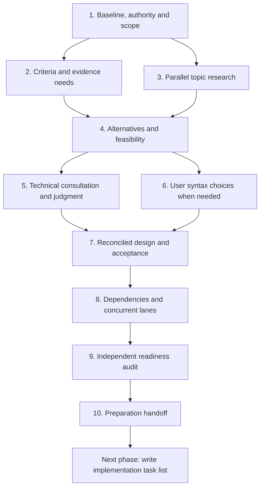

# Can: preparation checklist for the next implementation plan

26 September 2026

**Destination:** a complete implementation task list in dependency order, with multiple concurrent lanes, explicit prerequisites, ownership boundaries, integration checkpoints and acceptance evidence.

**Status:** preparation executed 2026-09-26; all 45 boxes checked. Records: [preparation-2026-09-26/](preparation-2026-09-26/README.md), [handoff](preparation-2026-09-26/handoff.md). No production changes were made; writing the implementation task list is the next phase.

**Starting point:** the [26 September review](full-language-review-2cb1bc3-2026-09-26.md) and its [evidence index](evidence/2026-09-26/full-review-2cb1bc3/README.md), covering revision `2cb1bc35435ab5075d51f9f945adfb0e1f9dfe64`.

The [September 24 preparation](can-design-preparation-2026-09-24.md) is historical. Carry forward applicable recorded decisions and evidence, not its completed checkboxes or execution instructions. In this round, **ask the user about syntax choices and consult Jev on technical decisions**. The earlier instruction to resolve remaining syntax without user questions does not govern this round.

## Working rules

- Preserve established user choices unless a concrete conflict or new requirement warrants reopening them. Read the [current design decisions](decisions.md) and their incorporated specifications before proposing changes; a review recommendation does not override them.
- Apply [AGENTS.md](../../AGENTS.md): no compatibility obligation; lower to native JavaScript/Bun operations with only the adapters needed for Can's contracts and immutability.
- Distinguish findings, desired outcomes and possible solutions. Including a topic here does not select the review's proposed mechanism.
- Ask focused questions when a user preference or syntax decision is needed. Continue independent work while awaiting an answer; leave dependent decisions open. Jev does not replace the user's syntax choices.
- Use Jev as a classifier supplied with researched evidence, not as a researcher or proof of correctness. Follow the three-request procedure in step 5 for technical choices.
- Preparation can include bounded, isolated feasibility experiments when this checklist is later executed. Keep those artifacts separate from production implementation, and state what each experiment can and cannot establish.
- Advance each topic when its own prerequisites are ready. Numbered steps express dependencies, not a requirement to finish every topic before another can advance.

## 1. Establish scope, authority and the current baseline

- [x] **P01.1** Record the current revision, relevant working-tree changes and differences from the reviewed revision. Keep historical evidence tied to its original version.
- [x] **P01.2** Reconcile existing user decisions, incorporated specifications, previous implementation records and the new review. Separate intended design, delivered behavior and proposals; identify actual conflicts without reopening everything.
- [x] **P01.3** Carry forward Can's recorded audience and design priorities, including its AI coding-agent focus. Resolve any missing scope choices with the user: target application classes, supported platforms, final ambition and intermediate milestones. Do not equate the review's SaaS recommendation with the whole language roadmap.
- [x] **P01.4** Build a source-linked finding ledger with stable IDs. Give every review concern, acceptance condition and relevant outstanding prior requirement a destination. Distinguish defects, missing capabilities, design choices, library work, tooling, operations and documentation.

**Output:** baseline and coverage ledger, with agreed evaluation scope. Inclusion in the ledger is not approval to implement.

## 2. Define success and the evidence needed

- [x] **P02.1** Define representative workloads and observable success criteria before comparing solutions: second application, second integration, reusable infrastructure, large iteration, controlled failures and production operation where in scope.
- [x] **P02.2** Decide which criteria need measurements and record their protocols and thresholds: correctness, agent authoring/repair effort, relevant token costs, stack/memory, latency, throughput and operational behavior. Avoid claiming measured advantages from intuition.
- [x] **P02.3** Inventory existing evidence and its limits. Keep source inspection, native probes, emitted-Can execution, assertion execution and live qualification distinct. Reuse applicable evidence; rerun only when changed code, missing coverage or uncertainty requires it.
- [x] **P02.4** Identify required environments and fixtures: browsers, supported databases, disposable object storage, Linux packaging, multiple workers, fault/stall injection and AI-provider evaluations as applicable. Record availability, cost, credentials requirements and substitutes that cannot establish full acceptance; never put credentials in evidence files.

**Output:** evaluation and qualification matrix. Design feasibility evidence belongs to preparation; production acceptance that requires the implementation belongs in the eventual task list.

## 3. Research the current behavior and native constraints

- [x] **P03.1** Audit each topic's current compiler, runtime, catalogue, libraries, examples, tooling and documentation. Establish the best supported Can idiom and its actual limitation.
- [x] **P03.2** Research relevant platform behavior and alternatives using current primary sources. Record versions, dates and applicability, especially native DOM, Bun, SQL, storage, cancellation and packaging behavior.
- [x] **P03.3** Reproduce disputed or insufficient claims with the smallest useful probes. Separate a language limitation from an example, library, tooling or deployment gap.
- [x] **P03.4** Produce evidence packets containing facts, uncertainties, counterexamples, existing guarantees to preserve and the questions still needing decisions. Investigate contradictions before feeding them to Jev as facts.

**Output:** enough grounded context to compare alternatives for each topic. Independent topic research may run concurrently after its baseline is available.

## 4. Brainstorm alternatives and test feasibility

- [x] **P04.1** Develop viable alternatives for each unresolved outcome, including retaining the current contract where it meets the criteria. Compare library, native-adapter, compiler and companion-service approaches where relevant; do not assume a new syntax form is necessary.
- [x] **P04.2** Compare semantic guarantees, composition, agent authoring/refactoring, diagnostics, native lowering, lifecycle behavior, maintenance and implementation cost. Make tradeoffs and counterevidence explicit.
- [x] **P04.3** Prepare complete representative programs and failure cases. Mark candidate syntax as illustrative, and identify cross-topic contracts affected by each option.
- [x] **P04.4** Run only the bounded experiments needed to distinguish plausible options. Record the question, expected observations, environment, result and limitations. Return to research when evidence contradicts an assumption.

**Output:** feasible alternatives with evidence, plus a map of interacting decisions. No option becomes accepted merely because a prototype exists.

## 5. Resolve technical choices with Jev's advice

- [x] **P05.1** Assemble a decision packet for each material technical choice: researched facts, constraints, exact examples, viable alternatives, acceptance criteria and evidence against the favored option. Consult technical aspects of mixed syntax/semantics questions without assigning the user's preference to Jev.
- [x] **P05.2** Prepare three fresh requests before sending the first. Rewrite **all explanatory prose** each time: context, instructions, questions and option descriptions. Preserve the same facts, constraints and alternatives; exact code and technical identifiers may remain unchanged.
- [x] **P05.3** Check semantic equivalence and full-request wording differences. Save the audit and all exact requests, responses and relevant invocation metadata without secrets.
- [x] **P05.4** Investigate disagreements, sensitivity and missing evidence. Perform focused follow-up research or experiments when needed. Preserve the review's earlier disagreements as context; they do not settle a new decision.
- [x] **P05.5** Record the engineering decision, rationale, limitations and affected contracts separately from Jev's classifications. Agreement is advice, not proof or a majority-vote rule. Keep decisions dependent on unresolved user choices provisional.

**Output:** supported technical decisions or clearly identified remaining evidence/questions. Factual lookups and mechanical bookkeeping do not need artificial design consultations.

## 6. Resolve syntax and authoring-policy choices with the user

- [x] **P06.1** Collect the actual surface choices raised by the alternatives, including new forms, changed bindings, required annotations and accepted/rejected source policies. Do not silently choose syntax in a technical packet.
- [x] **P06.2** Present focused options using complete examples, semantic consequences, companion forms, diagnostics and relevant evidence. Bundle contexts governed by one rule; show enough detail that agreement does not imply unseen syntax.
- [x] **P06.3** Ask the user to choose or refine the forms and policies. Record each answer and its exact scope before moving to another dependent question. Previously confirmed choices need no repeat confirmation unless materially reopened.
- [x] **P06.4** Check the selected syntax against the technical contracts. If it changes semantics or feasibility, revisit the affected research/Jev packet and return any necessary revised surface choice to the user.

**Output:** explicit user decisions for changed syntax and authoring policies. Topics with no surface change record that fact and skip this step. Ask direction questions early when they affect research; detailed syntax selection waits for enough evidence to explain the options honestly.

## 7. Consolidate the selected design and acceptance contracts

- [x] **P07.1** Give every ledger item a disposition: change, retain, already satisfied, reject or defer. Include a reason and evidence; deferrals need a reopening condition and their effect on supported scope.
- [x] **P07.2** Specify each accepted change's observable behavior, grammar/checking rules where affected, errors/provenance, ownership, native mappings and package/wire boundaries. Explicitly identify which prior rules it supersedes.
- [x] **P07.3** Reconcile interactions across storage, request lifetime, transactions, browser actions, widgets, host adapters, workers, shared contracts and deployment. Define shared interfaces before allowing dependent implementation lanes to diverge.
- [x] **P07.4** Write positive, negative, failure-path and integration acceptance cases. Include meaningful measurements and distinguish checking from execution and mocked evidence from live qualification.
- [x] **P07.5** Validate unresolved selected-design assumptions with focused probes. Reopen affected decisions when necessary; do not turn unresolved architecture or syntax into an implementation task called “figure this out.”
- [x] **P07.6** Consolidate specifications, decisions and acceptance records into a consistent handoff. Include required documentation, examples, editor support, generated artifacts and operational consequences.

**Output:** a coherent selected design with traceable acceptance criteria. Production tests requiring the future implementation are specified here, not claimed as passed.

## 8. Prepare the dependency map and concurrent implementation lanes

- [x] **P08.1** Map accepted changes to affected components and shared contracts. Identify hard prerequisites, work that can start against a settled interface, and work that only waits for final integration.
- [x] **P08.2** Identify shared foundations and the shortest necessary sequence of dependent work. Avoid serializing unrelated work or declaring concurrency where contracts are still unresolved.
- [x] **P08.3** Propose multiple implementation lanes with bounded ownership, inputs, outputs and handoffs. Assign one owner for each shared-file or generated-artifact conflict; specify sequencing or an integration owner for unavoidable overlap.
- [x] **P08.4** Define integration checkpoints and failure handling: which contracts must agree, which combined checks run, what blocks downstream work, and when an invalidated design returns to preparation.
- [x] **P08.5** Account for actual worker capacity and shared test environments. Separate “logically parallel” from “can run simultaneously with available resources”; avoid competing mutations of databases, buckets, generated outputs or packaging state.
- [x] **P08.6** Check for cycles, hidden prerequisites and bottlenecks. Split deliverables or resolve contracts to remove cycles. Identify critical-path candidates; do not invent precise durations or promise an optimal schedule without evidence.

**Output:** a validated dependency and ownership map ready to become an implementation task graph. Lane count and membership follow the selected design; the topic groups below are not predetermined implementation lanes.

## 9. Independently audit readiness to write the implementation plan

- [x] **P09.1** Have reviewers check coverage, established user choices, evidence quality, cross-topic contracts and concurrency boundaries. Give them requirements, selected designs and raw evidence without earlier review verdicts as instructions.
- [x] **P09.2** Walk the representative end-to-end scenarios through the design, including failure and disposal paths, the second app/integration, worker recovery and old-browser/new-server deployment where in scope.
- [x] **P09.3** Resolve findings and recheck affected sections. Every choice that could materially change architecture, syntax, public contracts or task ordering must be settled or explicitly excluded from this implementation scope.
- [x] **P09.4** Verify that each accepted requirement has an acceptance owner and a destination in the dependency map. Record known qualification blockers and how the eventual plan must remove them; unavailable live evidence is not a pass.

**Output:** a readiness record showing that implementation tasks can be written without hiding design decisions inside them.

## 10. Close preparation and hand off to implementation planning

- [x] **P10.1** Check that every in-scope topic has completed its applicable research, decisions, user syntax choices, consultation records and acceptance specification. Explicitly account for retained/rejected/deferred topics.
- [x] **P10.2** Assemble one linked handoff containing the coverage ledger, selected design, evidence, user decisions, Jev records, qualification matrix, dependency map, lane boundaries and readiness findings.
- [x] **P10.3** Confirm the required structure of the next deliverable: each implementation task must have a stable ID, outcome, source requirement, scope, prerequisites, lane/owner, shared-file boundaries, handoffs, validation and definition of done.
- [x] **P10.4** Ensure the next plan includes all necessary compiler/runtime/library/tooling changes, regeneration, examples, documentation, packaging, integration and live qualification work. Runtime tasks must carry the repository's lint-fix, formatting, runtime-check and relevant-test requirements; generated catalogue and pinned vendor files are not edited by hand.

**Exit:** ready to write the complete implementation task list, with a dependency graph, concurrent lanes and integration checkpoints. Writing that list is the next phase; implementing it is a subsequent phase.

## Mandatory topic coverage

Use these rows to check P01.4 and P07.1. They are research and decision coverage, not approved solutions. Expand the ledger if research reveals another relevant requirement.

| ID | Topic | Questions and evidence the preparation must account for |
| --- | --- | --- |
| R01 | Host integration | Supported adapters versus companion implementations or an explicitly bounded platform; target availability, immutable copying, failures, callbacks/reentrancy, disposal, capability admission and reproducible packaging; second-vendor acceptance. |
| R02 | Browser controls and reusable UI | Live value/checked properties; files, multiselect, modifiers and composition/IME; nested ownership and cross-view composition; two apps sharing keyed tables and field/error controls; normalization, reset/autofill, focus/caret, reorder, unmount and late replies. |
| R03 | Captured HTML routes | Server-rendered captured read pages, response contracts and reuse of capture/URL machinery; assess independently of a SPA router. |
| R04 | Budgets, cancellation and ownership | Race selection versus drainage; stalled SQL, headers and bodies; action transport abort/deadlines; disconnect, overlap, disposal and shutdown escalation; preserve leases, failure identity and honest unknown-write outcomes. |
| R05 | Iteration and collections | Dynamic constant-stack iteration alternatives and native bulk collection operations; 100,000-step state machine, growing aggregation and bounded worker batch; measure stack/memory and preserve evaluation order, fixture paths and diagnostics. |
| R06 | Generic failure composition | Result-data ergonomics versus finite error-set parameters; provenance/conversion costs; two unrelated callback error sets and isolated caller changes; verify retry count/sequence rather than only returned values. |
| R07 | Owner values and assertion setup | Legitimate fallible construction, private fixtures/test factories versus checked local setup; abstraction cost and useful assertions without forged owner values. |
| R08 | Authoring policies and captures | Boolean arm ordering, meaningful final locals and capture-name coupling; identify which changes need user choices and assess them against Can's established audience and guarantees. |
| R09 | Editor workflows | Completion, hover, references, rename and formatting; callback extraction, shared-record changes and contract inspection/repair. |
| R10 | Relational breadth | Supported SQL boundary, generated identities, precision/decimal encodings, nullable audit times, JSON, concurrent replay and migrations; PostgreSQL transaction-abort behavior and current backend regression coverage. |
| R11 | Durable workers and outbound policy | Claims across two workers, bounded concurrency, retry/backoff, poison jobs and crash recovery; tenant HTTP destinations, carrier authorization, signature verification and any companion-service responsibilities. |
| R12 | Failure observation | Redacted HTTP boundary reporting, request correlation/source identity and application hooks; account for existing main, late-owner and browser reporting. |
| R13 | Deployment and support | Existing supported Linux path and qualification; paired browser/server artifacts, credentials, migrations, rollout/rollback, retained assets and an already-open browser across server deployment. |
| R14 | AI product qualification | Shape guarantees versus prediction quality, latency and cost; tenant budgets/correlation and model-change evaluation; expand provider workflows only for an accepted requirement. |
| R15 | S3 cancellation and deadlines | Declared versus actual cancellation behavior; replacing an existing object, transient publication/deletion and service failures; never-settling reader, writer, flush, completion and metadata awaits. Plan isolated storage qualification. |
| R16 | Examples and documentation | Meaningful invoice startup errors; accurate Linux/browser support; explicit webhook security/deployment limitations; one consistent supported story tied to selected contracts. |

Existing strengths are preservation criteria across these rows: immutable domain data, owner construction, explicit failures, shared client/server contracts, checked generics, audited browser capabilities and ownership, transaction commit uncertainty, assertion/fixture evidence and native operations.

## How preparation can proceed concurrently

After a topic's baseline and applicable criteria are available, its research can proceed independently. A useful initial grouping is core/library authoring (R05–R08), browser/host integration (R01–R03, R09), lifetime/storage/observation (R04, R12, R15), backend/workers (R10–R11), and deployment/AI/documentation (R13–R14, R16). These are queues of bounded research work, not five simultaneous worker requirements.

The coordinator maintains coverage, handles user questions and reconciles shared contracts. Use available workers on ready packets; a topic awaiting a syntax answer or experiment does not block unrelated topics. Revisit the grouping when shared dependencies become clear.

The diagram shows the successful path. Technical advice and syntax discussion inform each other; neither branch overrides the other. Contradictions reopen only the affected topic and its dependent decisions. The final readiness audit and handoff require complete coverage of the selected scope.
