# Can implementation task list — 26 September 2026

**Status:** plan written; implementation has not started. **57 tasks in eight lanes. Both task-writer preparation blockers are resolved.** User answers 1A/2A/3A and the [technical follow-up](preparation-2026-09-26/blocker-resolution/README.md) select local references/rename and tenant token admission. Implementation, provisioning and real provider-bound qualification remain required; no release pass is implied.

**Baseline:** `d92d7180`, including the per-dist content-addressed store (CAS). Preparation evidence belongs to `2cb1bc35`; the [task-writer prompt](preparation-2026-09-26/task-writer-prompt.md) records the intervening documentation and CAS commits. The existing modified task-writer prompt is outside this document's changes.

**Authority:** [handoff](preparation-2026-09-26/handoff.md), [readiness record](preparation-2026-09-26/p09-readiness.md), [dispositions](preparation-2026-09-26/p07-dispositions.md), [selected contracts](preparation-2026-09-26/p07-contracts.md), [shared interfaces](preparation-2026-09-26/p07-reconciliation.md), [user answers](preparation-2026-09-26/p06-answers.md), [acceptance](preparation-2026-09-26/p07-acceptance.md), [lane plan](preparation-2026-09-26/p08-lanes.md), [evaluation](preparation-2026-09-26/p02-evaluation.md), [experiment register](preparation-2026-09-26/alternatives/README.md), [finding ledger](preparation-2026-09-26/finding-ledger.md), and [AGENTS.md](../../AGENTS.md). The source [review](full-language-review-2cb1bc3-2026-09-26.md) supplies findings, not replacement decisions. Final P09 amendments override earlier alternatives.

The original task-writing pass changed no source and ran no experiments, tests or Jev consultations. The subsequent blocker-resolution pass recorded user 1A/2A/3A and three fresh technical Jev consultations; its [supplement](preparation-2026-09-26/blocker-resolution/README.md) now governs R09/R14. No production implementation or qualification tests have run.

## Execution rules and completion semantics

- Full breadth and the widest prepared browser/database matrix remain in scope. Worker delivery/scheduling belongs to the companion; Can owns the ledger, outbox, authenticated protocol and idempotent transactions. AI, editor and Linux deliverables retain independent standing.
- No backward-compatibility work: do not preserve old spellings, goldens or layouts unless an explicit selected contract requires a particular preservation property. C-D's additive snapshot contract and C-H's retained assets remain selected requirements.
- Use native JavaScript/Bun operations with only contract-preserving adapters. Do not hand-edit generated TypeScript or pinned vendor files.
- **RH:** after edits to authored TypeScript under `runtime/` or `tools/runtime/`, including test fixtures, run `bun run lint:fix:runtime` and `bun run format:runtime`; before finishing run `bun run check:runtime` and relevant tests. Use `bun run lint:runtime --format=agent` for compact diagnostics. Preserve intentional test behavior; narrow explained suppressions only. Every task inherits RH if its implementation touches those paths; runtime tasks repeat the duty below.
- Catalogue sections originate with their area owner; **E alone merges `compiler/internal/catalogue/catalogue.json` and runs its generation path**, publishing the matching generated output with each slice. This is incremental, not a final all-lanes merge barrier. No consumer completes against stale generated admission.
- Each task has an ID, outcome, source, scope, prerequisites, lane/owner, shared-file boundary, handoff, validation and definition of done. An ID names work, not a sequential position. Listed prerequisites must deliver the required output before the dependent task can close. Drafting against frozen interfaces may proceed earlier; an experiment needing an earlier proof or provision may not.
- “Done” is local delivery and evidence. IC1 gates integrated interface claims, IC2 gates final release assembly, and IC3 gates supported-story publication. Candidate builds and qualification must occur before final assembly; do not create a cycle by making the W6 deployment tests wait for IC2.
- A conditional follow-up closes **inactive** when its experiment does not trigger it; inactive is not an implemented feature. If triggered, its affected contract returns to preparation for publication before implementation. These are the already-authorized conditional branches, not permission to invent grammar or relax scope.
- Evidence records the exact revision, pins, commands, environment and each pass/failure/skip. No credentials in task text or evidence; env-provided values only. Unavailable live evidence never counts as a pass.
- No x86 emulation anywhere: no `linux/amd64` emulation or QEMU. UP25 runs only on the user's native x86 machine. Ask before long full-tilt runs on the MacBook Air; use focused reruns. H owns exclusive x86 windows and capped/serialized AI evaluations.

## Preparation errors and scope of their blocks

| ID | Evidence and exact gap | Affected work | Resolution options / release condition |
| --- | --- | --- | --- |
| BLK-01 — RESOLVED | User 2A/3A select token allowances and immediate typed rejection. The [R14 follow-up](preparation-2026-09-26/blocker-resolution/README.md) fixes accounting after three Jev consultations. | H07/H08 no longer await design decisions; F01 supplies the C-G ledger/context and E integrates native invocation plumbing. | Combined input/output counting, fixed configured epochs, qualified upper-bound reservations and conservative unknown holds are selected. X-R14-1 still must qualify a real profile; unsupported bounds fail closed and block W6-AI success. |
| BLK-02 — RESOLVED | User [1A](preparation-2026-09-26/p06-answers.md) includes local variables in references and safe rename, distinguishing binding scopes. | G03/G04/G05 retain only their implementation prerequisites. | Include body-local and captured references by binding identity; shadowed/same-spelled other-scope names stay untouched. Existing with-parameter support and conservative definition lookup remain. |
| NOTE-01 | [P08.1 row F and P08.3 F inputs](preparation-2026-09-26/p08-lanes.md) retain a locking-read probe prerequisite for claims. [P07 R11, P09-B3](preparation-2026-09-26/p07-contracts.md) explicitly selects portable lookup-first lease-table claims with **no locking-read dependency**. | F02 remains required SQL evidence; F05 does not wait for it. | The graph follows the final explicit B3 contract. The stale dependency is flagged here; the prepared ownership text below is copied unchanged. |
| NOTE-02 | The short “two assumptions” passage in [P07.5](preparation-2026-09-26/p07-acceptance.md) is narrower than the final [handoff's conditioned branches](preparation-2026-09-26/handoff.md). | All experiment tasks. | Preserve the full final register and all branches below, including S3 deadline failure. |

Q4–Q6's intentionally unselected grammars are **conditional preparation returns**, not additional current blockers. Q4/Q5 have qualitative evidence gates; no numerical cost threshold was selected. Do not invent one or treat a single failed attempt as sufficient evidence.

## Concurrent lanes and shared-file ownership

| Lane | Owner | Tasks | Independent start / key handoff |
| --- | --- | --- | --- |
| A surface and lowering | surface owner | [A01](#a01), [A02](#a02), [A03](#a03), [A04](#a04), [A05](#a05), [A06](#a06), [A07](#a07), [A08](#a08) | Start core surfaces/lowering now; formatter → C, with → G. |
| B failure conventions | conventions owner | [B01](#b01), [B02](#b02), [B03](#b03), [B04](#b04), [B05](#b05) | Start conventions now; C-B → authors/E; final W3 after conditional gates. |
| C browser and applications | browser owner | [C01](#c01), [C02](#c02), [C03](#c03), [C04](#c04), [C05](#c05), [C06](#c06), [C07](#c07) | Invoice correction now; runners after H01; library proof → D. |
| D host integration | host owner | [D01](#d01), [D02](#d02), [D03](#d03) | Host experiment after C's proof and F's outbound identity. |
| E lifetime, observation and storage | lifetime owner | [E01](#e01), [E02](#e02), [E03](#e03), [E04](#e04), [E05](#e05), [E06](#e06), [E07](#e07), [E08](#e08), [E09](#e09) | Policy/rendering now; live adapters after separate H provisions; honesty → F. |
| F data and companion pair | data owner | [F01](#f01), [F02](#f02), [F03](#f03), [F04](#f04), [F05](#f05), [F06](#f06) | C-G/protocol after E vocabulary; descriptor probe independently after DB provision. |
| G editor | editor owner | [G01](#g01), [G02](#g02), [G03](#g03), [G04](#g04), [G05](#g05) | Format groundwork may start now; sequence closes in order; rename after A with. |
| H release, AI and documentation | release owner | [H01](#h01), [H02](#h02), [H03](#h03), [H04](#h04), [H05](#h05), [H06](#h06), [H07](#h07), [H08](#h08), [H09](#h09), [H10](#h10), [H11](#h11), [H12](#h12), [H13](#h13), [H14](#h14) | Provisioning and current docs now; identity-consuming AI and qualification follow relevant outputs. |

The following ownership block is reproduced verbatim from **P08.3**, including its source path notation:

Shared-file conflict owners (one owner each; others hand off patches):
`compiler/internal/catalogue/catalogue.json` merge → E owner (append
per-package sections only: browser→C, lifecycle→E, map/set→A, sql→F);
`runtime/platform/browser.ts` → C;
`runtime/platform/{server,transport,sql,s3,action-json,action-routes,html,htmx-guard,action-client}.ts` → E
(C hands the R03 server-boundary patch to E; action-client deadline stays
with E — no split ownership);
`compiler/internal/check/{completion_matches,locals,callables,array}.go` → A;
`compiler/internal/check/{actions,action_bindings,browser}.go` → C
(E hands the R04-operand patch to C);
`compiler/internal/emit/action*.go` + `compiler/internal/syntax/*` R03 slice → A
(C hands R03 emission/grammar patches to A);
`compiler/internal/sql/*` + descriptors → F; `runtime/collections/*` → A;
`compiler/lsp.go` + `diagnostics.go` → G; `examples/webhook/**` + companion → F;
`examples/invoice*/**` → C; `distribution/**` → H.
Single-lane files: `runtime/ai/*`, `examples/native-ai/**`, top-level
`README.md`, `distribution/README.md` → H; `tests/<area>` follows the lane
of the code under test, integration matrix legs follow the owning workload
lane. Generated `runtime/catalogue.ts` and pinned vendor files: regenerated
only, never hand-edited. `runtime/` + `tools/runtime/` edits carry
lint-fix, format, runtime-check, and relevant-test duties.
(P09-m6: if C authors before A's formatter lands, C re-runs the formatter +
rechecks before handoff; A owns the formatter, C owns re-migration.)

**CAS baseline supplement from the task-writer prompt:** H owns generation staging, pairing, retention/pruning and `dist/cas/`, together with the generation writer. Distinct bytes stay stored once and linked into generations as 0400 read-only content; metadata/manifests remain unique 0600 writes. Negative/tamper tests first unlink and recreate staged files, never mutate a shared inode. Prune collects unreferenced CAS entries. The immutable fresh-emit mirror stays link-based, while mutable workspace copies stay full copies. Completed housekeeping and deleted regenerable outputs are not tasks.

C/A/E cross-owner patches are handoffs inside the owning task, not competing writers. Unlisted tests follow the code owner; matrix acceptance follows the owning workload below. H serializes packaging/publication; E serializes catalogue generation. Independent authors use isolated checkouts and per-run resources, then pass patches to the registered shared-file owner.

## Task records

### A01 — Allow Boolean arm order and demote C8 to a warning

- [ ] **Outcome:** Allow Boolean arm order and demote C8 to a warning.
- **Source requirement:** R08; F-R08-01/02; Q1/Q2; C-I ([contracts](preparation-2026-09-26/p07-contracts.md), [dispositions](preparation-2026-09-26/p07-dispositions.md), [acceptance](preparation-2026-09-26/p07-acceptance.md)).
- **Scope:** Remove only the selected validity checks; canonicalize ordinary Boolean matches false-first; preserve final-local source; surface advisory C8 warning through existing check/CLI pipeline.
- **Prerequisites:** None; ready for bounded work.
- **Lane/owner:** A — surface owner.
- **Shared-file boundaries:** A checker/formatter; G owns diagnostics.go and LSP surfacing, receiving severity payload.
- **Handoffs:** Formatter to C; warnings and canonical forms to G01.
- **Validation:** Q1 all match-mode negatives, fixpoint and overlay; Q2 type/error differential, warnings-only exit 0 and successful build.
- **Definition of done:** AU-Q1 and AU-Q2-core pass; no revived lint command.

### A02 — Implement explicit near bindings

- [ ] **Outcome:** Implement explicit near bindings.
- **Source requirement:** R08; F-R08-03; Q3; C-I ([contracts](preparation-2026-09-26/p07-contracts.md), [dispositions](preparation-2026-09-26/p07-dispositions.md), [acceptance](preparation-2026-09-26/p07-acceptance.md)).
- **Scope:** Parse/check/emit callable name with param = expr bindings; preserve order and unlisted name lookup; direct calls remain positional.
- **Prerequisites:** None; ready for bounded work.
- **Lane/owner:** A — surface owner.
- **Shared-file boundaries:** A callables/checker/syntax/emitter; G receives reference provenance.
- **Handoffs:** Binding/reference metadata to G03/G05; authoring examples to B/C.
- **Validation:** Correct capture/evaluation and located CAN-CHECK-CAPTURE for unknown, duplicate, non-near and mistyped names; fallback regression.
- **Definition of done:** AU-Q3-core passes with selected grammar only.

### A03 — Add captured document action syntax and emission

- [ ] **Outcome:** Add captured document action syntax and emission.
- **Source requirement:** R03; F-R03-01/02; Q7; C-E ([contracts](preparation-2026-09-26/p07-contracts.md), [dispositions](preparation-2026-09-26/p07-dispositions.md), [acceptance](preparation-2026-09-26/p07-acceptance.md)).
- **Scope:** Implement captured GET body html/document grammar and emitted action metadata using existing URL machinery.
- **Prerequisites:** None; ready for bounded work.
- **Lane/owner:** A — surface owner.
- **Shared-file boundaries:** A owns syntax/* R03 slice and emit/action*.go; C supplies action requirements; no A edits to C checker or E runtime.
- **Handoffs:** Grammar/emission slice to C03; emitted response metadata to E03.
- **Validation:** Parser/emitter positive and negative fixtures for document versus swap inner and unchanged JSON actions.
- **Definition of done:** Selected document mode emits consistently for C03 integration.

### A04 — Implement and evaluate proven self-tail lowering

- [ ] **Outcome:** Implement and evaluate proven self-tail lowering.
- **Source requirement:** R05; F-R05-01/02/04/05; Q6; C-A ([contracts](preparation-2026-09-26/p07-contracts.md), [dispositions](preparation-2026-09-26/p07-dispositions.md), [acceptance](preparation-2026-09-26/p07-acceptance.md)).
- **Scope:** Native while lowering only for self relay with no live lease, drain-owned value, pending timer or deferred completion; step-index/occurrence diagnostics; record Q6 proof coverage.
- **Prerequisites:** None; ready for bounded work.
- **Lane/owner:** A — surface owner.
- **Shared-file boundaries:** A checker/emitter and lowering fixtures; runtime diagnostic edits use A's bounded C-A slice with E handoff if shared.
- **Handoffs:** Proof predicate, required-W4 shape results and reporting schema to A06/A07/F05/G04.
- **Validation:** Exactly-once ordered arguments, failures/fixtures; reject lowering mutual/non-self calls, held leases, timers and post-processing; bounded feasibility measurements. RH is mandatory for authored runtime/tools-runtime TypeScript, including fixtures.
- **Definition of done:** Lowering and negative proof tests pass; Q6 gate records covered or excluded required W4 shapes.

### A05 — Add native bulk collection construction

- [ ] **Outcome:** Add native bulk collection construction.
- **Source requirement:** R05; F-R05-03/05; C-A ([contracts](preparation-2026-09-26/p07-contracts.md), [dispositions](preparation-2026-09-26/p07-dispositions.md), [acceptance](preparation-2026-09-26/p07-acceptance.md)).
- **Scope:** Implement selected native build/single immutable publication APIs and documented collision, order, per-element-failure and nonescaping-builder contracts.
- **Prerequisites:** None; ready for bounded work.
- **Lane/owner:** A — surface owner.
- **Shared-file boundaries:** A runtime/collections/* and checker/array; E merges map/set catalogue patch and regenerates.
- **Handoffs:** Bulk APIs and evidence to A07; generated admission to authoring consumers.
- **Validation:** Empty/duplicate/order/failure/immutability cases and growing aggregation measurement; no point-insert history copying. RH is mandatory for authored runtime/tools-runtime TypeScript, including fixtures.
- **Definition of done:** Bulk contract and fixtures land through owned generation path.

### A06 — Gated Q6 iteration-surface follow-up

- [ ] **Outcome:** **Conditional follow-up.** Gated Q6 iteration-surface follow-up.
- **Source requirement:** R05; Q6 conditional; C-A ([contracts](preparation-2026-09-26/p07-contracts.md), [dispositions](preparation-2026-09-26/p07-dispositions.md), [acceptance](preparation-2026-09-26/p07-acceptance.md)).
- **Scope:** Activate only if A04 proves its predicate excludes a needed W4 shape. Return the precise case to preparation for primitive grammar/contract publication; implement only that published surface.
- **Prerequisites:** [A04](#a04)
- **Lane/owner:** A — surface owner.
- **Shared-file boundaries:** A syntax/checker/emitter/formatter; coordinate runtime C-A slice with E.
- **Handoffs:** Selected surface to A07/G04; otherwise inactive record.
- **Validation:** Triggered: same order/failure/fixture/step guarantees and negative cases. Not triggered: no primitive or keyword ships. RH is mandatory for authored runtime/tools-runtime TypeScript, including fixtures.
- **Definition of done:** Gate inactive, or triggered contract published and implementation validated; no invented grammar.

### A07 — Qualify W4 core iteration and aggregation

- [ ] **Outcome:** Qualify W4 core iteration and aggregation.
- **Source requirement:** R05; W4; C-A ([contracts](preparation-2026-09-26/p07-contracts.md), [dispositions](preparation-2026-09-26/p07-dispositions.md), [acceptance](preparation-2026-09-26/p07-acceptance.md)).
- **Scope:** Execute core W4 legs against final lowering and bulk APIs; companion batch remains F06-owned.
- **Prerequisites:** [A04](#a04), [A05](#a05), [A06](#a06)
- **Lane/owner:** A — surface owner.
- **Shared-file boundaries:** A core acceptance harness; immutable staged tamper fixtures must unlink/recreate.
- **Handoffs:** Measured stack/memory, step diagnostics and aggregation evidence to IC2.
- **Validation:** 100/20k/100k state/aggregation runs; failure at step 60k reports declared error, step and occurrence; nonlowerable behavior/note; order/failure identity; reject quadratic history growth.
- **Definition of done:** W4-core acceptance passes with environment and memory growth stated.

### A08 — Run registered authoring-policy comparisons

- [ ] **Outcome:** Run registered authoring-policy comparisons.
- **Source requirement:** R08; X-R08-1/2/3; P02.2 ([contracts](preparation-2026-09-26/p07-contracts.md), [dispositions](preparation-2026-09-26/p07-dispositions.md), [acceptance](preparation-2026-09-26/p07-acceptance.md)).
- **Scope:** Register held-out cases before attempts; compare Boolean, local-warning and near-binding repair costs without reopening Q1–Q3.
- **Prerequisites:** [A01](#a01), [A02](#a02)
- **Lane/owner:** A — surface owner.
- **Shared-file boundaries:** A comparison artifacts only; baseline immutable copies distinct from writable candidate copies.
- **Handoffs:** Attempts, prompts, diagnostics, retries, tokens/model/tokenizer and limitations to H14.
- **Validation:** Use linked held-out protocol; no training on hidden cases or intuition-based superiority claim.
- **Definition of done:** All three comparison records complete, including neutral/adverse results.

### B01 — Prove concise result-data retry/trace conventions

- [ ] **Outcome:** Prove concise result-data retry/trace conventions.
- **Source requirement:** R06; F-R06-01/03/04/05; X-R06-1; C-B ([contracts](preparation-2026-09-26/p07-contracts.md), [dispositions](preparation-2026-09-26/p07-dispositions.md), [acceptance](preparation-2026-09-26/p07-acceptance.md)).
- **Scope:** Build nominal outcome/helper and boundary adapters; preserve occurrence/provenance. Measure two-domain and wrapper-around-wrapper concision after genuine simplification.
- **Prerequisites:** None; ready for bounded work.
- **Lane/owner:** B — conventions owner.
- **Shared-file boundaries:** B Can libraries, fixtures and convention docs; no shared generated files.
- **Handoffs:** C-B convention/redaction-preservation rules to E06 and authoring lanes; Q5 evidence to B03.
- **Validation:** Independent attempt/sequence oracle, failure then success, two unrelated error sets, add-error/recheck with no unrelated edits; conversion/provenance and cost records.
- **Definition of done:** W3-helper passes or precise failed legs remain recorded; Q5 trigger decision supported by evidence.

### B02 — Prove owner-value factory setup

- [ ] **Outcome:** Prove owner-value factory setup.
- **Source requirement:** R07; F-R07-01/03; X-R07-1; C-B ([contracts](preparation-2026-09-26/p07-contracts.md), [dispositions](preparation-2026-09-26/p07-dispositions.md), [acceptance](preparation-2026-09-26/p07-acceptance.md)).
- **Scope:** Extract a real owner-accepting handler helper using private fallible-constructor fixtures; compare setup and repair burden with retained tests.
- **Prerequisites:** None; ready for bounded work.
- **Lane/owner:** B — conventions owner.
- **Shared-file boundaries:** B library/extraction fixtures; C applies any invoice-owned demonstration patch.
- **Handoffs:** Worked factory convention to authors; measured Q4 evidence to B04.
- **Validation:** Unexpected rejection gives located standard fault; never forge owner values or bypass assertions; registered authoring-cost comparison.
- **Definition of done:** W3-owner evidence and exact qualitative gate assessment published.

### B03 — Gated Q5 finite error-set follow-up

- [ ] **Outcome:** **Conditional follow-up.** Gated Q5 finite error-set follow-up.
- **Source requirement:** R06; Q5 conditional; C-B ([contracts](preparation-2026-09-26/p07-contracts.md), [dispositions](preparation-2026-09-26/p07-dispositions.md), [acceptance](preparation-2026-09-26/p07-acceptance.md)).
- **Scope:** Only when B01 shows extensive adapters remain after genuine concision effort: return evidence to preparation for finite C4/C5/C9 contract and grammar; implement that contract after publication.
- **Prerequisites:** [B01](#b01)
- **Lane/owner:** B — conventions owner.
- **Shared-file boundaries:** B owns requirement/acceptance; A receives compiler/syntax patches; E any runtime/catalogue patch; no unauthorized shared writes.
- **Handoffs:** Closed or inactive Q5 gate to B01 consumers and IC1.
- **Validation:** Triggered: rerun W3 helper/edit/oracle legs under finite explicit errors. Not triggered: convention only. No broad effects. RH is mandatory for authored runtime/tools-runtime TypeScript, including fixtures.
- **Definition of done:** Inactive, or approved triggered contract implemented with W3 evidence.

### B04 — Gated Q4 checked setup follow-up

- [ ] **Outcome:** **Conditional follow-up.** Gated Q4 checked setup follow-up.
- **Source requirement:** R07; Q4 conditional; C-B ([contracts](preparation-2026-09-26/p07-contracts.md), [dispositions](preparation-2026-09-26/p07-dispositions.md), [acceptance](preparation-2026-09-26/p07-acceptance.md)).
- **Scope:** Only demonstrated excess factory cost/failure in B02 activates explicit LD29 reopening. Publish checked setup grammar first, then implement it through file owners.
- **Prerequisites:** [B02](#b02)
- **Lane/owner:** B — conventions owner.
- **Shared-file boundaries:** B fixtures/acceptance; A parser/checker/emitter/formatter; no invented syntax or scenario-coverage substitution.
- **Handoffs:** Closed or inactive Q4 gate and updated worked extraction to IC1.
- **Validation:** Triggered: ordinary constructor/error handling, useful verified assertions, no forged owner values; rerun W3-owner legs. Otherwise factories remain.
- **Definition of done:** Inactive, or triggered contract implemented and setup evidence passes.

### B05 — Qualify final reusable infrastructure

- [ ] **Outcome:** Qualify final reusable infrastructure.
- **Source requirement:** R06/R07; W3; C-B ([contracts](preparation-2026-09-26/p07-contracts.md), [dispositions](preparation-2026-09-26/p07-dispositions.md), [acceptance](preparation-2026-09-26/p07-acceptance.md)).
- **Scope:** Own all final W3 legs after baseline conventions and any activated Q4/Q5 follow-up; experiment records remain inputs, not duplicate acceptance owners.
- **Prerequisites:** [B01](#b01), [B02](#b02), [B03](#b03), [B04](#b04)
- **Lane/owner:** B — conventions owner.
- **Shared-file boundaries:** B final Can library/fixture/edit acceptance harness; compiler/runtime fixes stay with A/E owners.
- **Handoffs:** Single W3 verdict and measured setup/conversion evidence to H11.
- **Validation:** Two error sets; oracle attempts/failure-then-success; add-error isolation; owner-handler extraction retains useful tests; unexpected fixture rejection located standard fault; no forged values.
- **Definition of done:** Every W3 leg passes under final selected conventions/surface, with costs and limitations recorded.

### C01 — Provision the widest browser runners

- [ ] **Outcome:** Provision the widest browser runners.
- **Source requirement:** R02/R13; S-platforms; P08.5 ([contracts](preparation-2026-09-26/p07-contracts.md), [dispositions](preparation-2026-09-26/p07-dispositions.md), [acceptance](preparation-2026-09-26/p07-acceptance.md)).
- **Scope:** Execute H's browser provisioning entry: pinned Chromium 140, WebKit 26 and Firefox through Playwright 1.55.1; wire Firefox into the matrix.
- **Prerequisites:** [H01](#h01)
- **Lane/owner:** C — browser owner.
- **Shared-file boundaries:** C browser runners/matrix legs; H retains provisioning register ownership.
- **Handoffs:** Verified runner versions, profiles/ports and availability to C02/C06/H13.
- **Validation:** Actual runner launch and isolated profiles; preserve existing browsers; sandbox approval only when required. RH is mandatory for authored runtime/tools-runtime TypeScript, including fixtures.
- **Definition of done:** All three runners available; unavailable runner remains a blocking provision.

### C02 — Implement the required native browser controls

- [ ] **Outcome:** Implement the required native browser controls.
- **Source requirement:** R02; F-R02-01/02/06; C-D ([contracts](preparation-2026-09-26/p07-contracts.md), [dispositions](preparation-2026-09-26/p07-dispositions.md), [acceptance](preparation-2026-09-26/p07-acceptance.md)).
- **Scope:** Bounded immutable snapshots and live property/selection calls for checked state, files, multiselect, modifiers, composition/IME and caret; additions justified by all-Can workflows.
- **Prerequisites:** [C01](#c01)
- **Lane/owner:** C — browser owner.
- **Shared-file boundaries:** C browser.ts and browser checker; E merges browser catalogue sections and regenerates.
- **Handoffs:** C-D operation/query contract to C04/D/G; field evidence per browser.
- **Validation:** Native and emitted-Can field tests in all three browsers, dirty value/checked reset and autofill, no mutable escape; preserve existing snapshots. RH is mandatory for authored runtime/tools-runtime TypeScript, including fixtures.
- **Definition of done:** Minimal sufficient additions supported by workflows and per-field evidence.

### C03 — Integrate captured HTML actions

- [ ] **Outcome:** Integrate captured HTML actions.
- **Source requirement:** R03; F-R03-01/02; C-E ([contracts](preparation-2026-09-26/p07-contracts.md), [dispositions](preparation-2026-09-26/p07-dispositions.md), [acceptance](preparation-2026-09-26/p07-acceptance.md)).
- **Scope:** Implement action checker and binding rules; join A03 emission and E03 rendering with existing capture/URL/status/ambiguity rules.
- **Prerequisites:** [A03](#a03), [E03](#e03)
- **Lane/owner:** C — browser owner.
- **Shared-file boundaries:** C actions/action_bindings checker; A syntax/emission and E server/HTML files remain sole owners.
- **Handoffs:** C-E action wire contract to C04/F05/H06; paired build fixtures to C06.
- **Validation:** Document and fragment guards; statuses 200–599 excluding 204/205/304, required bodies, missing-target/OOB/control-header rejection, canonical URLs.
- **Definition of done:** Captured document actions check/emit/render; no plain-route or SPA-router expansion.

### C04 — Extract shared controls and build the second app

- [ ] **Outcome:** Extract shared controls and build the second app.
- **Source requirement:** R02; F-R02-03/04/05/06; X-R02-1; C-D/C-E ([contracts](preparation-2026-09-26/p07-contracts.md), [dispositions](preparation-2026-09-26/p07-dispositions.md), [acceptance](preparation-2026-09-26/p07-acceptance.md)).
- **Scope:** Extract ordinary Can keyed-table/field/error libraries; consume unmodified in invoice grid and a second app; run nested two-instance library proof.
- **Prerequisites:** [C02](#c02), [C03](#c03), [A01](#a01)
- **Lane/owner:** C — browser owner.
- **Shared-file boundaries:** C invoice*/new app/shared UI; B conventions consumed when published; E/A handle shared runtime/emission patches.
- **Handoffs:** Library proof and precise inexpressible shape if any to C05/D01; minimal addition feedback to C02.
- **Validation:** Immutable drafts, versions, conflicts and disposal; normalization/reset/autofill, files/multiselect, IME, focus/caret/reorder; independently disposed instances.
- **Definition of done:** X-R02-1 outcome recorded; formatter migration/recheck complete before handoff.

### C05 — Gated nested-view ownership correction

- [ ] **Outcome:** **Conditional follow-up.** Gated nested-view ownership correction.
- **Source requirement:** R02; F-R02-04 retained condition; X-R02-1; C-D ([contracts](preparation-2026-09-26/p07-contracts.md), [dispositions](preparation-2026-09-26/p07-dispositions.md), [acceptance](preparation-2026-09-26/p07-acceptance.md)).
- **Scope:** Only a precise nested cross-view shape proved inexpressible safely by C04 activates this follow-up. Return contract to preparation; implement only its republished bounded ownership primitive.
- **Prerequisites:** [C04](#c04)
- **Lane/owner:** C — browser owner.
- **Shared-file boundaries:** C append/browser ownership slice; E any lifetime shared patch; catalogue through E.
- **Handoffs:** Republished or unchanged C-D plus repeated two-instance proof to D01/C06.
- **Validation:** Positive composition and independent disposal; late callbacks never mutate disposed views. Nontrigger preserves root-only rule. RH is mandatory for authored runtime/tools-runtime TypeScript, including fixtures.
- **Definition of done:** Inactive, or revised contract and proof complete; component syntax remains deferred.

### C06 — Qualify W1 across both apps and three browsers

- [ ] **Outcome:** Qualify W1 across both apps and three browsers.
- **Source requirement:** R02/R03; W1; C-D/C-E/C-H ([contracts](preparation-2026-09-26/p07-contracts.md), [dispositions](preparation-2026-09-26/p07-dispositions.md), [acceptance](preparation-2026-09-26/p07-acceptance.md)).
- **Scope:** Own every W1 acceptance leg on final shared controls/actions and generation policy.
- **Prerequisites:** [C01](#c01), [C04](#c04), [C05](#c05), [E04](#e04), [H06](#h06)
- **Lane/owner:** C — browser owner.
- **Shared-file boundaries:** C integration matrix/apps; H candidate build infrastructure; no C staging mutations.
- **Handoffs:** W1 positive/negative/failure/paired-read evidence to IC2 and H13.
- **Validation:** Both apps check/emit/run unchanged libraries; untouched-app diagnostic after API break; route/capture/wire/body/leaf edit propagation; late reply, mid-save disposal, IME/caret; truthful denied/not-found paired reads.
- **Definition of done:** All W1 legs pass on Chromium/WebKit/Firefox; no skipped browser counted as pass.

### C07 — Correct the invoice startup example

- [ ] **Outcome:** Correct the invoice startup example.
- **Source requirement:** R16; F-R16-01 ([contracts](preparation-2026-09-26/p07-contracts.md), [dispositions](preparation-2026-09-26/p07-dispositions.md), [acceptance](preparation-2026-09-26/p07-acceptance.md)).
- **Scope:** Use the selected bare env::invalid_name("") authored completion and truthful comment; retain startup_window handling.
- **Prerequisites:** None; ready for bounded work.
- **Lane/owner:** C — browser owner.
- **Shared-file boundaries:** C examples/invoice*/** only.
- **Handoffs:** Example correction evidence to H14.
- **Validation:** Check and canlc assert for touched invoice examples; verify intended startup rejection.
- **Definition of done:** DOC-invoice passes with no obsolete catalogue-only-error claim.

### D01 — Run host discrimination after the library proof

- [ ] **Outcome:** Run host discrimination after the library proof.
- **Source requirement:** R01; F-R01-01/02/04; X-R01-1; C-D/C-G ([contracts](preparation-2026-09-26/p07-contracts.md), [dispositions](preparation-2026-09-26/p07-dispositions.md), [acceptance](preparation-2026-09-26/p07-acceptance.md)).
- **Scope:** Compare two concrete missing operations and required widget through reviewed adapter and companion prototypes; keep generic catalogue tier live.
- **Prerequisites:** [C04](#c04), [C05](#c05), [F01](#f01)
- **Lane/owner:** D — host owner.
- **Shared-file boundaries:** D isolated prototypes; C browser capability changes; E catalogue merge; F owns outbound identity.
- **Handoffs:** Per-class tier assignment and evidence to D02/H packaging.
- **Validation:** Compare targets, immutable copies, failures, callback/reentrancy, disposal, reproducibility and companion auth/release parity; no self-admission.
- **Definition of done:** Measured per-class discrimination recorded; evidence gaps return to preparation rather than an assumed tier.

### D02 — Deliver the selected reviewed integration path

- [ ] **Outcome:** Deliver the selected reviewed integration path.
- **Source requirement:** R01; F-R01-01/02/04; C-D/C-G ([contracts](preparation-2026-09-26/p07-contracts.md), [dispositions](preparation-2026-09-26/p07-dispositions.md), [acceptance](preparation-2026-09-26/p07-acceptance.md)).
- **Scope:** Implement only tiers selected by D01: generic catalogue capabilities, reviewed typed adapters or typed companion boundary with serving/auth/release recipe.
- **Prerequisites:** [D01](#d01)
- **Lane/owner:** D — host owner.
- **Shared-file boundaries:** D adapter/companion host package; C admission/browser; E catalogue; H packaging; F network policy remains authoritative.
- **Handoffs:** Reproducible integration artifact and conformance suite to D03/H.
- **Validation:** Each selected tier meets copying/failure/target/lifecycle/reentrancy/admission contracts; no arbitrary script or package self-admission. RH is mandatory for authored runtime/tools-runtime TypeScript, including fixtures.
- **Definition of done:** Assigned tiers implemented with located rejection tests and CI-shaped conformance.

### D03 — Qualify the second vendor integration

- [ ] **Outcome:** Qualify the second vendor integration.
- **Source requirement:** R01/R11; F-R01-03; W2 ([contracts](preparation-2026-09-26/p07-contracts.md), [dispositions](preparation-2026-09-26/p07-dispositions.md), [acceptance](preparation-2026-09-26/p07-acceptance.md)).
- **Scope:** Own second-vendor proof using the assigned path and explicit capability/lifecycle rejection.
- **Prerequisites:** [D02](#d02)
- **Lane/owner:** D — host owner.
- **Shared-file boundaries:** D W2 integration harness; C closure test patches through C; H packaging consumes results.
- **Handoffs:** W2 evidence and release scope to IC2/H13.
- **Validation:** No vendor-specific compiler patch or hand-edited generated code; generic reviewed catalogue additions permitted; unadmitted capability rejects with location; assigned tier conformance runs.
- **Definition of done:** Every W2 leg passes; second integration demonstrably uses reusable path.

### E01 — Publish and implement request lifetime foundations

- [ ] **Outcome:** Publish and implement request lifetime foundations.
- **Source requirement:** R04; F-R04-01/04/06; C-C ([contracts](preparation-2026-09-26/p07-contracts.md), [dispositions](preparation-2026-09-26/p07-dispositions.md), [acceptance](preparation-2026-09-26/p07-acceptance.md)).
- **Scope:** Shared request budget; effective deadline min(operation bound, remaining budget); drain default, lease preservation, unknown-write vocabulary, owned remaining work and supervisor escalation.
- **Prerequisites:** None; ready for bounded work.
- **Lane/owner:** E — lifetime owner.
- **Shared-file boundaries:** E request policy, ownership/runtime boundary and lifecycle catalogue; F supplies C-G identity later without blocking base vocabulary.
- **Handoffs:** C-C vocabulary to F01/F05/C; policy hooks to E02/E04/E06.
- **Validation:** Contract tests for budget composition, ownership after visible timeout, no lease revocation and preserved commit uncertainty. RH is mandatory for authored runtime/tools-runtime TypeScript, including fixtures.
- **Definition of done:** Base policy/vocabulary published; native interruption claims remain conditioned.

### E02 — Qualify native SQL cancellation and ingress disconnect

- [ ] **Outcome:** Qualify native SQL cancellation and ingress disconnect.
- **Source requirement:** R04; X-R04-1/3; C-C/C-F ([contracts](preparation-2026-09-26/p07-contracts.md), [dispositions](preparation-2026-09-26/p07-dispositions.md), [acceptance](preparation-2026-09-26/p07-acceptance.md)).
- **Scope:** Retain native query handles in isolated dialect probes; test server-side cancel and pinned Bun disconnect projection separately.
- **Prerequisites:** [H02](#h02)
- **Lane/owner:** E — lifetime owner.
- **Shared-file boundaries:** E SQL/serve probe fixtures; F descriptor patches if needed; no new operands before meaning qualifies.
- **Handoffs:** Per-dialect and disconnect verdicts to E04/F02 and W5.
- **Validation:** Positive: observed native interruption supports exact mapped operands. Negative: require budget-bound response, still-owned operation, unknown write and supervisor escalation; aborting queued reservation is not query cancellation. RH is mandatory for authored runtime/tools-runtime TypeScript, including fixtures.
- **Definition of done:** X-R04-1/3 records separate evidence for SQLite behavior and live PG/MySQL; no unsupported abort claims.

### E03 — Implement document-action runtime rendering

- [ ] **Outcome:** Implement document-action runtime rendering.
- **Source requirement:** R03; C-E ([contracts](preparation-2026-09-26/p07-contracts.md), [dispositions](preparation-2026-09-26/p07-dispositions.md), [acceptance](preparation-2026-09-26/p07-acceptance.md)).
- **Scope:** Add full document response mode alongside swap inner under selected HTML guards and request ownership.
- **Prerequisites:** None; ready for bounded work.
- **Lane/owner:** E — lifetime owner.
- **Shared-file boundaries:** E action-routes/html/htmx-guard/server; C hands R03 requirements, A emission slice via A03.
- **Handoffs:** Runtime mode/guard contract to C03.
- **Validation:** Rendering/status/body and guard unit cases; fixed request ownership, existing fragment behavior. RH is mandatory for authored runtime/tools-runtime TypeScript, including fixtures.
- **Definition of done:** Runtime supports selected mode; C03 owns end-to-end action integration.

### E04 — Implement qualified operation budgets and action cancellation

- [ ] **Outcome:** Implement qualified operation budgets and action cancellation.
- **Source requirement:** R04; F-R04-01..06; C-C/C-F ([contracts](preparation-2026-09-26/p07-contracts.md), [dispositions](preparation-2026-09-26/p07-dispositions.md), [acceptance](preparation-2026-09-26/p07-acceptance.md)).
- **Scope:** Wire qualified SQL, fetch/action caller bounds/cancel and request remaining budget; disconnect/SIGTERM propagation; negative native branches retain honest owned work.
- **Prerequisites:** [E01](#e01), [E02](#e02)
- **Lane/owner:** E — lifetime owner.
- **Shared-file boundaries:** E platform SQL/transport/server/action-client/action-json; C applies action operand checker patches; E catalogue merge/regeneration.
- **Handoffs:** Native budget adapters to F data and C06; parameter/failure contract to E09.
- **Validation:** Cancel-verified abort cases; absent-cancel boundary-return cases; held leases, commit unknown, overlapping pool use, header/body stalls, late settlement. RH is mandatory for authored runtime/tools-runtime TypeScript, including fixtures.
- **Definition of done:** Operands only have qualified native meanings; bounded visible response and ownership policy implemented.

### E05 — Measure O1 hedging and resolve its conditioned O2 branch

- [ ] **Outcome:** Measure O1 hedging and resolve its conditioned O2 branch.
- **Source requirement:** R04; F-R04-06; X-R04-2; C-C ([contracts](preparation-2026-09-26/p07-contracts.md), [dispositions](preparation-2026-09-26/p07-dispositions.md), [acceptance](preparation-2026-09-26/p07-acceptance.md)).
- **Scope:** Compare real HTTP hedge response, leases, late failures, disconnect, cleanup/effects and shutdown after O1. Only measured inability to satisfy W5 activates O2 preparation return.
- **Prerequisites:** [E04](#e04), [E06](#e06)
- **Lane/owner:** E — lifetime owner.
- **Shared-file boundaries:** E scope/hedge harness; no premature supervisor-policy redesign.
- **Handoffs:** O1-sufficient or republished O2 contract/evidence to E09.
- **Validation:** Sufficient: retain O1. Insufficient: publish supervised-loser lifetime contract before code, preserve live leases and unknown outcomes, rerun comparison. No universal SLO. RH is mandatory for authored runtime/tools-runtime TypeScript, including fixtures.
- **Definition of done:** Selected branch supported by measurements; unresolved O2 blocks affected W5 legs.

### E06 — Install automatic redacted request failure reporting

- [ ] **Outcome:** Install automatic redacted request failure reporting.
- **Source requirement:** R12; F-R12-01/02/03; C-B/C-C ([contracts](preparation-2026-09-26/p07-contracts.md), [dispositions](preparation-2026-09-26/p07-dispositions.md), [acceptance](preparation-2026-09-26/p07-acceptance.md)).
- **Scope:** Builtin automatic request-boundary reporting using entry redaction and shared occurrence discipline; document manual handling for expected failures.
- **Prerequisites:** [E01](#e01), [B01](#b01)
- **Lane/owner:** E — lifetime owner.
- **Shared-file boundaries:** E server/dispatch/reporter slices; B owns failure/provenance convention; G owns compiler diagnostics.
- **Handoffs:** Safe correlation/source reports and expected-failure guidance to E09/H.
- **Validation:** Unexpected handler/adaptation/drain failures, throwing wrapper, main/late-owner/browser dedup; no native messages/paths/secrets; fixed client 500. RH is mandatory for authored runtime/tools-runtime TypeScript, including fixtures.
- **Definition of done:** Reporter implemented; E09 owns W5 live failure-hook acceptance.

### E07 — Run isolated S3 remedy experiments

- [ ] **Outcome:** Run isolated S3 remedy experiments.
- **Source requirement:** R15; F-R15-01..04; X-R15-1/3; C-C ([contracts](preparation-2026-09-26/p07-contracts.md), [dispositions](preparation-2026-09-26/p07-dispositions.md), [acceptance](preparation-2026-09-26/p07-acceptance.md)).
- **Scope:** Qualify end(Error) pin release/nonpublication and effective bounds for hung reader/writer/flush/end/stat; inject each cleanup-await service failure.
- **Prerequisites:** [H03](#h03), [E01](#e01)
- **Lane/owner:** E — lifetime owner.
- **Shared-file boundaries:** E disposable S3 experiment harness; isolated bucket/prefix, env credentials only.
- **Handoffs:** Two independent cancel/deadline branch verdicts to E08.
- **Validation:** Cancel positive supports preservation candidate; negative requires destructive rename. Deadline positive supports bounded implementation; negative documents between-awaits limit and blocks W5 pending scope return. RH is mandatory for authored runtime/tools-runtime TypeScript, including fixtures.
- **Definition of done:** No fake-only live claim; raw observations and negative outcomes retained.

### E08 — Resolve S3 APIs and deadline behavior by measured branch

- [ ] **Outcome:** Resolve S3 APIs and deadline behavior by measured branch.
- **Source requirement:** R15; F-R15-01..04; C-C ([contracts](preparation-2026-09-26/p07-contracts.md), [dispositions](preparation-2026-09-26/p07-dispositions.md), [acceptance](preparation-2026-09-26/p07-acceptance.md)).
- **Scope:** If cancel qualifies, preserve never-materializes/never-deletes. Otherwise remove cancel_upload and expose explicit discard_upload with destructive/unknown contract. Implement only qualified effective deadline.
- **Prerequisites:** [E07](#e07)
- **Lane/owner:** E — lifetime owner.
- **Shared-file boundaries:** E s3 runtime/catalogue/regeneration; affected callers via their owners.
- **Handoffs:** Selected API, terminal semantics and operator orphan guidance to E09/H.
- **Validation:** upload_closed terminal guards; explicit destructive call sites/name rejection if O2; best-effort abort and orphan accounting. Deadline-negative branch documents limit but remains W5-blocked. RH is mandatory for authored runtime/tools-runtime TypeScript, including fixtures.
- **Definition of done:** Contract discrepancy removed; no silent delete named cancel; deadline status truthful.

### E09 — Qualify W5 lifetime, reporting and storage

- [ ] **Outcome:** Qualify W5 lifetime, reporting and storage.
- **Source requirement:** R04/R12/R15; W5; X-R15-2 ([contracts](preparation-2026-09-26/p07-contracts.md), [dispositions](preparation-2026-09-26/p07-dispositions.md), [acceptance](preparation-2026-09-26/p07-acceptance.md)).
- **Scope:** Own all live W5 legs and branch-specific storage qualification on final adapters.
- **Prerequisites:** [E04](#e04), [E05](#e05), [E06](#e06), [E08](#e08), [H02](#h02), [H03](#h03)
- **Lane/owner:** E — lifetime owner.
- **Shared-file boundaries:** E W5 integration/live harness; unique DBs/storage prefixes; H coordinates environment availability.
- **Handoffs:** Per-leg W5 evidence and failures to IC2/H lifecycle story.
- **Validation:** SQL/header/body stalls, disconnect/overlap/SIGTERM, owned settlement and escalation; once-only redacted fixed-500 hook incl. double-throw; S3 seed bytes+etag/observer preservation if O1, explicit destructive/unknown evidence if O2; hung awaits and orphan/service failures. RH is mandatory for authored runtime/tools-runtime TypeScript, including fixtures.
- **Definition of done:** Every W5 leg passes or blocks; X-R15-3 negative never becomes an accepted pass.

### F01 — Implement shared outbound identity and destination policy

- [ ] **Outcome:** Implement shared outbound identity and destination policy.
- **Source requirement:** R11/R14/R01; F-R11-03; C-G ([contracts](preparation-2026-09-26/p07-contracts.md), [dispositions](preparation-2026-09-26/p07-dispositions.md), [acceptance](preparation-2026-09-26/p07-acceptance.md)).
- **Scope:** Single tenant/pool/correlation vocabulary, env-name credential binding, destination/redirect policy and URL fixtures; supply the R14 durable reserve/fence/settle/reconcile ledger with fixed-epoch configuration and transitions. H/E consume its native service contract.
- **Prerequisites:** [E01](#e01)
- **Lane/owner:** F — data owner.
- **Shared-file boundaries:** F owns C-G and companion policy; E owns platform transport patches; H consumes identity, D consumes networking policy.
- **Handoffs:** C-G identity and durable ledger/context contract to H07/E; network rules to D01/F05; publication is independent of H implementation.
- **Validation:** Allowed/denied/redirect destinations, credential nonlogging and identity fixtures; atomic exact-fit/rejected reservation, idempotent fencing/settlement, concurrent/restart/unknown-commit and epoch-transition cases. RH is mandatory for authored runtime/tools-runtime TypeScript, including fixtures.
- **Definition of done:** Shared policy and R14 durable service implemented from the published supplement; no F/H design cycle or unselected budget semantics.

### F02 — Run SQL expressibility and generated-identity experiments

- [ ] **Outcome:** Run SQL expressibility and generated-identity experiments.
- **Source requirement:** R10; F-R10-01/03/05; X-R10-1; C-F ([contracts](preparation-2026-09-26/p07-contracts.md), [dispositions](preparation-2026-09-26/p07-dispositions.md), [acceptance](preparation-2026-09-26/p07-acceptance.md)).
- **Scope:** Live PG locking-read descriptor probe; real post-write-read/race-cost demonstration for RETURNING need; preserve selected portable lease claims regardless.
- **Prerequisites:** [H02](#h02)
- **Lane/owner:** F — data owner.
- **Shared-file boundaries:** F compiler/sql/descriptors and isolated SQL demos; E native runtime owner.
- **Handoffs:** Admitted/rejected locking evidence and RETURNING need/no-need record to F03.
- **Validation:** Both locking outcomes recorded without syntax change; RETURNING only if demonstrated need and per-dialect row/cardinality/error contract subsequently published. RH is mandatory for authored runtime/tools-runtime TypeScript, including fixtures.
- **Definition of done:** Experiment complete; no new SELECT expansion or claim-policy choice hidden in it.

### F03 — Implement the qualified relational slice and encoding guidance

- [ ] **Outcome:** Implement the qualified relational slice and encoding guidance.
- **Source requirement:** R10; F-R10-01/02/04/05; C-F ([contracts](preparation-2026-09-26/p07-contracts.md), [dispositions](preparation-2026-09-26/p07-dispositions.md), [acceptance](preparation-2026-09-26/p07-acceptance.md)).
- **Scope:** Lookup-first PG recipe and blessed minor-unit/ms-epoch/TEXT-codec guidance; apply only demonstrated RETURNING admission with published dialect contracts. Unnecessary RETURNING stays rejected.
- **Prerequisites:** [F02](#f02)
- **Lane/owner:** F — data owner.
- **Shared-file boundaries:** F compiler/sql/descriptors/docs; E applies runtime SQL changes and catalogue; C owns invoice patches.
- **Handoffs:** C-F descriptor/row contracts and operator-DDL recipe to F04/E budgets.
- **Validation:** Dialect positive/negative row/cardinality/error cases; PG aborted-transaction/replay cases. Encoding insufficiency or savepoint need returns to preparation, not automatic syntax work. RH is mandatory for authored runtime/tools-runtime TypeScript, including fixtures.
- **Definition of done:** Required slice validated; new column kinds/savepoints/migrations remain excluded unless scope is explicitly reopened.

### F04 — Qualify real PG app and live MySQL parity

- [ ] **Outcome:** Qualify real PG app and live MySQL parity.
- **Source requirement:** R10/R14; F-R10-01..05, F-R14-01/02; W6-data and budget-ledger dialect evidence; C-F/C-G ([contracts](preparation-2026-09-26/p07-contracts.md), [dispositions](preparation-2026-09-26/p07-dispositions.md), [acceptance](preparation-2026-09-26/p07-acceptance.md)).
- **Scope:** Build and operate the concrete relational app through shared SQL contract; qualify F01 budget ledger across SQLite/PG/MySQL alongside the app; retain operator-owned DDL.
- **Prerequisites:** [F03](#f03), [F01](#f01), [E04](#e04), [H02](#h02).
- **Lane/owner:** F — data owner.
- **Shared-file boundaries:** F new DB acceptance app/harness; C applies invoice-owned ports; E owns SQL runtime fixes.
- **Handoffs:** PG/MySQL and SQLite evidence, encoding and operator migration recipes to IC2/H.
- **Validation:** Generated identities, precise values, nullable audit times, JSON, concurrent replay including conflicts/unknown commits; live MySQL parity; operator procedure executed. RH is mandatory for authored runtime/tools-runtime TypeScript, including fixtures.
- **Definition of done:** All W6-data legs pass on named live backends; no mocks/skips replace parity.

### F05 — Implement the authenticated companion pair

- [ ] **Outcome:** Implement the authenticated companion pair.
- **Source requirement:** R11/R16; F-R11-01/02/03, F-R16-03; C-A/C-C/C-E/C-F/C-G ([contracts](preparation-2026-09-26/p07-contracts.md), [dispositions](preparation-2026-09-26/p07-dispositions.md), [acceptance](preparation-2026-09-26/p07-acceptance.md)).
- **Scope:** Portable lookup-first claim_outbox lease rows; worker ID/expiry/heartbeat versioning; at-least-once delivery, idempotent ack, N-attempt dead_letter, supervisor restart/redelivery; companion scheduling/concurrency/backoff/destination enforcement.
- **Prerequisites:** [F01](#f01), [E01](#e01), [C03](#c03), [A04](#a04)
- **Lane/owner:** F — data owner.
- **Shared-file boundaries:** F webhook/companion/protocol; E runtime shared patches; no locking-read prerequisite; C action status contract consumed.
- **Handoffs:** Versioned auth/protocol, batch step/failure shape and honest webhook limits to F06/H.
- **Validation:** Unauthenticated/replayed/invalid carrier requests reject; idempotency/unknown writes; lease expiry/heartbeat, poison/dead-letter, restart and destination fixtures; canlc assert on webhook.
- **Definition of done:** Pair implementation and DOC-webhook complete; constant-time limitation stays honest unless separately fixed.

### F06 — Qualify companion operations and W4 batch mirror

- [ ] **Outcome:** Qualify companion operations and W4 batch mirror.
- **Source requirement:** R11/R05; W6-pair/W4-batch; superseded X-R11-1 ([contracts](preparation-2026-09-26/p07-contracts.md), [dispositions](preparation-2026-09-26/p07-dispositions.md), [acceptance](preparation-2026-09-26/p07-acceptance.md)).
- **Scope:** Run two companions against Can; qualify full operations and bounded batch mirroring C-A diagnostics.
- **Prerequisites:** [F05](#f05), [A07](#a07), [E04](#e04), [H02](#h02)
- **Lane/owner:** F — data owner.
- **Shared-file boundaries:** F pair/batch live harness; distinct DB per run; H exclusive resources when required.
- **Handoffs:** W6-pair and W4-batch evidence to IC2/H12/H13.
- **Validation:** Two-worker leases/claims, concurrency, backoff, poison/dead-letter, crash/unacked redelivery, idempotent ack, auth/destination; measured batch stack/memory/throughput with step/failure occurrence. RH is mandatory for authored runtime/tools-runtime TypeScript, including fixtures.
- **Definition of done:** Full companion scope passes; no Can-worker implementation or exactly-once-delivery claim.

### G01 — Deliver whole-document formatting and advisory diagnostics

- [ ] **Outcome:** Deliver whole-document formatting and advisory diagnostics.
- **Source requirement:** R09/R08; Q8/Q2; C-I ([contracts](preparation-2026-09-26/p07-contracts.md), [dispositions](preparation-2026-09-26/p07-dispositions.md), [acceptance](preparation-2026-09-26/p07-acceptance.md)).
- **Scope:** Wire textDocument/formatting to formatSource plus overlay validation; surface check-pipeline warnings in publishDiagnostics.
- **Prerequisites:** [A01](#a01)
- **Lane/owner:** G — editor owner.
- **Shared-file boundaries:** G compiler/lsp.go + diagnostics.go; A owns formatter/checker.
- **Handoffs:** Formatting/severity layer to G02 and C/B authors.
- **Validation:** LSP formatting fixpoint, validation before edits, CLI diagnostic parity, warning-only severity without failed builds.
- **Definition of done:** AU-LSP-format and AU-Q2-LSP pass.

### G02 — Deliver checked-contract hover

- [ ] **Outcome:** Deliver checked-contract hover.
- **Source requirement:** R09; Q8; C-I/C-D ([contracts](preparation-2026-09-26/p07-contracts.md), [dispositions](preparation-2026-09-26/p07-dispositions.md), [acceptance](preparation-2026-09-26/p07-acceptance.md)).
- **Scope:** Type-at-offset over checked World/scope data, with inert snapshots and precise source locations.
- **Prerequisites:** [G01](#g01)
- **Lane/owner:** G — editor owner.
- **Shared-file boundaries:** G hover/query integration; C supplies C-D query boundary; A binding metadata.
- **Handoffs:** Hover queries to G03 and authoring flow.
- **Validation:** Inspect declared/inferred contract on callback/shared-record scenarios; no guessed type on unresolved source; diagnostics parity.
- **Definition of done:** AU-LSP-hover passes in the ordered editor sequence.

### G03 — Deliver project references under the selected scope

- [ ] **Outcome:** Deliver project references including function-local variables.
- **Source requirement:** R09/R08; Q8/Q3; C-I/C-D ([contracts](preparation-2026-09-26/p07-contracts.md), [dispositions](preparation-2026-09-26/p07-dispositions.md), [acceptance](preparation-2026-09-26/p07-acceptance.md)).
- **Scope:** Project index includes function-local variables, nested captures and callee-parameter with references. Use binding identity to distinguish shadowed/same-spelled names in other scopes, per user 1A.
- **Prerequisites:** [G02](#g02), [A02](#a02). BLK-02 is resolved by user 1A.
- **Lane/owner:** G — editor owner.
- **Shared-file boundaries:** G references/index; A parser metadata; C browser query interface.
- **Handoffs:** Reference index to G04/G05 with explicit approved local-name scope.
- **Validation:** Cross-file/shared-record/callback/local references and binding provenance; captures resolve correctly, shadowed and other-scope names stay distinct; definition still declines rather than guesses.
- **Definition of done:** AU-LSP-references passes with the selected local-variable scope and no guessed references.

### G04 — Deliver scope-aware completion

- [ ] **Outcome:** Deliver scope-aware completion.
- **Source requirement:** R09; Q8; C-I/C-D/C-A ([contracts](preparation-2026-09-26/p07-contracts.md), [dispositions](preparation-2026-09-26/p07-dispositions.md), [acceptance](preparation-2026-09-26/p07-acceptance.md)).
- **Scope:** Respect keyword/near/arity obligations; consume settled browser query and conditional iteration surface only if active.
- **Prerequisites:** [G03](#g03), [A06](#a06), [C02](#c02)
- **Lane/owner:** G — editor owner.
- **Shared-file boundaries:** G completion/index; C/A supply contracts without G changing grammar.
- **Handoffs:** Completion service to G05 and authoring consumers.
- **Validation:** Scope/arity/near precision, absent unselected keywords, callback extraction and caller-repair scenarios.
- **Definition of done:** AU-LSP-completion passes after preceding sequence.

### G05 — Deliver validated rename and editor workflow

- [ ] **Outcome:** Deliver validated rename and editor workflow.
- **Source requirement:** R09/R08; Q8/Q3; C-I/C-D ([contracts](preparation-2026-09-26/p07-contracts.md), [dispositions](preparation-2026-09-26/p07-dispositions.md), [acceptance](preparation-2026-09-26/p07-acceptance.md)).
- **Scope:** Rename uses reference index and --write-style overlay validation; includes function-local bindings/captures without capturing or renaming other-scope names, updates with sites and respects fallback name-coupling.
- **Prerequisites:** [G04](#g04), [A02](#a02)
- **Lane/owner:** G — editor owner.
- **Shared-file boundaries:** G rename/lsp diagnostics; C/B apply dogfood edits in owned examples.
- **Handoffs:** Validated rename and end-to-end authoring evidence to B/C/H.
- **Validation:** Extract/rename callback, change shared record, inspect contract and repair callers; atomic safe edits and no wrong-scope rename; with parameter references updated.
- **Definition of done:** AU-LSP-rename and AU-Q3-rename pass; full ordered workflow demonstrated.

### H01 — Open the owned provisioning and evidence register

- [ ] **Outcome:** Open the owned provisioning and evidence register.
- **Source requirement:** R13; P08.5; S-platforms ([contracts](preparation-2026-09-26/p07-contracts.md), [dispositions](preparation-2026-09-26/p07-dispositions.md), [acceptance](preparation-2026-09-26/p07-acceptance.md)).
- **Scope:** Track DB, storage, three-browser, AI-cap and x86-window readiness separately; assign unique resources, evidence IDs, pins and credential env names only.
- **Prerequisites:** None; ready for bounded work.
- **Lane/owner:** H — release owner.
- **Shared-file boundaries:** H provisioning register; C executes browser provisioning; each workload owner retains its harness.
- **Handoffs:** Independent availability gates to H02/H03/H04/H05/C01; no all-environment barrier.
- **Validation:** Each provision has owner, request/access status and consumers; no credential values; actual capacity distinguished from logical lanes.
- **Definition of done:** Register usable; each unavailable live dependency remains visibly blocked.

### H02 — Provision live database qualification resources

- [ ] **Outcome:** Provision live database qualification resources.
- **Source requirement:** R04/R10/R11; P08.5 ([contracts](preparation-2026-09-26/p07-contracts.md), [dispositions](preparation-2026-09-26/p07-dispositions.md), [acceptance](preparation-2026-09-26/p07-acceptance.md)).
- **Scope:** Provide pinned live PG and MySQL plus isolated DB namespaces; SQLite remains included; validate env-only access.
- **Prerequisites:** [H01](#h01)
- **Lane/owner:** H — release owner.
- **Shared-file boundaries:** H environment register/provisioning; E/F consume separate DBs.
- **Handoffs:** Live access/version evidence to E02/F02/F04/F06.
- **Validation:** Real connections and per-run isolation; no shared mutable tables; both PG/MySQL available.
- **Definition of done:** Database gate ready; missing backend blocks its live legs.

### H03 — Provision disposable object storage

- [ ] **Outcome:** Provision disposable object storage.
- **Source requirement:** R15; P08.5 ([contracts](preparation-2026-09-26/p07-contracts.md), [dispositions](preparation-2026-09-26/p07-dispositions.md), [acceptance](preparation-2026-09-26/p07-acceptance.md)).
- **Scope:** Isolated bucket and per-run prefixes plus env-provided credentials; no production replacement keys.
- **Prerequisites:** [H01](#h01)
- **Lane/owner:** H — release owner.
- **Shared-file boundaries:** H storage provision register; E exclusively owns run keys and qualification harness.
- **Handoffs:** Disposable storage availability to E07/E09.
- **Validation:** Access and isolation verified without logging secrets; cleanup/orphan lifecycle ownership recorded.
- **Definition of done:** S3 gate ready; local fake availability cannot close it.

### H04 — Provision capped AI evaluation access

- [ ] **Outcome:** Provision capped AI evaluation access.
- **Source requirement:** R14; P08.5 ([contracts](preparation-2026-09-26/p07-contracts.md), [dispositions](preparation-2026-09-26/p07-dispositions.md), [acceptance](preparation-2026-09-26/p07-acceptance.md)).
- **Scope:** Env credentials and explicitly approved evaluation spend caps; serialize provider runs. Evaluation spending caps are distinct from the selected tenant token budget.
- **Prerequisites:** [H01](#h01)
- **Lane/owner:** H — release owner.
- **Shared-file boundaries:** H provider access/spend register only.
- **Handoffs:** Live evaluation gate to H08.
- **Validation:** Credentials absent from artifacts; capped run authorization and accounting availability recorded.
- **Definition of done:** AI live gate ready or blocked; no paid evaluation without its required spend approval.

### H05 — Reserve native x86 UP25 windows

- [ ] **Outcome:** Reserve native x86 UP25 windows.
- **Source requirement:** R13; F-R13-04; P08.5 ([contracts](preparation-2026-09-26/p07-contracts.md), [dispositions](preparation-2026-09-26/p07-dispositions.md), [acceptance](preparation-2026-09-26/p07-acceptance.md)).
- **Scope:** Arrange exclusive access to user's Debian 13+ amd64/glibc machine and matching pinned qualification tools.
- **Prerequisites:** [H01](#h01)
- **Lane/owner:** H — release owner.
- **Shared-file boundaries:** H environment schedule/distribution tooling.
- **Handoffs:** Native x86 availability to H12.
- **Validation:** Verify native host/target; no Docker linux/amd64 or QEMU emulation anywhere; no long Air saturation without asking.
- **Definition of done:** Exclusive native window and access ready, or UP25 explicitly blocked.

### H06 — Implement generation handshake and CAS-safe pairing

- [ ] **Outcome:** Implement generation handshake and CAS-safe pairing.
- **Source requirement:** R13/R02/R03; C-H; baseline d92d7180 ([contracts](preparation-2026-09-26/p07-contracts.md), [dispositions](preparation-2026-09-26/p07-dispositions.md), [acceptance](preparation-2026-09-26/p07-acceptance.md)).
- **Scope:** Browser sends paired server generation; server returns typed mismatch and app blocking refresh; retain seven-day digest assets, shared-lock hashes and CAS/GC semantics.
- **Prerequisites:** [C03](#c03), [E04](#e04)
- **Lane/owner:** H — release owner.
- **Shared-file boundaries:** H driver staging/pairing/pruning/distribution; E applies transport/server mismatch patches; C applies app prompt; A generated emission if required.
- **Handoffs:** Implemented C-H and immutable candidate builds to C06/H10/H12.
- **Validation:** Generation mismatch fails closed; retained assets/rollback; CAS 0400 hardlinks and unique 0600 metadata; unlink/recreate tamper tests, unreferenced CAS GC, separate read-only mirror/full mutable copies. RH is mandatory for authored runtime/tools-runtime TypeScript, including fixtures.
- **Definition of done:** C-H build contract passes; no full-copy staging reintroduced.

### H07 — Implement the selected tenant AI budget contract

- [ ] **Outcome:** Implement the selected tenant AI token budget contract.
- **Source requirement:** R14; F-R14-01/02; C-G ([contracts](preparation-2026-09-26/p07-contracts.md), [dispositions](preparation-2026-09-26/p07-dispositions.md), [acceptance](preparation-2026-09-26/p07-acceptance.md)).
- **Scope:** Implement the R14 native guard and ai_budget::within using existing call syntax; F01 supplies authenticated tenant/pool context and durable ledger. Qualify complete-call token bounds; reserve atomically, reject immediately with exceeded/unavailable failures, decode authoritative usage and retain unknown holds under fixed-epoch rules.
- **Prerequisites:** [F01](#f01). BLK-01 is resolved by the R14 supplement; metered profiles remain disabled until their complete-request bound qualifies.
- **Lane/owner:** H — release owner.
- **Shared-file boundaries:** H runtime/ai/* and native-ai; E merges catalogue and shared runtime/transport context patches; A applies existing-call/callback checking and emitted-context integration as needed; F retains C-G ledger ownership.
- **Handoffs:** Enforced product-budget behavior and redacted correlation to H08.
- **Validation:** R14 exact-fit/exceeded/no-dispatch, parallel/multi-process admission, guarded-call bypass rejection, tenant isolation, summed usage, idempotent/late/unknown settlement, epoch transitions and profile-breach cases; preserve shape/raw fixtures and nonstreaming scope. RH is mandatory for authored runtime/tools-runtime TypeScript, including fixtures.
- **Definition of done:** Published token-budget contract implemented and tested. Unqualified profiles reject before send; no estimated cap or queue substitutes for selected behavior. H08 owns successful live qualification.

### H08 — Qualify AI budgets and model-change performance

- [ ] **Outcome:** Qualify AI budgets and model-change performance.
- **Source requirement:** R14; W6-AI; P02.2 ([contracts](preparation-2026-09-26/p07-contracts.md), [dispositions](preparation-2026-09-26/p07-dispositions.md), [acceptance](preparation-2026-09-26/p07-acceptance.md)).
- **Scope:** Execute X-R14-1 and the registered support-ticket-triage model-change protocol; qualify at least one real complete-call-bound profile and measure quality, cost, latency and token budget/correlation. H04 spend caps remain separate.
- **Prerequisites:** [H04](#h04), [H07](#h07), [F04](#f04).
- **Lane/owner:** H — release owner.
- **Shared-file boundaries:** H eval harness/native-ai evidence; serial provider execution.
- **Handoffs:** W6-AI results and model-change recipe to IC2/H14.
- **Validation:** Raw fixture regression, enforced budget/correlation cases, quality/cost/latency comparison with versions and limitations; no shape-to-quality inference. RH is mandatory for authored runtime/tools-runtime TypeScript, including fixtures.
- **Definition of done:** All AI acceptance legs evidenced. Unavailable live access or no qualified real metering profile blocks W6-AI; correct rejection-only fixtures are not a successful live pass.

### H09 — Correct current Linux support wording

- [ ] **Outcome:** Correct current Linux support wording.
- **Source requirement:** R16; F-R16-02; R13 ([contracts](preparation-2026-09-26/p07-contracts.md), [dispositions](preparation-2026-09-26/p07-dispositions.md), [acceptance](preparation-2026-09-26/p07-acceptance.md)).
- **Scope:** Correct both stale README Linux sentences to implemented target with qualification still pending; preserve real release limitations.
- **Prerequisites:** None; ready for bounded work.
- **Lane/owner:** H — release owner.
- **Shared-file boundaries:** H root/distribution READMEs.
- **Handoffs:** Accurate initial docs to H14; final qualification status updated after H12.
- **Validation:** Links and support facts match selected target; no premature UP25 pass or claim of absent browser support.
- **Definition of done:** DOC-Linux correction complete; final evidence-dependent wording belongs to H14.

### H10 — Close IC1 shared-interface integration

- [ ] **Outcome:** Close IC1 shared-interface integration.
- **Source requirement:** P08.4 IC1; C-A..C-I ([contracts](preparation-2026-09-26/p07-contracts.md), [dispositions](preparation-2026-09-26/p07-dispositions.md), [acceptance](preparation-2026-09-26/p07-acceptance.md)).
- **Scope:** Join implemented owner/consumer slices; publish versions of interfaces and cross-lane evidence, consuming each lane's generated outputs through owners.
- **Prerequisites:** [A01](#a01), [A02](#a02), [A03](#a03), [A04](#a04), [A05](#a05), [A06](#a06), [B01](#b01), [B02](#b02), [B03](#b03), [B04](#b04), [C02](#c02), [C03](#c03), [C04](#c04), [C05](#c05), [D02](#d02), [E04](#e04), [E05](#e05), [E06](#e06), [E08](#e08), [F01](#f01), [F03](#f03), [F05](#f05), [G05](#g05), [H06](#h06), [H07](#h07)
- **Lane/owner:** H — release owner.
- **Shared-file boundaries:** H coordinates IC1 record; no takeover of A–G files or catalogue merge.
- **Handoffs:** IC1 release-candidate inputs to H12; dependent lane completion gate.
- **Validation:** Edit propagation, status honesty, failure vocabulary/provenance, wire/generation identity, catalogue/runtime generated consistency; triggered conditional interfaces republished first.
- **Definition of done:** IC1 green; failures pause affected consumers and return only their contract to preparation.

### H11 — Close IC2 workload acceptance

- [ ] **Outcome:** Close IC2 workload acceptance.
- **Source requirement:** P08.4 IC2; W1–W6 ([contracts](preparation-2026-09-26/p07-contracts.md), [dispositions](preparation-2026-09-26/p07-dispositions.md), [acceptance](preparation-2026-09-26/p07-acceptance.md)).
- **Scope:** Aggregate W1–W6, authoring/tooling and pre-publication example evidence from their sole owners; verify versions/environments and live requirements. Final DOC-story/DOC-assert closeout remains H14 after IC3.
- **Prerequisites:** [H10](#h10), [A07](#a07), [A08](#a08), [B01](#b01), [B02](#b02), [B03](#b03), [B04](#b04), [C06](#c06), [C07](#c07), [D03](#d03), [E09](#e09), [F04](#f04), [F06](#f06), [G05](#g05), [H08](#h08), [H12](#h12), [B05](#b05)
- **Lane/owner:** H — release owner.
- **Shared-file boundaries:** H checkpoint/evidence index; workload owners supply reports.
- **Handoffs:** Green workload gate to H13 final assembly.
- **Validation:** All positive/negative/failure/integration legs; no unavailable-live pass, no double-counted evidence; gated syntax either inactive or qualified.
- **Definition of done:** IC2 green; final release assembly blocked otherwise.

### H12 — Qualify paired deployment on native x86

- [ ] **Outcome:** Qualify paired deployment on native x86.
- **Source requirement:** R13; F-R13-01b/02/03; W6-deploy; C-H ([contracts](preparation-2026-09-26/p07-contracts.md), [dispositions](preparation-2026-09-26/p07-dispositions.md), [acceptance](preparation-2026-09-26/p07-acceptance.md)).
- **Scope:** Build/install/smoke candidate pair on user's x86 (UP25), live PG roundtrip, service/health/credentials/operator-DDL/rollback and old-browser scenario.
- **Prerequisites:** [H05](#h05), [H10](#h10), [C06](#c06), [D03](#d03), [E09](#e09), [F04](#f04), [F06](#f06)
- **Lane/owner:** H — release owner.
- **Shared-file boundaries:** H distribution/driver candidate staging; E/C fix owned runtime/app defects via handoff.
- **Handoffs:** W6-deploy evidence and lifecycle recipe to H11/H13/H14.
- **Validation:** Network-denied smoke; old app typed mismatch/blocking refresh, retained old assets, rollout/rollback, CAS GC/read-only safety; exclusive native x86 run.
- **Definition of done:** UP25 and deployment legs pass natively; no emulation or unexecuted claim.

### H13 — Close IC3 full matrix and final assembly

- [ ] **Outcome:** Close IC3 full matrix and final assembly.
- **Source requirement:** P08.4 IC3; S-platforms; C-H ([contracts](preparation-2026-09-26/p07-contracts.md), [dispositions](preparation-2026-09-26/p07-dispositions.md), [acceptance](preparation-2026-09-26/p07-acceptance.md)).
- **Scope:** Assemble qualified artifacts after IC2; verify full browser/database, companion, UP25 and AI evidence across exact candidate versions.
- **Prerequisites:** [H11](#h11), [C01](#c01), [H02](#h02), [H08](#h08), [H12](#h12), [F06](#f06)
- **Lane/owner:** H — release owner.
- **Shared-file boundaries:** H packaging/outputs publication state; C/F/E own their matrix test legs.
- **Handoffs:** IC3 qualified bundle and evidence to H14.
- **Validation:** Chromium140/WebKit26/Firefox Playwright1.55.1 × SQLite/live PG/live MySQL applicable full matrix; preserve prior legs; targeted rerun only on drift; signatures/upload not silently added.
- **Definition of done:** IC3 green; all skips/unavailable environments accounted as blockers, not coverage.

### H14 — Publish the consistent supported story and completion record

- [ ] **Outcome:** Publish the consistent supported story and completion record.
- **Source requirement:** R16; F-R16-04; all accepted dispositions ([contracts](preparation-2026-09-26/p07-contracts.md), [dispositions](preparation-2026-09-26/p07-dispositions.md), [acceptance](preparation-2026-09-26/p07-acceptance.md)).
- **Scope:** Reconcile examples/API/operational docs with measured supported behavior; include rich-client exclusions, selected host tiers, companion auth, operator DDL, lifecycle and AI limits.
- **Prerequisites:** [H13](#h13), [H09](#h09), [C07](#c07), [A08](#a08)
- **Lane/owner:** H — release owner.
- **Shared-file boundaries:** H authoritative story/root/distribution docs; other owners update their own area/example docs via handoff.
- **Handoffs:** One supported guide, task/evidence closeout and residual exclusions to user.
- **Validation:** All CHANGE rows linked to implementation evidence; DOC-story consistent; invoice/webhook and all touched examples canlc assert green via owners; no deferred scope smuggled in.
- **Definition of done:** Supported-story publication after IC3 only; no unresolved preparation or qualification blocker hidden.

## Requirement traceability

Every CHANGE in the [disposition ledger](preparation-2026-09-26/p07-dispositions.md) maps below. A slash shares the preceding F-R prefix; F-R13-01a is already satisfied and only **01b** is qualification work. Conditional F-R02-04 is included without treating its retained rule as unconditionally changed.

| Requirement IDs | Implementation tasks |
| --- | --- |
| F-R01-01/02/04 | D01, D02 |
| F-R01-03 | D03 |
| F-R02-01/02 | C02, C06 |
| F-R02-03/05 | C04, C06 |
| F-R02-06 | C02, C04, H14 |
| F-R02-04 (conditional RETAIN) | C04, C05 |
| F-R03-01/02 | A03, E03, C03, C06 |
| F-R04-01/02/03/04/05/06 | E01, E02, E04, E05, E09 |
| F-R05-01/02/04/05 | A04, A06, A07, F05, F06 |
| F-R05-03 | A05, A07 |
| F-R06-01/03/04/05 | B01, B03, B05 |
| F-R07-01/03 | B02, B04, B05 |
| F-R08-01/02 | A01, A08, G01 |
| F-R08-03 | A02, A08, G03, G05 |
| F-R09-01/02/03 | G01, G02, G03, G04, G05 |
| F-R10-01/02/03/04/05 | F02, F03, F04 |
| F-R11-01/02 | F05, F06 |
| F-R11-03 | F01, F05, F06 |
| F-R12-01/02/03 | E06, E09 |
| F-R13-01b/02/03 | H05, H06, H12, H13 |
| F-R14-01/02 | F01, F04, H04, H07, H08 |
| F-R15-01/02/03/04 | H03, E07, E08, E09 |
| F-R16-01 | C07 |
| F-R16-02 | H09 |
| F-R16-03 | F05 |
| F-R16-04 | H14 |

## Acceptance ownership

Each acceptance leg has **one final owning task**. Build tasks and experiments supply evidence; they do not create another owner for that leg. B05, A07 and C06 in particular qualify the final result after any active conditional follow-up. H11/H13 verify the owners' evidence and run necessary combined checks; they do not double-count historical runs.

| Leg | Required observation | Sole owner |
| --- | --- | --- |
| W1.1 | Shared controls unmodified in two apps; check/emit/run all three browsers | C06 |
| W1.2 | Breaking control API diagnoses the unedited app | C06 |
| W1.3 | Route/capture/wire/body/result-leaf edits propagate or diagnose both targets | C06 |
| W1.4 | Late reply/unmount, disposal mid-save, IME/normalization/caret; full R02 control case list | C06 |
| W1.5 | Paired captured HTML reads with truthful denied/not-found | C06 |
| W2.1 | Second vendor without vendor-specific compiler patch or hand-edited generated code; conditional generic catalogue path allowed | D03 |
| W2.2 | Located unadmitted capability rejection and lifecycle tests | D03 |
| W2.3 | Assigned adapter/companion conformance in CI shape | D03 |
| W3.1 | Two unrelated error sets; independent retry attempt and failure→success oracle | B05 |
| W3.2 | Add an error to one caller; no unrelated edits | B05 |
| W3.3 | Owner-handler extraction retains useful tests; measured setup/conversion cost | B05 |
| W3.4 | Unexpected fixture rejection gives located standard fault, never forged owner | B05 |
| W4.1 | 100k-step state machine; stack/memory at 100/20k/100k | A07 |
| W4.2 | Growing bulk aggregation; measured growth, ordering/failure identity, no quadratic history copying | A07 |
| W4.3 | Bounded companion batch mirroring C-A step/failure/occurrence; measured resources/throughput | F06 |
| W4.4 | Nonlowerable recursion unchanged with not-lowered note and exact negative fixtures | A07 |
| W4.5 | Injected step-60k fault reports declared failure, step and occurrence without overflow | A07 |
| W5.1 | Stalled SQL: verified cancel or owned-until-settlement budget-return branch | E09 |
| W5.2 | Stalled response headers with visible bound and honest ownership | E09 |
| W5.3 | Stalled response body with visible bound and honest ownership | E09 |
| W5.4 | Disconnect: qualified ingress abort or documented cancel-absent branch | E09 |
| W5.5 | Overlap/shared-pool requests, no post-disposal resource use | E09 |
| W5.6 | SIGTERM, drainage and demonstrated external supervisor escalation | E09 |
| W5.7 | Once-only redacted correlated/source report; fixed 500; double-throw wrapper | E09 |
| W5.8 | S3 replacement/observer visibility: O1 bytes+etag preservation or O2 explicit destructive rename and honest outcomes | E09 |
| W5.9 | Hung read/write/flush/end/stat bounded return; deadline-negative branch fails W5 | E09 |
| W5.10 | S3 cleanup service failures, pin release, best-effort abort and measured/documented orphan risk | E09 |
| W6.1 | Real PG app: generated identities, precise values, nullable audit times, JSON, replay and executed operator-DDL migration recipe | F04 |
| W6.2 | Live MySQL parity and retained SQLite regression legs | F04 |
| W6.3 | Companion two-worker claims/concurrency/backoff/poison/crash/restart, versioned auth and destination enforcement | F06 |
| W6.4 | Native x86 UP25 package/install/network-denied smoke/PG roundtrip; credentials, health, retained assets, old browser, rollout/rollback | H12 |
| W6.5 | Enforced/measured tenant AI budgets/correlation and one feature model-change quality/cost/latency evaluation | H08 |
| AU-Q1 | Both Boolean orders check; false-first formatting/fixpoint/overlay; other match modes unchanged | A01 |
| AU-Q2-core | C8 accepted/warned; source preserved; type/error differential; CLI warnings-only exit 0/build success | A01 |
| AU-Q2-LSP | Advisory warning severity in publishDiagnostics, consistent with CLI | G01 |
| AU-Q3-core | With check/emit/capture and CAN-CHECK-CAPTURE negatives; unchanged fallback/positional calls | A02 |
| AU-Q3-rename | Safe rename updates with parameter references and handles fallback coupling | G05 |
| AU-LSP-format | Whole-document validated formatting on authoring flow | G01 |
| AU-LSP-hover | Contract inspection through checked hover | G02 |
| AU-LSP-references | Project and function-local reference flow; binding identity distinguishes shadows and same-spelled other-scope names | G03 |
| AU-LSP-completion | Precise keyword/scope/near/arity candidates on caller repair | G04 |
| AU-LSP-rename | Complete extract/rename callback, shared-record change, inspect/repair flow | G05 |
| DOC-invoice | Selected authored startup failure and truthful comment | C07 |
| DOC-webhook | Authenticated carrier envelope and honest remaining signature/deployment limits | F05 |
| DOC-Linux | Two current Linux sentences accurate without premature qualification claim | H09 |
| DOC-story | One consistent supported story, rich-client boundary and final qualification status | H14 |
| DOC-assert | Final evidence index verifies canlc assert for every touched example from its area owner | H14 |

## Shared interfaces: builders and consumers

These owners remain those of [P07 reconciliation](preparation-2026-09-26/p07-reconciliation.md). A file-level contributor does not take over the interface.

| Interface | Owner / build tasks | Consumer tasks and required handoff |
| --- | --- | --- |
| C-A | A: A04/A05; A06 only if triggered | A07, F05/F06 batch mirror, G04 keyword set; proof predicate, loop and step/occurrence diagnostics. |
| C-B | B: B01/B02; B03/B04 only if triggered | B05, E06; conventions to Can-authoring lanes, explicit finite failures/provenance and reused entry redaction. |
| C-C | E: E01/E04/E05/E08 | C06 disposal, F01/F05/F06 identity/worker honesty, H06/H12 transport/deployment, E09; shared request budget and unknown-write vocabulary. |
| C-D | C: C02/C04; C05 only if triggered | D01/D02, G02–G05, C06; snapshots, property calls, admission and query/lifecycle boundaries. |
| C-E | C: C03, with A03 grammar/emission and E03 runtime slices | C04/C06, F05 endpoint honesty, H06 paired transport; one capture/URL grammar and document/fragment guards. |
| C-F | F: F03; E04 supplies qualified native deadline operands | F04/F05/F06, E04/E09 integration; dialect descriptors/rows and lookup-first/operator-DDL contract. Independent owner slices join at IC1. |
| C-G | F: F01 | D01/D02 networking, F05/F06 delivery, F04 ledger qualification, H07/H08 AI; env-name credentials, tenant/pool/correlation identity and durable reserve/fence/settle/reconcile service. H/E consume; F remains owner. |
| C-H | H: H06 | C06 action/app behavior, H12 paired companion/server/browser deployment, H13 assembly; hash/lock identity, mismatch handling, retention and CAS. |
| C-I | A: A01/A02 | G01–G05, C04 formatter migration, A08 comparisons and other source-owning lanes; formatter/checker policy and near-parameter reference metadata. |

## Experiment branches and conditional follow-ups

| Experiment / gate | Owning experiment task | Positive / sufficient outcome | Negative / insufficient outcome and follow-up |
| --- | --- | --- | --- |
| X-R04-1 / X-R04-3 | E02 | Per-dialect native cancel/ingress signal verified; E04 maps exact native meaning and E09 proves abort legs. | E04/E09 prove response at shared budget, operation still owned until settlement, unknown-write and supervisor escalation. No unsupported cancel operand. |
| X-R04-2 | E05 | O1 meets the actual W5 hedge criteria; retain it. | Demonstrated O1 insufficiency permits the prepared O2 branch only after its affected ownership contract returns to preparation and is republished; never timer-release a lease. |
| X-R15-1 | E07 | End(Error) no-complete release candidate → true-cancel E08. | Remove cancel_upload; explicit destructive discard_upload/unknown contract in E08. No “cancel” that silently deletes. |
| X-R15-2 | E09 | True cancel: seeded bytes+etag survive and observers never see partial/transient publication. | Under the selected destructive branch, test name removal, explicit sites and honest outcomes instead; do not assert preservation. A violation of either selected contract blocks W5. |
| X-R15-3 | E07; final E09 | Every hung read/write/flush/end/stat await bounded under qualified abort/abandonment. | Honest between-awaits documentation is required but **W5 fails**. Return storage scope/contract to preparation for explicit resolution; no silent reduced scope or green IC2. |
| X-R06-1 / Q5 | B01 → separate B03 | Genuine concision effort succeeds; B03 inactive and result-data convention remains. | Evidence shows extensive adapters still required across two domains/wrapper composition, with oracle/provenance/cost records. Activate B03 for published finite C4/C5/C9 contract before syntax implementation. No invented numeric cutoff or broad effects. |
| X-R07-1 / Q4 | B02 → separate B04 | Factories support real extraction with acceptable measured cost; B04 inactive. | Demonstrated excess setup/repair cost after worked comparison activates B04, explicitly reopens LD29, and requires published checked setup grammar before implementation. Never forge values or skip verification. |
| Q6 lowering proof | A04 → separate A06 | Exact proof covers needed W4 shapes; A06 inactive. | A named needed W4 shape is excluded by the exact proof predicate; activate A06 for published explicit-iteration contract. A merely non-tail program is not sufficient. |
| X-R02-1 | C04 → separate C05 | Ordinary Can libraries safely express nested instances; preserve append contract. | A precise nested cross-view shape cannot be expressed safely; C05 returns only that ownership contract to preparation. Component syntax stays deferred. |
| X-R01-1 | D01 | Per-class evidence supports reviewed adapters or companions; D02 implements assigned tier. | Evidence instead supports generic catalogue additions: D02 uses reviewed generic capability path. Inconclusive discrimination returns to preparation; no vendor-specific patch or self-admission. |
| X-R10-1 | F02 | Locking descriptor admitted: preserve evidence; no new grammar. | Rejection recorded: no new grammar or forced SELECT expansion. Portable F05 lease claims stand in both cases. |
| RETURNING demonstration | F02 → F03 | Real post-write-read/race cost establishes need; publish per-dialect row/cardinality/error contract before F03 admission. | Keep existing descriptor admission and use the proved current idiom. New column kinds/savepoints require their own preparation return on demonstrated insufficiency, not automatic scope expansion. |
| X-R11-1 superseded | F06 | Companion claim/lease/crash-redelivery evidence satisfies B3. | Pair defects block W6; never switch to an unapproved Can worker. |
| X-R08-1/2/3 | A08 | Measured favorable comparison may be reported with protocol/environment. | Neutral/adverse results are retained equally; no reversal of already selected Q1–Q3 or invented advantage. |
| X-R14-1 | H07/H08 | Qualified complete-call token bound plus real budgeted support-ticket-triage execution; atomic ledger and live accounting cases pass. | Unqualified profile rejects before dispatch; no real qualifying profile blocks W6-AI. Return the affected contract/scope to preparation, never weaken to estimates or count rejection-only fixtures as live success. |

## Dependency graph and launch order

This is the complete hard-prerequisite graph. Conditional nodes still require an explicit **inactive** or completed-triggered outcome. BLK-01/02 are resolved; native metering-profile qualification remains an implementation gate within H07/H08. Logical concurrency is limited by worker capacity and available environments; no round waits for unrelated tasks merely because they appear together in a numbered group.

```mermaid
flowchart TD
  subgraph LaneA["Lane A"]
    A01["A01"]
    A02["A02"]
    A03["A03"]
    A04["A04"]
    A05["A05"]
    A06{"A06 gate"}
    A07["A07"]
    A08["A08"]
  end
  subgraph LaneB["Lane B"]
    B01["B01"]
    B02["B02"]
    B03{"B03 gate"}
    B04{"B04 gate"}
    B05["B05"]
  end
  subgraph LaneC["Lane C"]
    C01["C01"]
    C02["C02"]
    C03["C03"]
    C04["C04"]
    C05{"C05 gate"}
    C06["C06"]
    C07["C07"]
  end
  subgraph LaneD["Lane D"]
    D01["D01"]
    D02["D02"]
    D03["D03"]
  end
  subgraph LaneE["Lane E"]
    E01["E01"]
    E02["E02"]
    E03["E03"]
    E04["E04"]
    E05["E05"]
    E06["E06"]
    E07["E07"]
    E08["E08"]
    E09["E09"]
  end
  subgraph LaneF["Lane F"]
    F01["F01"]
    F02["F02"]
    F03["F03"]
    F04["F04"]
    F05["F05"]
    F06["F06"]
  end
  subgraph LaneG["Lane G"]
    G01["G01"]
    G02["G02"]
    G03["G03"]
    G04["G04"]
    G05["G05"]
  end
  subgraph LaneH["Lane H"]
    H01["H01"]
    H02["H02"]
    H03["H03"]
    H04["H04"]
    H05["H05"]
    H06["H06"]
    H07["H07"]
    H08["H08"]
    H09["H09"]
    H10["H10"]
    H11["H11"]
    H12["H12"]
    H13["H13"]
    H14["H14"]
  end
  A04 --> A06
  A04 --> A07
  A05 --> A07
  A06 --> A07
  A01 --> A08
  A02 --> A08
  B01 --> B03
  B02 --> B04
  B01 --> B05
  B02 --> B05
  B03 --> B05
  B04 --> B05
  H01 --> C01
  C01 --> C02
  A03 --> C03
  E03 --> C03
  C02 --> C04
  C03 --> C04
  A01 --> C04
  C04 --> C05
  C01 --> C06
  C04 --> C06
  C05 --> C06
  E04 --> C06
  H06 --> C06
  C04 --> D01
  C05 --> D01
  F01 --> D01
  D01 --> D02
  D02 --> D03
  H02 --> E02
  E01 --> E04
  E02 --> E04
  E04 --> E05
  E06 --> E05
  E01 --> E06
  B01 --> E06
  H03 --> E07
  E01 --> E07
  E07 --> E08
  E04 --> E09
  E05 --> E09
  E06 --> E09
  E08 --> E09
  H02 --> E09
  H03 --> E09
  E01 --> F01
  H02 --> F02
  F02 --> F03
  F03 --> F04
  E04 --> F04
  H02 --> F04
  F01 --> F05
  E01 --> F05
  C03 --> F05
  A04 --> F05
  F05 --> F06
  A07 --> F06
  E04 --> F06
  H02 --> F06
  A01 --> G01
  G01 --> G02
  G02 --> G03
  A02 --> G03
  G03 --> G04
  A06 --> G04
  C02 --> G04
  G04 --> G05
  A02 --> G05
  H01 --> H02
  H01 --> H03
  H01 --> H04
  H01 --> H05
  C03 --> H06
  E04 --> H06
  F01 --> H07
  H04 --> H08
  H07 --> H08
  A01 --> H10
  A02 --> H10
  A03 --> H10
  A04 --> H10
  A05 --> H10
  A06 --> H10
  B01 --> H10
  B02 --> H10
  B03 --> H10
  B04 --> H10
  C02 --> H10
  C03 --> H10
  C04 --> H10
  C05 --> H10
  D02 --> H10
  E04 --> H10
  E05 --> H10
  E06 --> H10
  E08 --> H10
  F01 --> H10
  F03 --> H10
  F05 --> H10
  G05 --> H10
  H06 --> H10
  H07 --> H10
  H10 --> H11
  A07 --> H11
  A08 --> H11
  B01 --> H11
  B02 --> H11
  B03 --> H11
  B04 --> H11
  C06 --> H11
  C07 --> H11
  D03 --> H11
  E09 --> H11
  F04 --> H11
  F06 --> H11
  G05 --> H11
  H08 --> H11
  H12 --> H11
  B05 --> H11
  H05 --> H12
  H10 --> H12
  C06 --> H12
  D03 --> H12
  E09 --> H12
  F04 --> H12
  F06 --> H12
  H11 --> H13
  C01 --> H13
  H02 --> H13
  H08 --> H13
  H12 --> H13
  F06 --> H13
  H13 --> H14
  H09 --> H14
  C07 --> H14
  A08 --> H14
  F01 --> F04
  F04 --> H08
```

**Initial ready queue:** A01–A05, B01/B02, C07, E01/E03, H01/H09. G can prepare formatting/hover groundwork against existing interfaces while waiting for A01's final formatter/warning handoff. When H01 publishes provisions, C01 and H02–H05 proceed independently; unavailable storage never blocks the database provision. E01 releases F01; C's proof then releases D when F01 is also available.

Use task prerequisites to refill available worker slots continuously. C may author before A's formatter is final, but C owns reformat/recheck before its handoff. G closes format → hover → references → completion → rename in the selected order. H can provision, draft lifecycle material and build candidates early; final assembly and story publication wait for their checkpoints.

**Critical-path candidates, not duration estimates:**

- Browser/host: H01 → C01 → C02 → C04/C05 → D01 → D02 → D03 → H12 → H11 → H13 → H14, also requiring C03 and F01 inputs.
- Lifetime/data: H02 → E02 → E04 → E05/E09 and E01 → F01 → F05/F06 → H12; S3 provisioning/remedy runs independently but joins at E09.
- Editor: A01 → G01 → G02 → G03 → G04 → G05 → H10. A02 separately gates references/rename.
- AI: E01 → F01 → H07 → H08 → H11, with separate H04 live-spend provisioning. H07 also gates IC1.
- Core/library: A04/A05 → A06 gate → A07 → F06; B01/B02 → B03/B04 gates → B05 → H11.
- Scarce environments: exclusive x86 H05/H12 and capped live-AI H04/H08 can dominate wall time. No numerical longest path is claimed without execution measurements.

## Checkpoints and failure handling

| Checkpoint | Owning task | Must be true | Blocks |
| --- | --- | --- | --- |
| IC1 | H10 | All C-A..C-I owner slices integrated; contract tests green; activated surfaces published/validated; resolved R09/R14 supplemental contracts integrated. | Dependent integrated completion claims. Local builds/tests may already supply evidence. |
| IC2 | H11 | W1–W6, authoring/tooling and pre-publication example evidence are complete, including candidate-deployment W6 legs. Final DOC-story/DOC-assert closeout follows IC3 in H14 and is not an IC2 prerequisite. | Final release assembly in H13. |
| IC3 | H13 | Companion pair, widest browser/database matrix, native UP25 and AI evaluation green on matching artifacts. | Supported-story publication H14. |

A failed checkpoint records the affected contract, raw evidence and available options, and returns that contract to preparation. Its consumers pause until republication; unrelated lanes continue. An implementation defect within the unchanged contract goes back to its file owner for correction and focused revalidation. Neither path silently relaxes acceptance. A green unit suite does not override a failed or missing live leg.

## Deferred and retained scope

Do not add tasks for P19 versioned migrations/provenance, P10 history/WebSocket, P09 reload drafts, P16 multiline, P17 cleanup helpers, P21 owner equality, O01–O03, declarative component syntax, unrestricted fetch or a Can worker. Preserve their recorded [reopening conditions](preparation-2026-09-26/p07-dispositions.md). Operator-owned DDL and the companion service are the selected scope. Streaming AI, new column kinds and savepoints require the stated requirement/insufficiency gates and an affected-contract preparation return; this task list does not authorize them.

Keep existing grid ownership/conflict behavior, immutable data and native execution, owner boundaries, finite explicit failures, fixture/provenance identity, HTML/browser capability guards and commit uncertainty. The old five-root result-data evidence remains representation evidence, not a retry oracle. Existing Linux implementation is not rebuilt as a new feature. Completed CAS staging/housekeeping is not reimplemented.

## Plan self-audit

- 57 unique task IDs: A 8, B 5, C 7, D 3, E 9, F 6, G 5, H 14; all unchecked.
- Every task includes all ten required fields (ID in heading plus nine labeled fields). All prerequisites name existing tasks; the graph is acyclic.
- Every CHANGE disposition is mapped; every listed W1–W6, authoring/tooling and documentation acceptance leg has one owner. Shared interfaces map to owner build work plus consumers.
- Compiler, runtime, ordinary libraries, editor tooling, generated outputs, examples, documentation, packaging, integration and live qualification all appear. Runtime hygiene and CAS protections apply to each relevant task.
- Q4/Q5/Q6 each have an experiment and a separate gated follow-up, with both outcomes. Other conditioned branches retain explicit failure/scoping consequences.
- P08.3 shared-file ownership is copied verbatim; NOTE-01 flags its stale claim prerequisite without silently rewriting it. H's staging/CAS ownership is the explicit later baseline supplement.
- The two task-writer gaps were resolved by user 1A/2A/3A and the documented technical follow-up with three Jev consultations. Native token-bound qualification remains explicit implementation acceptance. Existing grammar is retained; new catalogue APIs follow the R14 supplement with no hidden design decision.
- This is a static document audit, not execution or qualification. There are no newly passing compiler/runtime/browser/database/release results from writing this plan.
