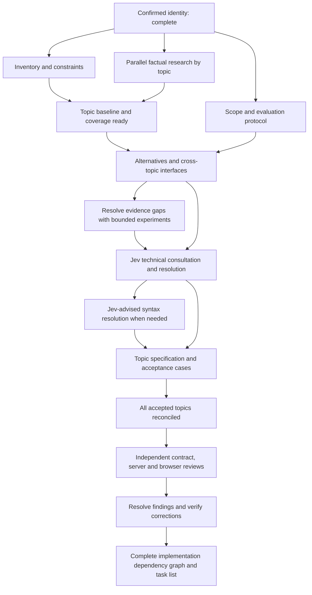

# Can preparation dependencies and parallel launch plan

24 September 2026 · historical execution map for the completed preparation round

The subsequent T01–T27 upgrade has recorded completion. Use the
[post-upgrade reconciliation](post-upgrade-reconciliation-2026-09-24.md) for
remaining gaps; the launch instructions below describe the earlier round.

This is the execution map for the [preparation checklist](can-design-preparation-2026-09-24.md)
and its [model assignments](can-preparation-model-allocation-2026-09-24.md).
**Run independent evidence work in parallel, then advance each topic when its
own inputs are ready. Do not wait for an entire numbered stage to finish.**

Task durations, available live-task capacity and user response times have not
been measured. This plan removes avoidable waiting; it cannot establish a
numerically optimal schedule or promise a completion time yet.

## Dependency rules

There are three distinct prerequisites:

- **Start prerequisite:** enough input to do useful work without inventing facts.
- **Acceptance prerequisite:** the evidence, decisions and cross-topic contracts
  required before that output can be accepted as settled.
- **Resource prerequisite:** an available worker, an uncontended test environment
  and ownership of the files it needs to change.

Drafting is not completion. A topic can collect evidence before the evaluation
protocol is agreed, but cannot claim a winning alternative or comparable benchmark
result using unagreed criteria. Closed topics may enter specification drafting
while others remain in research.

The diagram shows one successful pass. An experiment or disagreement can reopen
its affected topic; record a new revision and invalidate dependent conclusions.
Do not model that as a scheduler waiting on a circular dependency. Topics without
new syntax skip the user-syntax branch; skipped work needs a recorded reason.
Experiments occur before any decision that relies on them, including before Jev
or a syntax question. Later selected-design checks can trigger another pass.

## Ready to launch after the already completed identity step

These are the dispatch packets used for the live preparation. L1–L3 and R-A–R-F
have completed their initial evidence handoffs; bounded design comparisons and
probes now continue from them. Each task publishes partial handoffs instead of
retaining all results until its final response.

| Packet | Proposed task title | Lead | Can start | First handoff and completion boundary |
| --- | --- | --- | --- | --- |
| L1 | Can preparation: decision inventory | Sol · Medium | Now | Publish source-linked topic slices from P1.1–P1.4; finish with full coverage and stable finding IDs. Use Luna Medium for bounded extraction and Sol High for P1.3. |
| L2 | Can preparation: current constraints | Sol · High | Now | P2.2 constraint register with sources, conflicts and affected topics. Record existing rules without selecting replacements. |
| L3 | Can preparation: scope and evaluation | Astra · High | Now | P2.1/P2.3–P2.5: draft scope from already confirmed goals and investigate token measurement. Final protocol joins L2 and relevant evidence; no further user questions are requested. |
| R-A | Can evidence: core contracts | Sol · High | Now, from the recommendation and current specs | Current patterns, variants, validated values/codecs, generic operations/errors, captures and construction. Evidence only. |
| R-B | Can evidence: packages and assertions | Sol · High | Now, from the recommendation and current specs | Package/error identities, fixture/scenario ownership and assertion observation limits. Evidence only. |
| R-C | Can evidence: server product flows | Sol · High | Now, from the recommendation and current specs | Routes, forms, validation/auth, safe HTML/HTMX, SQL, webhooks/outbox and domain-library gaps. Evidence only. |
| R-D | Can evidence: ownership and deployment | Sol · High | Now, from the recommendation and current specs | Resource/transaction lifetime, streams, failure precedence, cancellation/races, shutdown and Linux qualification gaps. Evidence only. |
| R-E | Can evidence: browser and shared contracts | Sol · High | Now, from the recommendation and current specs | Browser target constraints, shared wire types, state/events, client capabilities, accessibility, grid and disposal requirements. Evidence only. |
| R-F | Can evidence: AI and supporting capabilities | Sol · High | Now, from the recommendation and current specs | Native AI composition, catalogue/SDK boundaries, bulk collections, multiline/formatter/diagnostic gaps. Evidence only. |

All R packets apply P3.1–P3.4 to their bounded area and may collect existing-code
examples for P4.4. P3.2 primary-source research and P3.4 evidence bookkeeping can
use Sol Medium. They do not wait for L1's final ledger: use source references and
provisional topic IDs, then reconcile to L1's IDs before a topic is closed.
Finding a missing topic expands the ledger and the responsible packet explicitly.

Do not require a full product implementation to finish an R packet. Start with
read-only inspection and already available probes. Propose any necessary new
experiment under P7 with stated inputs, expected observations and scope.

## Scheduling for low wall time

Maintain one coordinator and a queue of ready packets. Dispatch a packet as soon
as its start prerequisites and a worker are available; do not use synchronized
waves that wait for the slowest unrelated packet.

1. Start L1, L2 and L3 concurrently. The coordinator handles unresolved user
   questions from L3 promptly while the workers continue independent portions.
2. If more live-task capacity is available, start the R packets immediately.
   With three worker slots, replace finishing L packets with R packets; L2 can
   hand off its constraints early, and R work can continue while L3 awaits input.
3. Initially prioritize R-A and R-E, then R-B: shared type/codec, browser boundary
   and package/assertion contracts can affect many downstream decisions. Continue
   R-C, R-D and R-F as slots free up. This is a provisional priority, not a proven
   longest path; change it when measured durations or blockers justify doing so.
4. As soon as a topic has its baseline, coverage slice and applicable criteria,
   release its design packet on Astra High. That packet coordinates P4/P5 and
   any P7 probes; it delegates example/probe work using the checkbox assignments.
   It need not wait for the other R packets to finish.
5. Keep a single queue of unresolved syntax packets through the coordinator.
   The user later directed us to stop asking questions and consult Jev; resolve
   remaining syntax by three fresh Jev requests, evidence and recorded
   engineering judgment. Earlier user answers remain binding.
6. Release topic specification work when its decisions and relevant shared
   interfaces are settled. Integrate the closed topics incrementally.
7. After complete integration, run the independent contract, server and browser
   readiness reviews concurrently, then resolve and recheck findings. Only the
   closed readiness gate releases the final implementation-plan work. Give
   reviewers the same selected specifications and raw evidence without the
   authors' prior review verdicts; assign reviewers who did not author the
   sections they review.

This session has three subagent worker slots alongside the coordinator. That is
the capacity for a subagent execution here, not a claim about the maximum number
of separate user-owned live tasks. At a future live-task launch, use the actual
available capacity and avoid multiple tasks each spawning an unrestricted team.
Track elapsed time, remaining work and what each output unblocks; prioritize the
longest remaining blocking path once those estimates exist.

## Every checklist item's prerequisites

In this table, **topic** means only the relevant slice, not completion of all
topics. **Criteria** means the applicable agreed P2 outcomes. A task's original
checkbox completes only after all its required slices are covered.

| Item | Start prerequisite and acceptance dependency |
| --- | --- |
| P0.1 | Complete. Do not redo the user-confirmed identity. |
| P0.2 | Complete as the initial open state. The user subsequently adopted total tokens per successful coding task as a secondary measured goal under P2.4. |
| P1.1 | P0; source documents available. Extract sections independently. |
| P1.2 | Corresponding P1.1 slice. Publish stable IDs incrementally. |
| P1.3 | Corresponding P1.1/P1.2 slice and frozen identity; reconcile normative conflicts with P2.2 before closing the affected finding. |
| P1.4 | Corresponding P1.1/P1.2 slices; completion requires all source sections covered. Inclusion does not decide the later P8.5 disposition. |
| P2.1 | P0 and existing user goals. Reuse confirmed scope; ask only about material unresolved scope choices. |
| P2.2 | P0 and current authoritative records. Independent of full inventory completion. |
| P2.3 | Draft after P0; settle against P2.1/P2.2 and the user's evaluation priorities. |
| P2.4 | Complete. The user chose a secondary measured objective; protocol detail and weighting feed P2.5. |
| P2.5 | Draft workloads while P2.1–P2.4 proceed. Freeze applicable criteria after those outcomes; incorporate relevant inventory/baseline findings before comparative experiments. |
| P3.1 | P0, a bounded topic and current source/spec revision. Full P1/P2 completion is not required. |
| P3.2 | P0 and a bounded research question. Full P1/P2 completion is not required. |
| P3.3 | Corresponding P3.1 baseline; use P3.2 where external behavior matters. Measurements intended for comparing choices require applicable P2.5 criteria. |
| P3.4 | Starts with the topic audit and stays current through P3.1–P3.3 and subsequent discoveries. |
| P4.1 | Draft unranked alternatives from the topic's initial facts. Final candidate set requires its P1/P3 coverage and applicable criteria. |
| P4.2 | Topic P4.1, baseline P3.3 and criteria. Any claimed experimental advantage also waits for the relevant P7.2 results. |
| P4.3 | Start an interface/dependency map from existing contracts and emerging alternatives; update with other topics' constraints before accepting a choice that affects them. |
| P4.4 | Existing-idiom examples can be collected with P3.1/P3.3. Alternative examples need the relevant P4.1 and known constraints. They do not select syntax. |
| P5.1 | Topic P4.1–P4.4, evidence/criteria, and any P7 result needed to support the packet. Shared-interface assumptions must be explicit. |
| P5.2 | Frozen revision of that P5.1 packet. The three rewritten drafts may be prepared independently against the same facts and alternatives. |
| P5.3 | All three P5.2 drafts; validate semantic equivalence and wording differences before sending. Save exact request/response pairs. |
| P5.4 | All three responses from P5.3. New contradictions trigger focused P3/P7 work and a new decision revision where necessary. |
| P5.5 | P5.4, resolved evidence gaps and the applicable shared-interface agreements. Necessary syntax consequences must now be known. |
| P6.1 | Topic P5.5, complete illustrative examples and any experiment result the syntax comparison relies on. |
| P6.2 | P6.1 and related forms sharing the rule. Coordinate overlapping decision packets before consultation. |
| P6.3 | P6.1/P6.2 complete. Honor the later no-questions instruction; complete three fresh Jev requests for difficult remaining syntax and record the engineering choice. Unrelated topics can continue. |
| P6.4 | Actual earlier user answer or P6.3 engineering selection; record and check its exact scope before the next related design decision. |
| P7.1 | A concrete disputed claim, source revision and relevant criteria. Can be released from P3, P4, P5 or P6, wherever the gap appears. |
| P7.2 | P7.1 experiment specification and required inputs/fixtures/environment. Final selected-syntax tests additionally need P6.4; comparing explicitly provisional candidates does not. |
| P7.3 | P7.2 results; affected downstream conclusions remain provisional until contradictions are resolved. |
| P7.4 | Start when P7 artifacts are created; finish with correctly identified, reproducible outputs. No need to wait until every experiment finishes. |
| P8.1 | Draft/integrate closed topic slices from P5.5, P6.4 where needed, and required P7 results. Final integration waits for P8.2–P8.5 and cross-topic joins. |
| P8.2 | Accepted topic semantics, earlier user-selected syntax and later Jev-advised syntax where changed, supporting evidence and agreed shared interfaces. |
| P8.3 | Stable topic contract from P8.2; draft with P8.4 in parallel. Recheck when that contract changes. |
| P8.4 | Stable topic contract from P8.2 and applicable criteria; independent of P8.3 completion. Include negative and failure cases. |
| P8.5 | Disposition each topic as evidence/decisions close it. Final coverage requires P1.1–P1.4 complete and accepted scope; deferred items cannot conceal required blockers. |
| P9.1 | The same integrated P8 revision and complete coverage ledger used by all readiness reviewers. Independent from P9.2/P9.4. |
| P9.2 | Same integrated P8 revision; server and browser reviews can run independently alongside P9.1. |
| P9.3 | Act on actionable findings as they arrive. Closure requires all reviews, resolved blockers and verification of affected corrections. |
| P9.4 | Can compare recorded choices against the integrated P8 revision while P9.1/P9.2 run; revalidate affected records after P9.3 corrections. |
| P10.1 | Closed P9 readiness gate. Split the accepted design by component/topic for parallel decomposition. |
| P10.2 | P10.1 task slices and accepted shared interfaces. Draft edges incrementally; finalize after P10.3/P10.4 cannot introduce missing prerequisite work. |
| P10.3 | Corresponding P10.1 slice. Can run alongside P10.2 and P10.4. |
| P10.4 | P10.1 slices plus accepted cross-cutting obligations. Can run alongside P10.2/P10.3; feed missing work back into the task graph. |
| P10.5 | Complete P10.1–P10.4 list and graph; resolve omissions/cycles before publishing the final ordered plan. |

The start/acceptance distinction splits otherwise coarse tasks. For example,
P2.4 research is ready before P2.4 adoption, and P8.1 incremental drafting is
ready before P8.1 global integration. Neither is marked complete prematurely.
Do not turn all of P7 into a prerequisite of all of P5, or vice versa.

## Cross-topic agreements that must precede acceptance

The R packets have separate research scopes, but these interfaces need explicit
agreement before either side freezes the affected contract:

| Agreement | Contributors | What waits for it |
| --- | --- | --- |
| Pattern/variant/value/codec semantics | A, E; C for wire use | Matching, validated construction/decoding, generic helpers and shared client/server values |
| Package/error/scenario identity | B, A; F for native AI assertions | Independent-library and fixture composition claims |
| Routes/forms/shared wire and HTML targets | C, E; B for observation | Endpoint/field renames, browser/server response contracts and visible UI assertions |
| Authorization and tenant values | C, A, D | Operation-bound checks and any claim that a typed tenant value implies access |
| Transactions, SQL and delivery failure | C, D; A for scoped result shapes | Transaction result boundaries, uncertain commits, idempotency and outbox policy |
| Capabilities, lifetimes and native execution | D, E, F | Server/browser separation, disposal/cancellation, shutdown and controlled SDK access |
| Public callable/error contracts and native AI | A, F; B for fixtures | Generic wrapper/error preservation and native AI composition decisions |
| Authoring/tooling changes | F plus each affected owner | Named construction, capture and multiline/formatter choices are consistent across examples and diagnostics |

Publish a versioned provisional interface or explicit assumptions—input types,
identities, observable behavior and owner—before dependent probes. An unresolved
interface permits factual research, provisional design and experiments; final
agreement is required before accepting conclusions that rely on it. Interface
changes notify every listed consumer and invalidate only the outputs that
actually depend on them.

## Handoffs and ownership for separate live tasks

Each launch prompt must include its packet scope, prerequisite artifact revisions,
assigned model/effort, required output, completion condition and the planning-only
boundary. Include the frozen identity, existing user choices, native-lowering
constraint and the Jev procedure wherever relevant.

- Give workers a verified input snapshot. Some planning files are currently
  uncommitted; a new checkout may not contain them. Supply exact contents or
  otherwise verify their presence instead of relying on an inaccessible path.
- A handoff identifies covered finding IDs, source revision, facts versus
  proposals, remaining uncertainties, affected interfaces and the next task it
  unblocks. Report partial completed slices promptly to the coordinator.
- Let each packet write to its own staging area or isolated checkout. The
  coordinator alone updates the canonical checklist, combined ledger and
  authoritative specifications. Transfer artifacts explicitly between checkouts;
  a file in one live task is not assumed to exist in another.
- Shared test databases/providers and generated files need explicit ownership;
  otherwise use isolated fixtures. Avoid time lost to interference and conflicting
  edits. The preparation plan does not authorize production implementation.
- Route remaining syntax decisions through one coordinator, preserving
  complete options and consequences. Technical workers prepare decision
  packets and three fresh Jev consultations for difficult choices; the
  coordinator records engineering judgment without asking the user again.
- New evidence or a recorded decision is distributed with its revision and affected
  finding IDs. Reopen dependent outputs; preserve independent completed work.

The two global completion gates are **all accepted topic specifications integrated**
and **readiness findings resolved and verified**. A sketch of future implementation
work may be maintained earlier, but the requested complete implementation task
list is produced only after the readiness gate closes.
