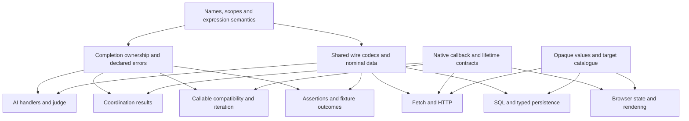

# Can language design: independent review

Review date: 20 September 2026. Repository snapshot: `6a8cffe55f0f422d69ab3e4a37c0e587dc6757b1`. The working tree was clean when the audit started. This report is a new artifact; it changes no design decision, existing document, or implementation. Recommendations below are proposals, not adopted rules.

## Readiness assessment

Can has a recognizable language model, but its current decisions are not yet an implementable whole-language contract. Named functions, immutable records and arrays, explicit domain errors, native judgments, and compiler-owned Bun integration fit together in principle. The blocking work is defining how those pieces compose, especially at completion, external-data, and asynchronous callback boundaries.

The most consequential findings are:

- Executable AI handlers and coordination handlers need a common account of what their completions finish, which errors they may produce, and what value the enclosing construct yields. An all-failed `race` presently selects multiple handlers without defining one composable result.
- A typed record header does not supply a wire codec. Exact integers, nominal variants, provider-specific schemas, and malformed responses need one shared boundary contract for fetch, LLM responses, judgments, HTTP, and SQL.
- Making every authored function asynchronous constrains native callback reuse. Native collection methods and browser render callbacks cannot simply receive Can functions unchanged.
- The intended application capabilities exceed the specified platform catalogue. A small server and an immutable browser application need lifecycle, opaque-value, and target-boundary contracts; they do not primarily need more control-flow keywords.

This is not a verdict that the language needs to become TypeScript, acquire effects, or restore historical features. Most repairs are technical design within the selected direction. A bounded set of **seven author-visible decisions** is identified later. Syntax selection alone is not readiness, and passing the historical compiler would not establish conformance to this design.

## Authority, method, and rule map

`D` below means [docs/syntax-taste/decisions.md](/Users/vince/Projects/can-lang/docs/syntax-taste/decisions.md:1); `S` means [docs/ASTRA_STDLIB.md](/Users/vince/Projects/can-lang/docs/ASTRA_STDLIB.md:1). Every `D:line` citation is current-decision evidence. `S` supplies capability intent only. Older documents and source are explicitly marked historical. All 2,199 lines of D and all 683 lines of S were read, including examples, qualifications, unresolved sections, and implementation restrictions. Independent reviews covered AI contracts, completion/coordination, and application/assertion capabilities; their conclusions were reconciled against D rather than accepted by vote.

The user's latest instruction removes LLM tool calling from scope. It overrides D:485–490, which still says tools are required but deferred. No finding counts tool declarations, execution, or tool loops as missing capabilities. The [repository guidance](/Users/vince/Projects/can-lang/AGENTS.md:1) also rules out compatibility as a reason to preserve obsolete designs and requires equivalent native operations rather than handwritten replacements.

| Current area | What is selected | Qualification and dependency |
|---|---|---|
| Authority and direction, D:1–82 | Recorded decisions only; immutable functional direction; native AI; named top-level functions | No inherited effects, externs, syntax, or implementation policy. Callable error placement is provisional. |
| Connections and Noul, D:83–187 | Named connection; primitive-first declaration; probability cutoff; raw `%` on 0–1 scale | Transport profile, serialization, failure contracts, `%` type, and omitted-minimum layout are unfinished. |
| Choice, judge, arms, dynamic options, D:188–355 | Winner-handler and all-field forms; one batched judge request; named reusable arms; description-only dynamic candidates | Captures, arm types, connection compatibility, phases, and dynamic option validation are unfinished. Runtime keys do not become static fields. |
| Score, D:356–399 | Settings before final `asks`; zero-based levels; fractional weighted score; separate confidence | Default confidence policy and shared judge/error/assertion contracts remain open. This layout does not silently revise Choice. |
| Fetch and LLM, D:401–490 | Named typed fetch; structured LLM record; arbitrary authored response shape; text generation required | Fetch body/status/bytes and LLM invocation/text spelling are incomplete. Tools wording is superseded by the request. |
| Names, packages, generics, D:492–666 | Snake case; same-scope collisions; shadowing; flat packages and qualified imports; generic spelling | Namespace lookup, method ownership, constraints/inference, and error-set polymorphism are not selected. |
| Numbers, expressions, strings, D:668–848 | Arbitrary integers, binary64 floats, no implicit mixed numerics; operator spellings; raw/multiline strings | Operator behavior, precedence, special numbers, comparison evaluation, text units and bounds remain open. Exact `dec` was removed. |
| Lines, comments, tooling, D:850–905 | One step per line; no trailing commas; nested comments; declaration docs; MCP reading levels | Reading levels are a tooling requirement, not runtime semantics. |
| Callables, values, functions, D:907–1137 | Named references; exact-name `near`; immutable receiver capture; explicit result types, `emits`, assertions | Callable compatibility is provisional; initialization and unnecessary-local rejection need a mechanical rule. |
| Assertions and completions, D:1139–1386 | Named whole-completion assertions; call-site `when`; explicit domain handling; standard-failure propagation; terminal relay and sequential chains | Fixture selection/context, handler boundaries, and additional composition rules remain open. |
| Patterns, errors, records, variants, D:1388–1700 | Exhaustive ordered matching; nominal records; copy update; record alternatives; stable numeric error IDs | Type/value resolution, pattern binders, overlap, equality, ID allocation and update details are unfinished. |
| Arrays/methods, D:1702–1834 | Immutable `T[]`; native spread; append; methods/chaining; no mutation | Callback, index/slice, conversion, method inventory and fallible-chain contracts remain open. |
| Async/coordination, D:1836–2076 | All generated functions async; sequential ordinary calls; four Promise mappings; ordered post-coordination handlers; callable spreads | Collected/shared failure results, callable errors, handler failures and lifetime ownership are unfinished. Wrapper functions are a provisional accepted tradeoff. |
| Iteration and unresolved list, D:2078–2116 | Sequential callable iteration; terminal completion only | No general loop or early-return syntax. Native async callback adaptation is explicitly acknowledged. The unresolved list is not exhaustive. |
| Platform and authorization, D:2118–2199 | Mac first; compiler-owned Bun catalogue; no project externs; native reuse | Browser execution is unspecified; library inventory remains open. No implementation or removal is authorized. |

The `timestamp` in the judge example is expressly illustrative, not an approved type (D:282–285). Header fragments, missing `provides` in layout excerpts, and the literal `...` handler placeholders at D:1924 are not treated as bugs. Conversely, examples cannot create exceptions to explicit rules merely by using conflicting syntax.

## Prioritized findings

Severity means: **blocker** prevents a coherent contract for a central promised flow; **major** blocks an intended capability or admits substantially different observable behavior; **moderate** is a localized ambiguity or costly design choice; **minor** is cleanup without a behavioral decision. Severity describes design readiness, not a demonstrated production incident.

### F01 — Executable regions do not yet have composable completion contracts

**Blocker · missing contract.** Current evidence: [D:139–140, 190–209](/Users/vince/Projects/can-lang/docs/syntax-taste/decisions.md:139) assigns AI handler success types; [D:234, 254–284](/Users/vince/Projects/can-lang/docs/syntax-taste/decisions.md:234) leaves handler/request failures open; [D:1118–1135](/Users/vince/Projects/can-lang/docs/syntax-taste/decisions.md:1118) defines function completion and `emits`; [D:1974–2015](/Users/vince/Projects/can-lang/docs/syntax-taste/decisions.md:1974) makes coordination-handler `ok` local and defers handler failure and aggregate result rules.

The same `ok value` can finish a function, supply an AI declaration's return value, supply a generated field, or contribute an array element. The coordination exception is explicit; it is not a contradiction. The missing contract is the boundary around each executable region, including nested matches, calls and `do`.

**Probe.** Assume `error 1008 review_required()` exists. Compose the selected full-record Choice shape with these handlers:

```text
record route_weights choice float weigh from service
    asks "Which team?"
        billing "Payments." => ok %
        technical "Product faults." => review_required()
```

This is a contract probe, not a claimed complete valid declaration. The provider succeeds and selects all field handlers for processing. One handler can produce a value and another a domain error; their execution order is itself undecided. Stop: the declaration has no selected `emits` surface, callers cannot derive its complete contract, and the record's disposition is undefined. A following `judge` cannot know whether to bind a record, dispatch an error, or continue remaining handlers. Similar questions arise if a coordination handler calls a fallible function. Handler-produced failures must be distinguished from the original participant/provider completion so coverage and propagation have defined boundaries.

**Recommendation.** Define one region model: an ordinary function owns its terminal completion; a native declaration owns its exported completion; each field/per-call handler owns a local completion consumed by its construct. `do` inherits its containing region and does not create an anonymous function. Reuse explicit `emits` bounds for native executable declarations and typed arm values; compute possible handler errors and check them against the authored bound. Validate a full provider answer before running any handler. For field construction, process handlers in written order, stop on first handler failure, and expose no partial record. This does not roll back earlier effects. Specify separately whether a `match call`/chain may produce an ordinary value; do not infer general completion storage from the selected coordination binding form.

An alternative is restricting native handlers to successful values after local recovery. It simplifies exported contracts but removes useful domain-error composition. Another alternative—turning every handler failure into a runtime string—would discard the stable typed recovery that `emits` is meant to provide.

**Decision and cost.** Native `emits` and arm-type spelling need surface approval (U1/U2); region ownership, catch boundaries, coverage and handler ordering are technical design. The compiler needs a typed completion context, not a new authored function kind for every arm. Generated native async calls can implement it with tagged completions or another consistent ABI; D does not select that representation. Confidence **high**, assuming executable handlers are intended to contain ordinary Can computations. If they are restricted, that restriction must be explicit instead.

### F02 — Coordination selects native scheduling but leaves its result and failure algebra open

**Blocker · missing contract.** Evidence: [D:1859–1874](/Users/vince/Projects/can-lang/docs/syntax-taste/decisions.md:1859), [D:1914–1920](/Users/vince/Projects/can-lang/docs/syntax-taste/decisions.md:1914), [D:1959–2015](/Users/vince/Projects/can-lang/docs/syntax-taste/decisions.md:1959), and runtime-sized spreads at [D:2019–2068](/Users/vince/Projects/can-lang/docs/syntax-taste/decisions.md:2019). Standard failures normally propagate unless caught ([D:1268–1286](/Users/vince/Projects/can-lang/docs/syntax-taste/decisions.md:1268)); their treatment in collected outcomes is expressly unresolved.

**Probe.** Two compatible `lookup` operations return the same `unavailable` error. `match call race` enters `errors`, and its `unavailable` arm runs twice, in input order. If that arm produces `ok diagnostic(...)`, the operation has two diagnostic values but no selected way to turn them into one result compatible with the winner arm's value. Writing a local `lookup_result result = match call race ...` does not resolve this. Plain `concurrent` similarly collects success-handler values but has no selected type relationship between that array and its shared failure-arm result.

Native Promise coordination also distinguishes fulfillment/rejection, not Can success/domain/standard failures. If Can domain errors are represented as fulfilled completion records, blindly passing those promises to `Promise.any` would let an error win; an adapter must translate settlement. If both domain and standard failures reject, native `any` can hide a standard failure behind a later success. That conflicts with one plausible reading of ordinary standard-failure propagation, but the coordination section explicitly leaves the override open: this is a **missing priority rule**, not a proven contradiction.

**Required edge table.** Native behavior is verified in the [ECMAScript Promise specification](https://tc39.es/ecma262/multipage/control-abstraction-objects.html#sec-promise-constructor). Can still must define the adapter and handler result.

| Case | Native scheduling fact | Can contract still needed |
|---|---|---|
| `concurrent`, all successful | All results, input order | Common handler element type; `void`; unbound result/discard rules |
| `concurrent`, first rejection | Aggregate rejects on the first input to reject in time | Tagged domain versus standard dispatch; shared failure result type |
| `concurrent with error` | Waits for all settlements | Exact per-entry coverage; standard failures; handler failures |
| `race`, all failed | `AggregateError`, reasons in input order | Repeated error dispatch and one aggregate result; distinguish domain/standard reasons |
| `race with error` | First settlement | One common arm result type; failure-category dispatch |
| Empty expanded collection | `all`/`allSettled` yield `[]`; `any` rejects; `race` stays pending | Explicit empty policy, particularly zero iterations of `errors` and accidental nontermination |
| One failure plus one operation that never finishes | `any` and `allSettled` may never finish | No implicit deadline; runtime owner and cancellation limits in F09 |

**Recommendation.** Specify a single internal settlement adapter preserving domain identity, complete payloads and standard-failure identity; use the selected native aggregate for coordination. Do not leak `AggregateError` as an invented Can domain error with no declared ID. Keep transformed results explicit: each selected per-call handler produces one common `T`, collected as `T[]`; success and shared failure paths of a bound expression must produce the same type (possibly an ordinary declared variant). Add a final aggregation continuation for repeated `errors` dispatch (U4), or explicitly revise that dispatch to one aggregate handler. Preserve input order, including duplicate error kinds. Heterogeneous direct successes can be mapped by their own handlers into an explicitly declared common record/variant; a race needs a common success contract before its shared arm can typecheck.

For standard failures, the smallest native-compatible policy is to state explicitly that coordination observes them as participant failures and that an unhandled standard failure propagates when its outcome is dispatched; a losing race failure is observed by the runtime, not later rethrown into a completed caller. This is an observable coordination-specific qualification of ordinary propagation, not mere bookkeeping. If bugs must instead abort first-success races immediately, approve an additional fatal-failure channel around `Promise.any`; that is a stronger Can policy and extra runtime work, not behavior supplied by `any` itself. Empty races should produce a documented standard failure before launch, rather than silently hang or run zero error handlers. This is a deliberate empty-case adaptation to the native mapping and must be recorded, not presumed.

**Decision and cost.** Aggregate result surface requires U4. Failure priority, empty behavior, exhaustive arm coverage, unreachable/duplicate arm rejection, and element typing are observable technical decisions within the unfinished contract. Compiler work is shared result typing and coverage; runtime work is tagging, settlement conversion and ordered dispatch, not a new scheduling algorithm. Confidence **high**. No assumption is made about an already selected completion ABI.

### F03 — Uniform async functions need method-specific native callback adapters

**Major · capability blocker.** Evidence: native `.map`/`.slice` lowering and adapters at [D:1796–1827](/Users/vince/Projects/can-lang/docs/syntax-taste/decisions.md:1796), all functions async and ordinary sequential calls at [D:1838–1847](/Users/vince/Projects/can-lang/docs/syntax-taste/decisions.md:1838), and explicit sequential `for_each` at [D:2080–2085](/Users/vince/Projects/can-lang/docs/syntax-taste/decisions.md:2080). S:244–256 supplies transform/filter/fold/search/sort capabilities, not approved method contracts.

**Probe.** `call numbers.map(callable double)` must return values usable by later Can code. An unchanged native `map` callback returning a Promise yields an array of promises; awaiting the array does not await its elements. `Promise.all(nativeMap(...))` obtains resolved callback results, which may still need Can completion adaptation, and launches callbacks concurrently, which is not an automatically approved ordinary-iteration policy. A native predicate receiving a Promise sees a truthy object; a native sorting comparator does not await it. These behaviors are specified by [ECMAScript indexed collections](https://tc39.es/ecma262/multipage/indexed-collections.html#sec-array.prototype.map). The document already identifies the `forEach` trap, so that observation alone is not a new finding.

**Recommendation.** Define a capability table for each exposed callback API: input signature, capture creation time, sequential or concurrent execution, stopping rule, return type and combined errors. Keep sequential iteration as the baseline unless an API explicitly promises concurrency. A `map` adapter can use native mapping with callbacks whose execution is sequenced through an internal promise chain, then await the aggregate; it must preserve failure/visit behavior and avoid eager user effects. Alternatively approve a simpler native traversal adapter for sequential mapping, explicitly relaxing a literal requirement to invoke `Array.prototype.map` while preserving native storage/copying. Neither approach authorizes handwritten upstream algorithms.

For future sorting APIs, prefer async key extraction followed by native immutable sorting with a compiler-owned synchronous comparator over supported key types. Arbitrary async comparison cannot simply be plugged into native sort. A reusable comparator contract can initially be data (for example, selected field orders), rather than an authored callable. If filter/find/every/some are exposed, all need awaiting adapters, and find/every/some additionally need the selected short-circuit/call-count policy; sorting may use `toSorted` or copy-before-sort, never mutate the Can input. A fallible callback requires the error-set solution in F06, not silent extraction of its success payload.

**Alternative.** Reopen the all-functions-async decision and infer/compile a synchronous subset. This helps native sort and render callbacks but adds inference, specialization and callable-ABI complexity, especially with higher-order calls. It should not be adopted merely for convenience.

**Decision and cost.** Most of the method table is technical/stdlib design; no new loop or lambda syntax is necessary. Literal `.map` lowering changes or a synchronous subset revise approved lowering decisions and need approval if chosen. The recommended key-based sorting path preserves the async ABI and native sort. Confidence **high** for the runtime mismatch; specific callback APIs remain unselected, so this is not a claim that all current method examples are intrinsically impossible.

### F04 — Typed external records require one explicit codec contract

**Blocker · missing contract.** Evidence: state serialization left open at [D:278–285](/Users/vince/Projects/can-lang/docs/syntax-taste/decisions.md:278), validated fetch/LLM records at [D:425–463](/Users/vince/Projects/can-lang/docs/syntax-taste/decisions.md:425), arbitrary integers at [D:670–673](/Users/vince/Projects/can-lang/docs/syntax-taste/decisions.md:670), nominal records/variants at [D:1594–1596](/Users/vince/Projects/can-lang/docs/syntax-taste/decisions.md:1594) and [D:1662–1700](/Users/vince/Projects/can-lang/docs/syntax-taste/decisions.md:1662). S:258–271 identifies precision-preserving codecs as capability intent.

**Probe.** A fetch response record contains `int count`. The body is `{"count":9007199254740993}`. Default native JSON parsing rounds that numeric token to `9007199254740992`; converting the resulting number to bigint preserves the wrong value. Default JSON serialization of a bigint throws. A later judgment can therefore receive changed state unless Can selects a wire contract. These are verified native behaviors, not allegations about the current compiler. The installed Bun 1.4.2 also supports source-aware JSON revivers and `JSON.rawJSON`; a schema-aware reviver recovered the original bigint. A replacement JSON parser is not the default solution. See [ECMAScript JSON parsing/source context](https://tc39.es/ecma262/multipage/structured-data.html#sec-json.parse) and [serialization](https://tc39.es/ecma262/multipage/structured-data.html#sec-serializejsonproperty).

A second probe uses two nominal alternatives with identical field shapes. Their JSON objects do not identify which nominal constructor to create. A third asks an LLM to produce a record with a callable or opaque resource field. Ordinary Can record permission cannot imply that all such shapes are serializable or generatable.

**Recommendation.** Define a shared wire-compatible type subset and generated codec layer: nested records/arrays, field names, null versus absence, extra fields, variant discrimination, integer representation, finite floats, size limits, and validation failures. Reject unsupported shapes at declaration checking. Keep unknown wire data internal until validation creates an admitted nominal Can value. A provider's structured-output schema may constrain generation; it does not replace Can decoding and validation. Unsupported provider schema features should fail capability checking or use an explicitly supported constrained subset, not silently widen the accepted record.

Use native JSON parsing/serialization with schema-aware conversion, choosing a supported Bun baseline. Exact integer tokens are feasible locally, but other JSON consumers may still round them; decimal strings or explicit wire records are safer interoperability choices when counterparties require them. Duplicate-key rejection, if retained from S, needs separate evidence: ordinary object validation happens after keys may have been overwritten. Do not claim the native reviver alone proves duplicate-key preservation. The current decisions have not yet selected that strictness.

**Alternative.** Start with strings, booleans, finite floats and nested data, requiring explicit string fields for large integers and distinct wrapper records for wire variants. This narrows initial capability but avoids custom mapping syntax. It must be an explicit restriction, not an implicit conversion.

**Decision and cost.** Codec subset, native adapters, validation and failure taxonomy are technical work; custom wire-mapping syntax would require later approval only if justified. No arbitrary-precision decision changes. Compiler work is schema derivation and admissibility; runtime work is conversion/validation around native transport and JSON. The same design unlocks AI state, LLM records, HTTP bodies and SQL row conversion without treating their wire formats as identical. Confidence **high**. No generative provider was selected or live-tested.

### F05 — One batched judge request needs registration phases and one connection identity

**Major · missing contract.** Evidence: question `from` at [D:136–149](/Users/vince/Projects/can-lang/docs/syntax-taste/decisions.md:136), one-request registration and delayed binding at [D:249–284](/Users/vince/Projects/can-lang/docs/syntax-taste/decisions.md:249), and generation dependencies at [D:465–476](/Users/vince/Projects/can-lang/docs/syntax-taste/decisions.md:465).

**Probe.** Inside one judge:

```text
call route_ticket() as str department
call needs_human(department, "Yes.", "No.") as bool human_needed
```

The second registration requires the first result before the shared request exists. Stop before dispatch. Ordinary sequential `call` scope cannot apply unchanged. Likewise, one question declared `from local`, another `from hosted`, and a judge `from hosted` cannot all retain distinct transport identities in one request. Splitting the request violates the selected batching contract; silently overriding a declaration changes its meaning. D explicitly leaves compatibility unresolved, so neither is an approved interpretation.

**Recommendation.** Establish phases: (1) evaluate ordinary inputs, shared state and registration descriptions without answer bindings; (2) issue exactly one compatible request and validate its complete answer set; (3) run handlers in specified order and expose results to the judge's final continuation. Reject dependencies on answer bindings during registration. A genuinely dependent question uses a later judge call through existing sequencing. Repeated uses of the same question need unique per-registration wire IDs; declaration names alone are insufficient. Reject missing/extra/mismatched answers before any handler executes.

Require the judge and questions to resolve to the same effective adapter/connection identity initially. Specify whether distinct names for identical validated configurations count as identical. Endpoint compatibility, credentials, model metadata and timeout policy belong to that identity. Do not infer support for a generation protocol from a TypeSafe-compatible judgment endpoint. Current [TypeSafe primitives](https://docs.typesafe.ai/primitives) verify independent mixed questions over shared state and later requests for true dependencies; they do not define Can phases or connection precedence.

**Alternative.** Make questions transport-neutral and let only the judge select a connection. That is cleaner for reuse but revises the approved question headers. Automatic splitting is not an alternative within the one-request promise.

**Decision and cost.** Phase scoping, registration IDs, validation and strict compatibility are technical design; transport-neutral headers would require surface revision. The compiler creates a request plan and separate continuation scope; runtime retains one native request. This does not ban transforming LLM output or make an LLM-to-Choice pipeline compulsory. Confidence **high**.

### F06 — First-class callables and reusable arms lack a complete compatibility model

**Major · missing contract.** Evidence: provisional callable errors at [D:911–946](/Users/vince/Projects/can-lang/docs/syntax-taste/decisions.md:911), exact captures at [D:966–997](/Users/vince/Projects/can-lang/docs/syntax-taste/decisions.md:966), receiver capture at [D:1044–1046](/Users/vince/Projects/can-lang/docs/syntax-taste/decisions.md:1044), arm storage at [D:301–332](/Users/vince/Projects/can-lang/docs/syntax-taste/decisions.md:301), and mixed callable collections at [D:2027–2068](/Users/vince/Projects/can-lang/docs/syntax-taste/decisions.md:2027). Generic spelling alone does not select type/error inference (D:637–666).

**Probe.** `save_postgres` and `save_redis` capture an immutable `account`, return `receipt`, and emit different errors. `[callable save_postgres, callable save_redis]` is the approved direction. Stop at assigning a common collection element type: equality of error sets, subset compatibility and error unions remain undecided. Spread entries have no argument list, so operations also need a fully captured zero-ordinary-input signature. Requiring the two functions to declare identical artificial errors would defeat useful narrow contracts.

Separately, `choice_arm float billing_arm` is stored in a field declared merely `choice_arm billing`. Replacing its value with a string-returning arm cannot be checked from that field type alone unless an additional inferred/erased arm contract is specified. Capturing arbitrary judge-local `conf` from such a top-level arm has no recorded creation point. `%` is an invocation-supplied observation, not an ordinary lexically captured local.

**Recommendation.** Use an explicit expected callable type with a common success type, ordinary input list and finite domain-error upper bound. A reference may emit a subset of the expected errors. Keep standard failures outside that bound. Initially use invariant input/result types except already-approved variant membership, avoiding an unnecessary subtyping system. Captures and receiver are supplied at reference creation, removed from the callable's invocation inputs; direct named calls continue to supply all `given` inputs. Exact-name `near` aliases are semantically necessary and must survive F14's local-binding check. Define array-of-callable type grammar and generic type-parameter scope; no anonymous tuple is needed.

Give executable arm values a result/error contract and a documented context. U2 proposes parameterized arm field types. Prefer capture-free reusable arms initially, or reuse an explicit reference-creation rule; never capture confidence or state dynamically from whichever judge happens to invoke them. Runtime option data remains a distinct ordinary immutable record, with selected key and description fields defined by the stdlib contract. Reject duplicate keys before request construction; never let a native map overwrite an option silently. Provider count limits belong to the adapter, not universal language constants. For example, current [TypeSafe Choice](https://docs.typesafe.ai/primitives/choice) documents a 255-option limit.

Static record-arm expansion preserves field order and checks duplicate options/metadata and return types. Dynamic description arrays cannot create static generated record fields; that rejection follows the current design. A collection-based dynamic full distribution could be a later evidence-driven extension, not a missing requirement inferred from the static form.

**Decision and cost.** Callable subset compatibility, nullary spreads, constructor checks and option validation are technical design; arm type/reference spelling requires U2. Generic error-set abstraction can follow demonstrated higher-order APIs rather than inventing a new general effect system now. An alternative is normalized wrapper functions with one common contract; wrappers are already allowed but should not be the only way to widen an error bound. Native closures and arrays suffice at runtime; Can's checker must retain their full contracts. Confidence **high**. Named top-level arms do not themselves violate the ban on anonymous/nested function declarations.

### F07 — Named fetch and LLM declarations do not yet expose their promised application capabilities

**Major · capability blocker / missing contract.** Evidence: connection settings and limits at [D:104–134](/Users/vince/Projects/can-lang/docs/syntax-taste/decisions.md:104), fetch at [D:401–433](/Users/vince/Projects/can-lang/docs/syntax-taste/decisions.md:401), LLM at [D:437–483](/Users/vince/Projects/can-lang/docs/syntax-taste/decisions.md:437). These sections explicitly acknowledge the gaps; a selection of declaration headers has not resolved them.

**Stopping traces.** `match call load_profile("42")` has an approved shape, but a valid full caller cannot enumerate outcomes until the fetch contract distinguishes transport, status and decoding failures. Sending a typed summary to `POST /summaries` stops at the absence of a request-body form. Reading status, response headers, text or bytes also has no selected surface. An LLM declaration has `state` inputs, but only judges have approved grouped-state invocation. Neither `call summarize_email(message)` nor `call summarize_email((message))` is selected for LLMs. Plain text is required, while the selected LLM header accepts a record type; `llm str ...` is a proposal, not an inherited rule.

**Recommendation.** Complete the named forms rather than bypassing them with backend code. U3 supplies the smallest LLM text/input extension; U5 supplies fetch methods, a typed body and a typed response-envelope mode. Keep decoded-body results convenient while making status/headers available through an explicit return contract. Define one decoder contract from F04 and one error taxonomy from F01. A non-success HTTP response is distinct from failure to receive an HTTP response; accepting/rejecting statuses is a Can policy, not implied by a `fetch` keyword.

For connections, specify endpoint/path resolution (including a base with a path), whether an absolute request URL may replace the origin, header name/value mapping and merge precedence, query repetition/encoding, auth conflicts, redirects, and timeout start/end boundaries. `timeout_ms` already has units; it still needs scope: does it include body consumption/decoding, and does handler execution count? Runtime environment lookup needs a defined missing-variable failure and observation time. `metadata` must be validated per supported operation/adapter; it is neither arbitrary headers nor unrestricted body injection. Credentials must not follow an origin change merely because a URL resolver supports it. The official [Bun fetch documentation](https://bun.com/docs/runtime/networking/fetch) shows the native transport surface; it does not settle any of these Can policies.

**Alternative.** An ordinary typed request-record library could cover more HTTP shapes with less dedicated grammar. It revises the selected named-fetch direction; it should be considered explicitly if the declaration starts accumulating a second full HTTP language. For the initial named form, ordinary record values for bodies and envelopes avoid that expansion.

**Decision and cost.** U3/U5 need surface approval. URL/header/query/timeout/auth/error policies and adapter identity are technical design. Native `fetch`, request/response/header operations and JSON remain the implementation basis, with conversion/immutability adapters; an arbitrary local endpoint is supported only if its protocol is compatible. Confidence **high**. No inference is made that TypeSafe supplies text generation or that every generation provider supports every Can record shape.

### F08 — Assertion fixtures need invocation identity and distinct evidence levels

**Major · missing contract.** Evidence: mandatory whole-completion assertions at [D:1143–1162](/Users/vince/Projects/can-lang/docs/syntax-taste/decisions.md:1143), substitution at [D:1166–1200](/Users/vince/Projects/can-lang/docs/syntax-taste/decisions.md:1166), declaration-fixture gap at [D:1202–1220](/Users/vince/Projects/can-lang/docs/syntax-taste/decisions.md:1202), and platform substitution open at [D:2181–2183](/Users/vince/Projects/can-lang/docs/syntax-taste/decisions.md:2181).

**Probe.** A retrying function reaches the same `load_profile("42")` site twice during assertion `eventually`. The first visit should fail; the second should succeed. The selected row `eventually: "42" => unavailable()` does not say whether it repeats forever, is consumed once, or permits another row. A helper reached from two concurrent participants creates a harder case: a global queue for the helper's lexical call site can allocate outcomes according to timing. Matching only argument values also fails when repeated calls have identical arguments but different supplied outcomes. Stop at fixture selection, before claiming a deterministic assertion.

**Recommendation.** Give each test a root assertion identity and each dependency occurrence a full dynamic invocation path plus local occurrence identity. Include participant source/spread index in concurrent paths, reserved before launch, so helper queues are not shared according to scheduler timing. Define exact expected-argument checking, missing rows, unused rows, multiple candidates, recursion, transitive context and malformed supplied completions. Fixture rows select an existing assertion; they are not new name declarations. Ordered repeated selector rows are the smallest extension using the existing row shape, but their repeated-call meaning must be confirmed as part of the fixture contract. Argument-matching search is an alternative, but needs explicit ambiguity rejection and cannot by itself distinguish identical repeated calls.

Do not silently invent a `when` position beneath coordination, a direct payload binding, or `match chain`: only beneath ordinary `match call` is selected. Initially place a substitutable ordinary call inside a named wrapper; the wrapper can be the callable participant, with transitive fixture context defined. This may be verbose but uses the accepted wrapper tradeoff. A coordination-wide fixture surface is warranted only if such wrappers cannot express the motivating tests. Simulating who wins a race also requires deterministic settlement control in the test harness; fixture allocation order is not completion order.

Separate four evidence levels: **consumer assertion**, which may substitute outcomes; **declaration/adapter fixture**, which runs request construction, decoding and handlers against raw synthetic responses; **target conformance**, which executes generated native operations; and **live integration/model evaluation**, which measures deployed behavior or quality. D already says a supplied AI result is not proof of model quality. The task is to provide the missing testing surface, not to accuse D of making that claim. Test AI cutoff boundaries, ties, malformed probabilities, duplicate/missing option keys, response-shape errors, handler failures and invalid fixture data through the same validators used at runtime. Invalid fixtures must fail tests rather than become pretend successful provider observations.

**Decision and cost.** Identity/queue semantics, malformed-fixture diagnostics and an external compiler-owned conformance harness are technical design. Reusing repeated selector rows clarifies the existing fixture table; if a new sequence/ordinal syntax is chosen, it requires approval (conditional alternatives are given under the decision boundary). No new top-level assertion or declaration-level `when` should be added silently. A real external dependency with no fixture should be rejected in an isolated deterministic assertion run, while ordinary authored computation should execute; do not restore old scripted-import behavior as a default. Confidence **high**. Historical [compiler/eval.go:1646](/Users/vince/Projects/can-lang/compiler/eval.go:1646) demonstrates one older queue approach, not current authorization.

### F09 — Early settlement needs runtime ownership

**Major · missing contract.** Evidence: sequential ordinary calls at [D:1838–1847](/Users/vince/Projects/can-lang/docs/syntax-taste/decisions.md:1838), no automatic cancellation at [D:1865–1874](/Users/vince/Projects/can-lang/docs/syntax-taste/decisions.md:1865) and [D:1974–1984](/Users/vince/Projects/can-lang/docs/syntax-taste/decisions.md:1974). S:485–489, 550–564 and 625–639 supply server/database/UI lifetime requirements; their old affine/effects mechanisms are not selected.

**Trace.** Assume F02's race result has been made composable. A race starts two writes through a shared database resource. The first succeeds and its arm completes. A later ordinary call closes the resource. The losing write is still active because cancellation is explicitly absent. Its effect may happen after the function's reported success, and a subsequent failure has no caller continuation left to catch it. Even without cancellation, there must be an owner for that work. If one participant never settles, waiting for every operation instead can prevent completion forever. Neither assumption may be silently added.

Nested arguments also need a launch boundary. In a coordination entry `save(call load_account(id))`, does `load_account` run as a sequential argument before participants start, or as part of an independently launched operation? Both are plausible under the written-order and start-before-await rules. The smallest initial rule is to require participant arguments to be precomputed values, moving a dependent pipeline into an existing named wrapper. That preserves explicit launch semantics and the no-anonymous-functions policy. It is a restriction requiring documentation, not a fact already selected.

**Recommendation.** Retain no automatic cancellation, but define runtime ownership of unfinished participants, late standard failures, application shutdown and shared-resource use. Early-settled work should remain attached to an owner that observes eventual settlement; it must not reuse the completed handler scope or test fixture context. Resource operations need a checked lifecycle at least at runtime (closed/committed/rolled back), and clear rules against closing a resource while outstanding operations use it. Scope-based library operations that acquire, await a named callable, and release in a generated `finally` can cover many cases without new syntax. Such an operation must declare precedence/aggregation if both the body and release fail. Shape initial catalogue APIs around scoped acquisition/use/release and runtime handle-state checks; add no general escape or affine rule silently.

Cancellation, deadlines and bounded cleanup are necessary where a particular server/transaction/UI contract promises them, but a universal cancellation keyword is optional. Native abort facilities only cancel supported operations and cannot retract already-observed effects. Promise settlement itself supplies neither rollback nor resource disposal. Race-based writes therefore need explicit semantics; racing idempotent reads is a simpler first motivating case.

**Alternative.** Cancel losers and join them before completion. This gives stronger lifetime guarantees but changes the selected no-automatic-cancellation behavior and can sacrifice early response or hang on noncooperative operations. General affine types are another option, with substantially larger checker complexity. Neither is required just to acknowledge who owns live work.

**Decision and cost.** Initial ownership/late-failure policy and scoped standard operations are technical design; automatic cancellation or general resource syntax would need approval. Runtime bookkeeping wraps native coordination and resource APIs, not their algorithms. Confidence **high** that the contract is missing, **medium** about the best ownership policy until one full resource-bearing service is specified. The trace is a deliberately constructed use case, not a claim that a current approved SQL API exists.

### F10 — The current Bun boundary does not yet specify service or browser execution

**Major · capability blocker.** Evidence: `main` and exit success at [D:528–537](/Users/vince/Projects/can-lang/docs/syntax-taste/decisions.md:528); package resolution open at [D:632–635](/Users/vince/Projects/can-lang/docs/syntax-taste/decisions.md:632); unchecked effects at [D:2070–2076](/Users/vince/Projects/can-lang/docs/syntax-taste/decisions.md:2070); Bun-only pipeline and closed catalogue at [D:2120–2183](/Users/vince/Projects/can-lang/docs/syntax-taste/decisions.md:2120). HTTP/SQL/frontend capability intent is S:428–639.

**Trace.** A future `main` starts an HTTP server, then reaches bare `ok`. Exit code zero is specified; when the process exits, who owns its event loop, and how it shuts down are not. An immutable request handler is expressible as a named function, but no selected catalogue operation registers it or maps its domain/standard completions into a response. A frontend update can construct a new state; mounting that state in a browser stops at an absent browser target, DOM catalogue and callback contract. Emitting TypeScript is not equivalent to supplying a browser runtime.

**Recommendation.** Define a host-callback adapter contract using existing named callable values, and define service lifetime using ordinary catalogue operations before proposing a special entry-point syntax. A library `run` operation may keep `main` pending until shutdown; alternatively `main` may hand ownership to a runtime-managed service. Either needs callback error mapping, teardown and assertion behavior. Reserve distribution-owned package identities and resolve them through the compiler/distribution manifest while keeping flat `uses` and `::`. First-party SQL support can begin with one parameterized, typed-row operation and one supported native driver; no SQL keyword, interpolation, project adapter or raw-completion type is required.

Browser execution requires a separate explicit target decision (U7). Preserve the compiler-owned catalogue, with browser-compatible operations distinct from Bun-only ones. A browser cannot read a server process environment variable; `auth bearer env` must not turn into a bundled secret. Pure data/state code can be shared, but server credentials and unsupported platform imports must be rejected at that target boundary. Native async Can view functions must be awaited by a Can UI driver before invoking a synchronous rendering boundary; they cannot be assumed to be drop-in framework function components. Precise framework adapter feasibility remains unverified here.

**Alternative.** Stage the UI as server rendering while browser support is deferred. That is useful but does not complete the interactive frontend requirement. Allowing arbitrary project-authored drivers would broaden capability but directly reverse the closed catalogue; it is not the recommended shortcut.

**Decision and cost.** Package resolution, Bun service adapters and callback/liveness mechanics are technical design; browser target scope requires U7. Static view purity is intentionally not promised: a pure view convention is compatible with current effects policy, while enforcing it would reopen a deferred language choice. Browser work adds target validation and runtime integration, not necessarily new Can grammar. Confidence **high** for the boundary gap; deployment/framework details require further targeted evidence.

### F11 — Nominal records alone cannot carry trusted construction or resource provenance

**Major · capability blocker.** Evidence: ordinary positional record construction at [D:1579–1614](/Users/vince/Projects/can-lang/docs/syntax-taste/decisions.md:1579), unrestricted record copy updates at [D:1634–1656](/Users/vince/Projects/can-lang/docs/syntax-taste/decisions.md:1634), and unfinished export ownership at [D:590–601](/Users/vince/Projects/can-lang/docs/syntax-taste/decisions.md:590). S:293–313 requires construction-based safe HTML; S:548–564 calls for validated query/schema and managed resource values.

**Probe.** Suppose an intended library exposes `html_safe` as an ordinary record containing a string. `html::html_safe("<script>bad()</script>")` bypasses its encoder. If the type name is withheld entirely, consumers cannot name the type in signatures under the recorded explicit typing rules. Nominality distinguishes two types; it does not prove a value was escaped. A record `server(int handle)` similarly permits fabricated handles, and immutable aliases still permit double close unless lifecycle is checked. These are capability probes, not claims that those hypothetical library records have been approved.

**Recommendation.** Start with opaque **catalogue-owned types** for safe fragments, approved URLs and host resources. Their names can appear in signatures, but constructors, representation fields, copy updates and generic wire decoding are unavailable to consumers. The maintained compiler already owns platform contracts, so this can initially be a standard-type contract without a general new declaration keyword. Encoders validate/escape context-appropriate data; renderers accept only the corresponding safe values. Resource types additionally need F09's lifecycle policy; opacity by itself does not establish single ownership or cleanup.

An alternative is type-versus-constructor visibility for ordinary packages, or a general `opaque record` form. It enables application-defined invariants and reduces catalogue special cases, but expands the selected declaration/export surface. Defer that generalization until a real user-defined abstraction requires it. Never restore historical `seal` or extern grants implicitly. The older [std/html/README.md:1–22](/Users/vince/Projects/can-lang/std/html/README.md:1) is evidence of the motivating invariant, not an approved implementation strategy to retain.

**Decision and cost.** A finite catalogue of opaque values and source rejection rules is technical type/stdlib design within the compiler-owned boundary. General opacity/ownership syntax requires a later explicit surface decision and is not counted as necessary for the initial slices. Runtime adapters may wrap native handles and validated data; they must not imply that native types enforce Can provenance automatically. Confidence **high** for missing opacity, **medium** for which generalization will eventually be worthwhile.

### F12 — Core value semantics must be fixed before claiming equivalent native lowering

**Major · missing contract.** Evidence: numeric decisions at [D:668–763](/Users/vince/Projects/can-lang/docs/syntax-taste/decisions.md:668), equality spelling at [D:765–773](/Users/vince/Projects/can-lang/docs/syntax-taste/decisions.md:765), string indexing at [D:840–848](/Users/vince/Projects/can-lang/docs/syntax-taste/decisions.md:840), array bounds at [D:1746–1758](/Users/vince/Projects/can-lang/docs/syntax-taste/decisions.md:1746), native properties at [D:1796–1802](/Users/vince/Projects/can-lang/docs/syntax-taste/decisions.md:1796), and native equivalence requirement at [D:2149–2164](/Users/vince/Projects/can-lang/docs/syntax-taste/decisions.md:2149).

**Discriminating probes.** Each row has two plausible interpretations; the report does not choose silently.

| Source/observation | Competing behaviors and consequence |
|---|---|
| `-7 / 3`, `-7 % 3` | Native bigint truncation/remainder versus historical Euclidean division; quotient/remainder and negative bucketing differ. |
| `ready and call check()` | Short-circuit versus eager call; a side effect or failure may happen only in one interpretation. |
| `0 < call measure() < 10` | Evaluate `measure` once and combine comparisons versus duplicate evaluation; a changing/effectful call makes duplication observably wrong. |
| `dimensions(1, 2) is dimensions(1, 2)`; assertion returns a fresh record | Structural same-nominal-type equality versus native object identity; fresh expected records must not accidentally fail solely because separately allocated. |
| `"😀".length`, `"😀"[0]` | Native UTF-16 count/index versus scalar count/index. Native length is 2, scalar count 1; the first native indexed element is half a surrogate pair. |
| `values[values.length]`, `call values.slice(huge, end)` | Failure versus missing value/clamping; arbitrary Can ints need an explicit checked bridge to native index types. |

The local Bun probe verified UTF-16 length 2, one iterated code point, bigint `-7n % 3n == -1n`, and false native identity for independently created equal-shaped objects. [ECMAScript strings](https://tc39.es/ecma262/multipage/ecmascript-data-types-and-values.html#sec-ecmascript-language-types-string-type) and [equality](https://tc39.es/ecma262/multipage/abstract-operations.html#sec-isstrictlyequal) confirm the relevant native contracts. Historical [compiler/emit.go:692–737](/Users/vince/Projects/can-lang/compiler/emit.go:692) implements different older division/string choices; it cannot settle this audit.

**AI-specific consequence.** D:172–179 requires raw fractional `%`; D:218/220 multiplies it by integer literals `100`/`400`; D:704–712 makes those literals `int` and forbids mixed arithmetic without a literal exception. `%`'s exact type is not yet declared. With the available fractional type `float`, the examples fail; making `%` an int cannot preserve probability 0.2. The coherent repair is to type probability, confidence and weighted score explicitly and use `100.0`/`400.0`. Do not infer a general cast from a handler's declared field type. The requested numeric-to-string special case at D:225–228 is narrower than global coercion and thus not a proven contradiction, but it adds avoidable contextual semantics; U6 recommends explicit formatting.

**Recommendation.** Publish one small semantic table for every primitive operation: accepted operand types, result, evaluation order, numeric faults/special values, equality eligibility and bounds. Use short-circuit booleans and single evaluation of chained-comparison operands as the simplest explicit contracts. Prefer native bigint/number operations where the chosen meaning matches; if Euclidean remainder is wanted, specify a small sign adapter around native division/remainder rather than a new arithmetic algorithm. Define whole-completion assertion comparison separately from callable/opaque identity; typed structural comparison or a verified native deep comparator needs explicit limits, not `===` on records by default.

For text, the direct `.length` requirement already strongly favors code-unit length for that property. Either complete indexing/slicing consistently with that native-facing contract and offer named scalar/grapheme library operations, or explicitly revise `.length` lowering for a scalar-oriented default. Native iterator/segmentation facilities can support the latter, with specified invalid-surrogate handling. Array/string length can bridge exactly to Can `int`; indices require bounds/range checks before native conversion. State these adaptations rather than calling them implicit Can numeric coercions.

Probability/threshold validation should reject NaN, infinities and out-of-range provider data before branching. TypeSafe confidence is a separate 0–1 statistic, not an independently proven probability of correctness; do not recompute its unpublished formula. Noul has no separate confidence. Score's weighted value is distinct from argmax. These facts are supported by [TypeSafe confidence](https://docs.typesafe.ai/confidence), [Noul](https://docs.typesafe.ai/primitives/noul), and [Score](https://docs.typesafe.ai/primitives/score). Confidence on record Choice/Score is metadata, not forced to the transformed field type. Validate distinct metadata names, option collisions, generated field order and tie policy explicitly; the old tie-to-low rule is not inherited.

**Decision and cost.** Most of this completes expressly open technical semantics. Altering the direct length mapping or special numeric-to-string direction requires approval. A primitive-operation matrix, native conversion guards and contextual `%` typing are moderate compiler work shared by assertions, codecs and libraries. Confidence **high** for the gaps and numeric example issue; no particular unrecorded equality/text policy is treated as current.

### F13 — A few grammar and scope boundaries have competing readings

**Moderate · syntax ambiguity / missing contract.** Evidence: reserved names/shadowing at [D:494–524](/Users/vince/Projects/can-lang/docs/syntax-taste/decisions.md:494), parameterized declaration scope at [D:637–666](/Users/vince/Projects/can-lang/docs/syntax-taste/decisions.md:637), Choice layouts at [D:190–201](/Users/vince/Projects/can-lang/docs/syntax-taste/decisions.md:190) and [D:289–299](/Users/vince/Projects/can-lang/docs/syntax-taste/decisions.md:289), Noul omission gap at [D:183–186](/Users/vince/Projects/can-lang/docs/syntax-taste/decisions.md:183), and type/value-shadowing examples at [D:1598–1655](/Users/vince/Projects/can-lang/docs/syntax-taste/decisions.md:1598).

**Concrete competing readings.** In a function with input `dimensions dimensions`, `dimensions(3, 4)` in an assertion or record pattern can resolve to the nominal constructor by syntactic context, or fail because the nearest declaration is the input value. D permits shadowing but expressly postpones type/value resolution. Error names similarly denote constructors outside an arm and matched payload values inside it. No implicit separate namespace can be assumed.

The statement that Choice criteria appear beneath `asks` and the selected minimum-confidence example disagree about their syntactic parent: the latter indents criteria beneath `minimum`. A parser could treat `minimum` as owning the branch block or treat it as a setting whose indentation indirectly continues `asks`. Those are different grammar productions. Score's settings-before-final-`asks` rule expressly does **not** resolve this for Choice. Default Noul behavior is semantically selected but its omitted-minimum branch layout is expressly absent.

Reserved-word policy also needs a lexical inventory: `score` is a primitive spelling yet `int score` appears at D:1769; `minimum` is a setting and a field/input in D:1536–1576. If those words are globally reserved, the examples fail; if they are contextual, the reservation rule needs that distinction. This is not proof that every declaration-setting word must be reserved.

**Recommendation.** Finish a compact grammar and scope table, including constructor/type lookup, generics visible in return types before their written declaration, generated record type registration, method lookup/ownership across packages, aliases, and handler binding lifetimes. Treat syntactic type/constructor/pattern positions explicitly and retain same-scope cross-kind collision rejection; nearest-scope lookup must say which declaration categories are eligible. Generated type/function names enter the same ordinary declaration table, not a hidden collision-free namespace. A fully qualified constructor is a possible escape, but requiring it everywhere should be deliberate. Error-ID allocation needs a distribution/dependency collision policy; generated internal aggregate failures must not invent ordinary error IDs outside it.

For the immediate grammar, retain shown explicit-minimum layouts and document them as distinct accepted productions; specify no-minimum Noul branches under `asks`. A later uniform settings-before-`asks` revision could simplify parsing and authoring, but must be proposed rather than silently applied to Choice/Noul. In expression grammar, contextual prefix `%` and infix remainder can be disambiguated by position (for example `% % 0.1`); generic calls occur in explicit call contexts; pattern `|` and expression bitwise `|` likewise need no extra keyword. They are not intrinsically ambiguous simply because tokens are reused.

Call spread has a related typing boundary ([D:1224–1266](/Users/vince/Projects/can-lang/docs/syntax-taste/decisions.md:1224)): `call add(...values)` cannot prove two required arguments when `values` has unknown runtime length. Choose checked runtime arity or restrict unknown-length expansion to the variadic portion; do not synthesize `undefined` or rejected empty slots. The latter is a simpler initial checker policy, while checked arity preserves more of the general spread direction. Fixed arguments, trailing commas, `void` payload omission and ordinary anonymous-tuple rejection remain as selected.

**Decision and cost.** Resolving admitted productions and namespaces is technical design; changing layouts or global reservation policy beyond examples would require surface review. U1–U5 should include their companion grammar, not just declaration heads. Confidence **high** for the documented gaps, **medium** for lexical conflicts until the keyword inventory is fixed. This audit does not claim a complete generated-parser proof.

### F14 — Behavior-equivalent local elimination is too broad as a compiler obligation

**Moderate · optional improvement / missing contract.** Evidence: mandatory unnecessary-local rejection at [D:1097–1115](/Users/vince/Projects/can-lang/docs/syntax-taste/decisions.md:1097), name-based captures at [D:966–997](/Users/vince/Projects/can-lang/docs/syntax-taste/decisions.md:966), effectful functions at [D:2070–2074](/Users/vince/Projects/can-lang/docs/syntax-taste/decisions.md:2070).

**Probe.** `int factor = settings.multiplier` may be used only to satisfy `callable multiply`'s exact-name capture. Replacing the apparent use by `settings.multiplier` is not available in the selected callable syntax. An intermediate binding can also fix effect timing, evaluation count, expected generic/array type, or a readable domain name used across a long one-line constructor. The narrow `int result = left + right; ok result` pattern (written on separate lines in actual Can) is removable; proving arbitrary effectful expression substitution is a much stronger obligation.

**Recommendation.** Keep any hard rejection mechanically bounded to immediate, single-use forwarding of a mechanically enumerated side-effect-free expression subset, with identical typing and no capture participation. Permit locals outside that pattern. This is a finite checking rule, not a new purity inference system. Consider making the broader rule a lint: descriptive naming can help an agent preserve domain intent, whereas a hard semantic-equivalence check adds no application capability. Compatibility with old source is not a reason to keep or reject either option.

**Alternative.** Preserve the hard policy broadly and invest in flow/effect analysis, despite explicitly treating functions as potentially effectful. That adds compiler complexity for little capability gain. This is a tradeoff criticism, not a claim that the already acknowledged narrow boundary is logically impossible to specify.

**Decision and cost.** The bounded pattern is technical completion of D:1113–1115 and changes no selected example. Converting the whole rule to a warning is an optional author-visible revision, not necessary to unblock the central flows and not included among the seven required repair decisions. Native lowering is unchanged. Confidence **high** for the need to bound it; **medium** for the optional lint preference.

### F15 — Current examples and scope wording need a small authoritative cleanup

**Moderate · stale documentation / localized contradiction.** The important conflicts are bounded:

| Current evidence | Conflict and minimal repair |
|---|---|
| [D:435, 485–490](/Users/vince/Projects/can-lang/docs/syntax-taste/decisions.md:485) | Tools remain “required but deferred”; the latest user instruction removes them entirely. Update heading and scope wording only. |
| [D:1305–1307, 1317–1319](/Users/vince/Projects/can-lang/docs/syntax-taste/decisions.md:1305) versus [D:1515–1526, 1986–1988](/Users/vince/Projects/can-lang/docs/syntax-taste/decisions.md:1515) | `missing() => ...` patterns survive where bare error-name patterns are required. Change patterns to `missing`; error construction in expressions still uses parentheses. |
| [D:1458–1462](/Users/vince/Projects/can-lang/docs/syntax-taste/decisions.md:1458) versus [D:1097–1115](/Users/vince/Projects/can-lang/docs/syntax-taste/decisions.md:1097) | The `do` example repeats the exact removable local pattern that must be rejected. Give `do` a genuinely necessary two-step example, or use the direct completion. |
| [D:213–228](/Users/vince/Projects/can-lang/docs/syntax-taste/decisions.md:213) versus D:704–712 | `100 * %` / `400 * %` cannot satisfy the intended fractional semantics without a missing type/coercion rule. F12 gives the decimal-point repair. |
| [D:55–60, 1662–1665](/Users/vince/Projects/can-lang/docs/syntax-taste/decisions.md:55) | Broad wording that the primitive inventory/Choice syntax is still unselected understates the later selected declarations. Say which details remain open. |

**Trace/impact.** An agent copying `missing() => ok 0` from the current ordinary-call example conflicts with the current error-pattern rule. An agent implementing the tools paragraph would work outside the requested product. These are concrete inconsistent instructions, not formatting placeholders or defects in every abbreviated example.

**Recommendation and alternative.** Correct the examples and scope in a later authorized cleanup, preserving the selected rules. Do not add compatibility grammar to accommodate stale snippets. Where two substantive selected layouts differ (F13), resolve the production explicitly rather than silently choosing the prettier example. There is no meaningful compatibility tradeoff with zero external users.

**Decision and cost.** Tools cleanup follows current user authority; bare-error and local-example cleanup changes no language decision. Numeric primitive typing remains F12 technical work. No runtime changes are implied by this finding; this audit edits none of those passages. Confidence **high**, with the `%` type qualification stated in F12.

## End-to-end traces and capability matrix

“Supported” here means the described source behavior follows from the selected design, not that the old compiler accepts it. “Blocked” means a complete contract cannot be derived at a necessary boundary. A partial syntax selection is marked “supported with unresolved details” when that distinction is useful.

### Trace A: ticket → generated plan → judgments → database results

Use a realistic ticket-routing application: fetch a ticket; ask an LLM for a factual summary and candidate departments; transform that authored result shape; evaluate routing and urgency together; inspect confidence; write an audit record to two databases; return one typed result. This is a sequence of dependent stages, not a compulsory LLM-to-Choice feature of the language.

| Stage | What can be derived | Exact stop or condition |
|---|---|---|
| 1. Define `ticket_payload` with `str body` and `int message_count`; declare `fetch ticket_payload load_ticket from account_service`, `given str ticket_id`, GET, query and headers | Nominal body declaration, named fetch and ordinary invocation shape | **First stop:** response/error/codec contract is unknown. Cannot finish exhaustive `match call` or safely decode a large count (F01/F04/F07). |
| 2. Independently assume a valid ticket value is supplied; declare an LLM result `routing_plan` containing summary text, question text and an array of separately declared candidate records | User-authored nested response data fits the intended general structured-output direction | **Stop:** permitted wire/schema subset and LLM `state` invocation are unselected. Do not borrow judge grouping silently (F04/F07). |
| 3. Independently supply a typed plan as an ordinary function input; inspect its fields and construct application records | No AI-specific pipeline is necessary. Ordinary field access, named functions and immutable transformations apply | **Stop at converting candidates:** `choice_option` has no selected field/constructor/validation contract. Using `.map` also needs F03/F06, rather than hidden async concurrency. |
| 4. Independently assume validated `choice_option[] candidates`; use `select_department(question, candidates)` within a judge alongside an independent Noul urgency question | Dynamic descriptions and shared selected-key success are selected; both questions can share supplied state in one request | **Stop:** batch phase/connection compatibility and native declaration completion signatures are unfinished (F01/F05). A second question based on the first answer must be a later request. |
| 5. Provider returns raw Noul probability, Choice selected key/probabilities/confidence | Noul true cutoff is inclusive, default 0.5; false handler still sees raw probability of true. Choice winner and confidence are separate; Score would return a weighted score, not a winning level | **Stop before a complete typed inspection path:** numeric/metadata types, invalid response handling and ordinary dynamic-Choice confidence access need the shared contracts. No symmetric uncertainty threshold or old tie policy is inherited (F04/F12). |
| 6. Independently supply a valid routing result to named `save_postgres`/`save_redis` wrappers; form callable values capturing `account`; expand them in `concurrent with error` | Capture-before-start and per-operation result mapping are selected; success/error arms can map into one `save_result` element type | **Stop at common callable type/error bound and handler failure:** F01/F02/F06. After those are fixed, the selected `save_result[] results = ...` layout suffices. |
| 7. Return `routing_report(summary, department, results)` | One positional record is a valid whole success payload; no tuple needed | Conditional on earlier stops being resolved. An all-failed replica `race` cannot be substituted for stage 6 without U4's aggregate rule. |

No complete runnable program is claimed by joining these rows. Each continuation explicitly starts with ordinary values supplied independently so that later boundaries can be examined without pretending an earlier missing rule has been filled.

A useful design consequence: the database stage already has a workable per-call recovery shape. It does not require a universal first-class completion value. If an application wants to retain failures, handlers can construct ordinary success/failure records in a declared variant. Generic `Option`/materialized result libraries may build on those values once generic contracts are settled. The old `Outcome<T,E>` notation in S does not itself approve raw completion storage or error-set parameters.

### Trace B: small HTTP service

Start with a named top-level function taking an immutable request snapshot and returning a complete response record. Match a route/path value; on success construct a response; on an expected application failure explicitly map it to another response. A named callable can be passed to a future approved server operation, with no anonymous handler needed.

The trace stops at registering that callable: D has no selected HTTP server catalogue contract, nominal/native response adapter or host failure mapping. Even assuming registration, `main` completion versus server lifetime is undefined (F09/F10). Fetching an upstream record inside the handler encounters Trace A's first stop. Returning safe HTML adds F11's construction boundary. These are language-runtime/stdlib contracts; the missing pieces do not justify a new HTTP statement language. Bun documents server callbacks and lifecycle facilities in its [server API](https://bun.com/docs/runtime/http/server); Can still owns the typed request/response, callback completion, error mapping and lifetime adapters.

### Trace C: immutable frontend update and render

This source-shaped excerpt uses only the selected ordinary-data direction:

```text
/// Editable form data.
record form_state
    str draft
    bool pending

/// Replaces draft text while preserving other state.
fn form_state revise
    emits []
    given
        form_state current
        str new_draft
    asserts
        changed: form_state("old", false), "new" => ok form_state("new", false)
    ok current with draft = new_draft
```

The update's result is derivable and immutable. Whole-record assertion comparison still needs F12's exact definition. A named view can consume the resulting record and construct typed node data once its stdlib types exist. The trace stops at rendering/mounting: there is no browser execution target or host callback driver; a returned Promise is not automatically a native framework node. Event-to-message functions and explicit commands fit the named-callable/data model, but ordered update scheduling, pending command outcomes, controlled-input resynchronization and unmount cleanup need runtime contracts. Statically enforced pure views are deliberately unselected; effects cannot be secretly restored to satisfy the historical frontend brief.

### Capability matrix

| Capability | Status | Owning layer / reason |
|---|---|---|
| Named scalar functions; basic integer add/match examples | Supported | Language rules and shown examples; broader operator semantics remain F12 |
| Immutable record construction, field access and simple `with` update | Supported | Language; multi-update evaluation/validation details remain open |
| Nominal record variants and exhaustive record-alternative branching | Supported with unresolved details | Language/type checker: overlap, nesting, generic alternatives and equality |
| Arrays, spread, append, ordinary nested successful calls | Supported | Selected source behavior; bounds/method inventories are separate |
| Generic records/functions/variants/errors | Supported with unresolved details | Spelling selected; constraints, inference, specialization/assertions unresolved |
| `near` capture and receiver-bound named callable | Supported with unresolved details | Capture time/name rule selected; full callable/error compatibility unfinished |
| Sequential chain and explicit domain forwarding | Supported with unresolved details | Basic failure/coverage selected; value composition and fixture placement incomplete |
| Standard runtime failure catch and automatic propagation | Supported with unresolved details | Inventory, string conversion, primitive fault mapping and coordination priority |
| Sequential async map/filter/fold/short-circuit search | Supported with unresolved details | Stdlib/native callback adapters and error contracts (F03/F06) |
| Arbitrary authored async comparator passed directly to native sort | Blocked | Native callback contract mismatch; key extraction/native ordering is an alternative |
| All four coordination scheduling modes | Supported with unresolved details | Scheduling selected; total result/failure/empty/lifetime contracts incomplete |
| Different database callables in a runtime collection | Supported with unresolved details | Selected wrapper/spread direction; common error-bound and nullary type rules missing |
| Handling every collected failure, including duplicate kinds and standard failures | Blocked as a complete flow | Completion/result adapter and coverage policy (F01/F02) |
| Native Noul threshold and raw probability behavior | Supported with unresolved details | Core branch semantics selected; numeric/adapter/error/assertion contracts unfinished |
| Choice winner, static full-field transforms, Score weighted value/level fields | Supported with unresolved details | Selected semantics; field/metadata types, failures and validation missing |
| Generated nominal record name and metadata collision rejection | Supported with unresolved details | Collision prohibition selected; scope/export/order and type details incomplete |
| Batch independent mixed judgments | Supported with unresolved details | One request selected; phases, complete decoding and connection compatibility |
| Answer-dependent questions in that same independent batch | Blocked by selected one-request model | Use a later judge call; not a feature to add implicitly |
| Dynamic description-only Choice and selected key | Supported with unresolved details | Data spread selected; exact option construction/validation missing |
| Runtime-generated static record fields/executable generated handlers | Intentionally out of scope | Current static type/data-execution boundary |
| Typed LLM record generation; arbitrary authored shape transformed later | Supported with unresolved details | Shape direction selected; invocation, codec subset and failures block a complete program |
| Plain-text LLM generation | Blocked at surface | Requirement retained, concrete return/call form absent (U3) |
| GET decoded-record fetch | Supported with unresolved details | Declaration and invocation selected; status/codec/error/transport policy unfinished |
| Fetch request bodies, other methods, response status/headers/text/bytes | Blocked at surface | Native APIs exist; Can signatures/declaration forms do not (U5) |
| Full ticket → generation → dynamic judgment → persistence flow | Blocked | Exact stops in Trace A; no missing tool-calling requirement |
| One consumer dependency stub | Supported with unresolved details | Basic `when` selected; exact/missing-row behavior unfinished |
| Repeated/transitive/concurrent deterministic assertion flow | Blocked | Invocation identity, fixture consumption and settlement simulation |
| Native declaration validation/routing tests | Blocked at test contract | Consumer stubs bypass them; protocol fixtures needed |
| Safe HTML/contextual URL construction | Blocked at type/stdlib contract | Opaque provenance and contextual encoder/renderer contracts |
| Small HTTP serving application | Blocked | Catalogue, host callbacks, liveness and shutdown, not request-handler syntax |
| Typed SQL parameters/one-row lookup/transactions | Blocked | Codec/schema/driver/resource catalogue; no SQL keyword implied |
| Pure immutable frontend state transition | Supported | Ordinary records, variants and named functions |
| Typed frontend node composition | Supported with unresolved details | Stdlib contract absent; purity only a convention under current language rules |
| Browser mount/events/commands/hydration | Blocked | Target, native callback bridge and lifecycle (U7) |
| Bytes, maps, sets, clocks, randomness, codecs | Blocked at stdlib contract | In-scope catalogue/types and native mappings remain unspecified; old APIs are not inherited |
| Exact financial quantities/rounding utilities | Supported with unresolved details | `dec` is intentionally gone; integer units or rational/explicit library representations need contracts; never silently substitute float for exactness |
| LLM tool calling; arbitrary project backend escape | Intentionally out of scope | Latest request; separately selected platform prohibition |

## Interaction map



The highest-value simplifications are one completion model, one schema/codec boundary, one callable compatibility rule, and one definition of adapter ownership. Four independently invented mechanisms for each AI primitive, fetch, coordination, and testing would multiply compiler work and create different failure behavior for equivalent operations.

## Prioritized repair plan

| Priority | Work | Completion evidence |
|---|---|---|
| 1 — documentation cleanup | Correct tools scope, bare error patterns, removable-local example and numeric multipliers; identify provisional and illustrative forms consistently. | Every example is labeled complete or partial; current-rule conflicts F15 are gone. This report itself makes none of those edits. |
| 2 — technical design | Define region/completion ownership, domain versus standard failures, callable compatibility, aggregate result typing, primitive semantics and scoped name lookup. | Trace a fallible ordinary call, chain, AI handler, full-record handler and all four coordination modes without inventing a rule. |
| 3 — technical design | Specify shared wire subset/codecs, adapter identity, batch phases, option validation, deterministic fixtures and native callback method contracts. | One raw-response fixture can exercise decoding and routing; one exact-int round trip and one sequential callback trace preserve Can contracts. |
| 4 — bounded surface review | Review U1–U6 together with complete companion examples, not isolated preferred tokens. | Chosen source forms cover native errors/arms, LLM inputs/text, failed aggregation and outbound HTTP without exemptions or hidden coercions. |
| 5 — runtime/stdlib design | Select an initial closed catalogue with opaque types; define service/resource owner and callback boundaries; decide U7. | Complete HTTP service, one typed SQL operation, and immutable UI update/render traces identify every platform crossing and cleanup path. |
| 6 — later implementation authorization | Only after design repair is accepted: implement coherent vertical slices, replace obsolete paths, and run new conformance gates. | Current-design tests and emitted native behavior agree; old goldens do not constrain the new ABI. No such implementation is authorized by this report. |

The first design gate should be a small successful **and failing** ticket-routing flow plus a service callback. It should include one large integer, invalid generated data, repeated fixture calls, duplicate domain-error kinds, a standard failure, an empty callable list, and a late-settling operation. That distinguishes real composition from a collection of independently attractive snippets. General affine types, custom wire-mapping syntax, broad driver inventories and new UI DSLs should wait for a demonstrated unresolved requirement.

## Necessary author-visible decisions

There are **seven decisions to adopt the recommended author-visible repairs below**, not seven remaining engineering tasks. The count is bounded to this audit's central AI/fetch/composition and application traces. It does not claim that future library APIs or a formal grammar cannot expose more decisions. In particular, callable compatibility, codec validation, names/scopes, fixture identity, standard-failure policy and resource ownership still require written technical decisions; they are not additional taste questionnaires by default.

Every form in U1–U6 is **proposed syntax**, including new library names. These are comparable fragments; ordinary package headers, documentation and assertions are omitted deliberately. Alternatives are mutually exclusive choices, not a proposal to support all spellings. No choice is adopted by this report.

### U1. How do native executable declarations publish their domain-error bounds?

Use the same routing question with an `auto` success and `manual` domain error.

**A — ordinary `emits` section (recommended):**

```text
choice str route from service
    emits [review_required]
    asks "Which route?"
        auto "Routine request." => ok "auto"
        manual "Needs review." => review_required()
```

**B — header annotation:**

```text
choice str route from service emits [review_required]
    asks "Which route?"
        auto "Routine request." => ok "auto"
        manual "Needs review." => review_required()
```

**C — separate typed contract section:**

```text
choice str route from service
    contract callable str () emits [review_required]
    asks "Which route?"
        auto "Routine request." => ok "auto"
        manual "Needs review." => review_required()
```

A extends the familiar function section without duplicating success/input types. Apply its rule consistently to judge, native questions, reusable arms and named external declarations. Adapter intrinsic outcomes must also be visible in the resulting signature; define whether the author enumerates them in the same list or the signature has an explicit compiler-owned fixed component. Do not call that choice settled merely because grammar for `emits` already exists. B makes long signatures longer; C duplicates a contract and creates agreement checks. None requires purity/effects syntax.

### U2. How is a reusable arm's result/error type written in stored values?

Assume a named `choice_arm float billing_arm` whose criterion is “Payments” and whose body returns `%`. Compare the same `departments.billing` field:

**A — parameterized arm type plus callable-style error annotation (recommended):**

```text
record departments
    choice_arm<float> emits [] billing
```

**B — return-first arm type:**

```text
record departments
    choice_arm float emits [] billing
```

**C — ordinary description record plus explicitly contextual callable:**

```text
record described_arm<output>
    str description
    callable output (choice_context) emits [] evaluate

record departments
    described_arm<float> billing
```

C's equivalent named function receives a `choice_context` value and returns `context.probability`; creating it uses `callable`, with any ordinary `near` captures taken then. It removes a second special executable-value mechanism but substantially revises approved arm storage and contextual `%`. A is the smallest extension of the selected first-class arm direction; B is equally feasible but expands type grammar differently. Initially capture-free reusable arms avoid inventing dynamic scope. If captures are needed, show the creation expression and input/error contract together before approving it.

### U3. What is the complete text-LLM and state-input form?

All alternatives summarize the same `email_text` and return `str`. Structured generation substitutes an admitted record result type under the same calling convention.

**A — extend existing `state` with judge-style invocation (recommended):**

```text
llm str summarize from generator
    state
        str email_content
    asks "Summarize the email."

call summarize((email_text))
```

This explicitly extends grouped state beyond judges; it is not a claim that grouping was already general. If ordinary `given` parameters are also supported, they precede that final group. Define zero-state and one-state arity without creating general tuple values.

**B — one input section, all fields are supplied model content:**

```text
llm str summarize from generator
    given
        str email_content
    asks "Summarize the email."

call summarize(email_text)
```

B is simpler to invoke but collapses the deliberate ordinary-parameter versus evaluated-content distinction. That disclosure/parameter policy must be part of the choice, not hidden in lowering.

**C — explicit state expression from an ordinary record argument:**

```text
llm str summarize from generator
    given
        email_input input
    state input
    asks "Summarize the email."

call summarize(email_input(email_text))
```

C keeps explicit content selection and ordinary calls, but changes `state` from a declaration section into an expression and requires an input record. A preserves the selected LLM layout most directly. All three need the same output validation/error and provider compatibility work; none adds tools.

### U4. How does an all-failed race yield one composable result?

Assume both participants return `profile`, emit `unavailable(str message)`, and the desired record is `lookup_result(bool found, str name, str[] failures)`. Standard failures also need explicit handling. This is the same lookup in all alternatives.

**A — map each failure, then one final handler in `errors` (recommended):**

```text
lookup_result result = match call race
    primary::lookup(user_id)
    backup::lookup(user_id)
    ok profile found => ok lookup_result(true, found.name, [])
    errors
        unavailable => ok unavailable.message
        [_] as str message => ok message
        ok str[] failures => ok lookup_result(false, "", failures)
```

The new final arm runs once after repeated per-error handlers have produced their common element type. Its result agrees with the winner arm. This preserves approved repeated dispatch and ordinary typed data, at the price of one aggregate continuation rule. Handler failures still follow F01; an empty-race precheck does not pretend there was a failed participant.

**B — one aggregate error-data handler:**

```text
lookup_result result = match call race
    primary::lookup(user_id)
    backup::lookup(user_id)
    ok profile found => ok lookup_result(true, found.name, [])
    errors as lookup_failure[] failures => ok lookup_result(false, "", call explain_failures(failures))
```

`lookup_failure` would be an explicit finite data variant preserving participant index and error/standard-failure identity, not an untyped catch-all. `explain_failures` exhaustively handles it and has an empty exported error set. B has fewer region types but revises the repeated-dispatch decision.

**C — one generated aggregate domain error:**

```text
lookup_result result = match call race
    primary::lookup(user_id)
    backup::lookup(user_id)
    ok profile found => ok lookup_result(true, found.name, [])
    all_failed => ok lookup_result(false, "", call explain_failures(all_failed.failures))
```

C requires an explicit aggregate error declaration/type/ID and a derived coordination `emits` contract; it also revises the selected `errors` layout. It is regular from a caller's perspective but creates an error-kind mechanism that A avoids. None should conflate a collection of domain errors with an arbitrary native `AggregateError` string.

### U5. How does named fetch send a body and return transport metadata?

All alternatives POST the same `receipt_request` to `/receipts` and return decoded `receipt` plus status/headers. `http::response<receipt>` is a proposed standard response-envelope record; it is not currently approved.

**A — retain method line, add explicit body encoding and envelope return (recommended):**

```text
fetch http::response<receipt> save_receipt from service
    given
        receipt_request payload
    post "/receipts"
    body json payload
```

Decoded body-only `fetch receipt ...` remains the lighter return contract. Define explicit text/bytes modes using approved standard value types; do not overload JSON string versus raw text silently. The envelope contains immutable header/status data, not a mutable native `Response` with an untracked consumable body.

**B — one typed request expression within the named declaration:**

```text
fetch http::response<receipt> save_receipt from service
    given
        receipt_request payload
    request call http::post_json("/receipts", payload)
```

B centralizes transport structure in ordinary data/library contracts, but replaces selected method/query/header sections with a competing request mechanism unless those sections are retired.

**C — ordinary named function over a transport library:**

```text
fn http::response<receipt> save_receipt
    emits [http::request_failed, http::invalid_response]
    given
        receipt_request payload
    // Mandatory assertions would appear here in a complete declaration.
    relay call http::send_json<receipt>(service, "/receipts", payload)
```

C would define the service connection as a supported library argument and this operation as POST; those are explicit parts of the alternative. It deliberately revises the named-fetch choice. It offers the smallest compiler grammar but moves more of the authored request contract into library calls. A best preserves selected intent without requiring an unrestricted transport escape. The illustrative error names in C are not a proposed universal two-error taxonomy.

### U6. Keep or remove the special numeric-to-string conversion in generated fields?

Use the same numeric Choice probability to produce a string field.

**A — explicit ordinary conversion in the handler (recommended):**

```text
record text_weights choice str weights from service
    asks "Which team?"
        billing "Payments." => ok call text::from_float(%)
        technical "Product faults." => ok call text::from_float(%)
```

**B — preserve narrow contextual conversion:**

```text
record text_weights choice str weights from service
    asks "Which team?"
        billing "Payments." => ok %
        technical "Product faults." => ok %
```

B must define exact formatting and restrict conversion to this completion site; no numeric scaling follows. It is the closest completion of the requested special direction, but adds a hidden checker/lowering rule.

**C — keep the native record numeric and format in an ordinary function:**

```text
record raw_weights choice float weights from service
    asks "Which team?"
        billing "Payments." => ok %
        technical "Product faults." => ok %

// In a named function receiving raw_weights observed:
ok text_weights(call text::from_float(observed.billing), call text::from_float(observed.technical))
```

C uses a separately declared ordinary `text_weights` record. It reuses one observation for multiple transformations, but adds an explicit stage where the author wanted a string result directly. A retains direct transformed fields and makes conversion ordinary Can code. These sketches assume the proposed canonical conversion has `emits []`; its name and formatting contract are technical stdlib design. Deleting the context-specific conversion direction requires user approval. This is a policy choice, not an excuse to adopt blanket coercion.

### U7. What execution target fulfills interactive frontend scope?

1. **Specify a compiler-owned browser target alongside Bun (recommended for the full capability scope).** Share ordinary Can logic; validate target-specific catalogue imports; keep server credential connections unavailable in browser output. Design the UI callback/runtime adapter before promising framework interoperation.
2. **Keep Bun execution and provide server-rendered HTML only.** Smaller target/runtime surface; explicitly defer interactive browser capabilities rather than claiming they are satisfied.
3. **Deliberately permit a constrained application-authored browser adapter layer.** Faster framework integration, but changes the selected no-project-adapters boundary and expands the executable-code trust/maintenance surface. This is not recommended as an unannounced exception.

This is an architecture/scope decision, so inventing three language keywords would obscure the real tradeoff. No syntax addition is necessary for option 1 merely to make it a separate compiler target.

**What does not require another immediate user choice.** Retain selected explicit-minimum grammar until a deliberate uniform-layout revision is justified; finish its omitted cases and scope table technically. Use repeated existing `when` selector rows if sequence semantics suffice. If an explicit sequence spelling is later required, the concrete alternatives for the same two-visit retry are `eventually: "42" => unavailable()` followed by another `eventually: "42" => ok profile("Sam")` row; one row `eventually: ["42" => unavailable(), "42" => ok profile("Sam")]`; or ordinal rows `eventually 1: "42" => unavailable()` and `eventually 2: "42" => ok profile("Sam")`. The first uses existing tokens, the other two add fixture grammar and would create an additional approval item. Likewise, general opaque/affine declarations, checked purity, first-class raw completions, automatic loser cancellation and relaxing one-line layouts are optional future proposals, not prerequisites manufactured by this audit.

## Verification boundary and exclusions

The review read every current decision section and the complete capability catalogue, as recorded in the rule map. It cross-checked selected historical native-AI proposals (the a94–a97 notes, since removed). Those files were used selectively; they did not reapprove old uncertainty bands, exact-decimal probabilities, effects, revision/pinning machinery, scripts, or rejected syntax. The old a95 statement that a94 was unavailable described an earlier snapshot, not the filesystem at review time.

Selective source inspection covered parser declaration regexes, emission of equality/integer/string operations and extern imports, assertion evaluation/fixture queues, HTML/host documentation and the form-state sketch. The old parser still uses a different declaration grammar ([compiler/parse.go:1859–1874](/Users/vince/Projects/can-lang/compiler/parse.go:1859)); the old emitter still contains external imports ([compiler/emit.go:2544](/Users/vince/Projects/can-lang/compiler/emit.go:2544)). These are documented historical implementation mismatches, not newly discovered authorization to remove code. Current compilation/tests were not used as design authority and no compiler test suite was run.

Current primary documentation was checked for TypeSafe probability/distribution/score/batch behavior, ECMAScript Promise/collection/JSON/string/equality behavior, and Bun transport/server capabilities. Citations appear beside the claims. Local read-only Bun 1.4.2 probes checked numeric-token precision/source-aware recovery, bigint serialization, async callback behavior, empty/late Promise settlements, UTF-16 length/indexing and bigint remainder. They establish native feasibility and traps, not Can conformance. No live AI request, credential use, paid provider operation, database mutation or deployment was performed.

Deliberate exclusions and limits:

- **LLM tool calling is excluded entirely.** There are no recommendations for tool declarations, execution loops or tool-result return protocols.
- No implementation, source migration, deletion, existing-document rewrite, automatic adoption, commit or PR is part of this audit. The only repository addition is this report.
- All of D was read, but no formal grammar, type-soundness proof or exhaustive parser validation was possible from this decision record. Unsettled generic constraints, variance, recursive type admissibility, overlapping variants, generic error identity, method ownership and complete operator precedence remain technical work. They were checked for cross-cutting consequences rather than assigned one finding each.
- Array/string property inventories, all standard failure kinds, exact arithmetic/conversion/rounding policies, top-level initialization order/cycles, full import/dependency resolution, error-ID allocation, CLI argument contents and platform packaging/architecture selection were reviewed as open items, not fully specified or externally verified.
- The standard-library catalogue was covered by capability families. This is not a completed contract for every numeric utility, map/set operation, codec, HTML context, HTTP feature, SQL dialect, transaction outcome or browser control. Removing `dec` does not automatically remove the need for explicit exact-value representations; it also does not reauthorize the old decimal implementation.
- No generative provider was selected, so schema-dialect coverage, refusals, truncation and streaming behavior need adapter-specific evidence. TypeSafe docs do not establish a tie-breaking policy or publish a confidence formula used here. No claim is made about live quality, calibration or reproducibility across model changes.
- No browser/framework build, DOM resynchronization/hydration test, server shutdown probe, transaction/driver conformance test, cancellation benchmark or performance study was run. Proposed compiler/runtime costs are qualitative tradeoffs, not measurements.
- The seven-decision count applies to the recommended immediate surface/policy repairs. Optional alternatives that add general opacity, resource, fixture-sequence or layout syntax can enlarge that count; this report does not approve them by mentioning them.
