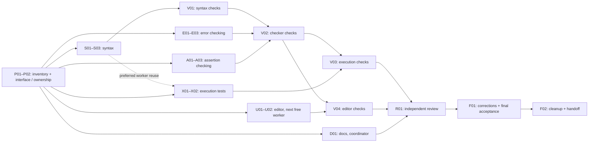

# Grouped errors and test labels: parallel implementation tasks

Status: **complete 30 September 2026: implementation, bounded validation (V01-V04),
independent review (R01), corrections (F01) and closure (F02) all done.** All 23
tasks are done with evidence in the
[completion record](grouped-errors-and-labels-completion-record-2026-09-30.md).
This file is the execution order and progress ledger; the
[design and handoff](grouped-errors-and-labels-implementation-plan-2026-09-30.md)
contains the semantic contract, current diff inventory, known risks, consultation
evidence and scope exclusions. Read both before implementing.

Workspace: `/Users/vince/Projects/can-lang`. Preserve the partial work already in
this checkout and any later unrelated edits. No application rewrite, new error
control-flow family, compatibility layer, benchmark or broad build is included.
Codex is the executor; this checklist does not authorize a Muse run.

## Execution strategy

Use **one coordinator and at most three workers**. Reuse the current checkout
with exclusive file ownership. Logical lanes below are assignments that reuse
worker slots, not a request to launch one agent for every lane. Do not create
extra worktrees or copied dependencies just to parallelize this work.

1. The coordinator completes **P01–P02**: inspect the draft, publish the shared
   syntax contract, separate the mixed checker test file and assign owners.
2. Start **S (syntax), E (error checking), A (assertion checking)** together.
   Checker authors can work from the frozen AST contract immediately; they do
   not need to wait for all parser/formatter work or its test result.
3. When S finishes, its worker takes **X (execution tests)**. Give **U (editor)**
   to the first available E/A worker. If X finishes before either checker lane,
   that worker takes U instead. Keep the next ready assignment running; do not
   wait for a whole wave to finish. U may start after P02 if a slot opens sooner.
4. The coordinator drafts **D01** alongside implementation and runs the **V01–V04**
   validation queue as dependencies become ready. These commands run serially.
   Freeze only the source files read by the current command; other independent
   authoring can continue. Workers do not start their own competing build runs.
5. Once implementation, evidence and docs are ready, use one freed slot for
   **R01**, with a fresh reviewer context. The coordinator routes corrections to
   file owners, performs **F01**, and closes with **F02**.

This removes the unnecessary global syntax-before-checker-authoring barrier and
keeps execution-test authoring off the end of the integration path. Actual wall
time still depends on the findings; do not invent time estimates or parallelize
CPU-heavy checks to claim a speedup.



Solid arrows are prerequisites. The dotted arrow is worker reuse, not a semantic
dependency. The table below gives the exact task-level dependencies.

## File ownership

P02 owns the initial test split. After its handoff, only the assigned lane may
write its files. Read access is shared. Before editing an unlisted file, record
an exclusive owner here; if another lane owns it, send the proposed change to
that owner or explicitly transfer it after the current writer stops. Avoid
directory-wide formatting while another lane is writing.

| Lane | Exclusive write ownership after P02 | Worker use |
| --- | --- | --- |
| I — coordinator | This ledger, the handoff plan, and `docs/implementation/{assertions.md,completions.md}`, `docs/syntax-taste/{decisions.md,technical-spec.md}` | Inventory, interface agreement, command queue, documentation, integration |
| S — syntax | `compiler/internal/syntax/{ast.go,matches.go,coordination.go,declarations.go,format.go,grouped_rows_test.go}` | First worker, then X; retains ownership for later syntax fixes |
| E — errors | `compiler/internal/check/{completion_matches.go,program.go,coordination.go,grouped_completions_test.go}`; audit ownership of `compiler/internal/check/{wrap.go,aggregate.go}` and `compiler/internal/ir/regions.go` | Second worker, then a ready U or review assignment |
| A — assertions | `compiler/internal/check/{assertions.go,templates.go,grouped_assertions_test.go}` | Third worker, then a ready U or review assignment |
| X — execution | `compiler/internal/emit/grouped_syntax_test.go`; audit ownership of `compiler/internal/emit/{regions.go,browser_prune.go,region_types.go,wrap.go}` | Normally the freed S worker |
| U — editor | `compiler/internal/driver/{diagnostics.go,grouped_syntax_test.go}`, `editors/vscode/{syntaxes/can.tmGrammar.json,test/grammar.test.js}` | First free worker after initial assignments; no extra concurrent slot |
| R — review | Read-only; record findings through coordinator | Fresh context in a freed slot; no self-approval |

`compiler/internal/check/grouped_syntax_test.go` currently mixes error and label
tests. P02 moves those tests into the two named checker files above and removes
the old file only after preserving all test functions/imports. Those destination
names are planned, not files already present at handoff. Other existing tests
remain with their current owners; reserve them before editing.

Audit `compiler/internal/project/fixtures.go` and
`compiler/internal/driver/fixes.go` read-only first: they intentionally process
source rows once. A needed fix there belongs to A after explicit reservation.
An E audit of a shared-body consumer inside an A-owned file is a change request
to A, not permission for two writers. Do the same for emitter consumers owned by X.
Likewise, A requests any needed `program.go` change from E. Audit ownership does
not mandate a change: modify production consumers only for a demonstrated defect.
Requests that unblock a validation gate take priority over an owner's next
optional assignment; keep one writer per file during corrections too.

## Dependency ledger

For implementation tasks, checking the box means the requested change and its
tests are authored, self-reviewed and handed off with evidence. It does **not**
mean those tests passed: the validation gate in the last column must separately
pass. Gate tasks require actual command results. Record `ready`, `blocked` or
`done` plus evidence in the progress log; never infer completion from a draft.

| Task | Owner | Prerequisites to start | Verification / acceptance gate |
| --- | --- | --- | --- |
| P01 | I | None | Inventory and environment findings recorded |
| P02 | I | P01 | Interface and ownership handoff recorded |
| S01 | S | P02 | V01 |
| S02 | S | S01 | V01 |
| S03 | S | S02 | V01 |
| E01 | E | P02 | V02 |
| E02 | E | E01 | V02, V03 |
| E03 | E | E02 | V02, V03 |
| A01 | A | P02 | V02 |
| A02 | A | A01 | V02, V03 |
| A03 | A | A02 | V02, V03 |
| X01 | X | P02 | V03 |
| X02 | X | X01 | V03 |
| U01 | U | P02 | V04 |
| U02 | U | U01 | V04 |
| D01 | I | P02 | R01, F01 reconcile with verified behavior |
| V01 | I | S03 | Focused syntax checks pass |
| V02 | I | V01, E03, A03 | Focused checker checks pass |
| V03 | I | V02, X02 | Execution checks pass |
| V04 | I | V02, U02 | Editor checks pass |
| R01 | R | V03, V04, D01 | Findings recorded against requirements |
| F01 | I + file owners | R01 | Findings resolved and final checks pass |
| F02 | I | F01 | Cleanup and final completion record |

The expected integration path is
`P02 → max(S/V01, E, A) → V02 → V03 and V04 → R01 → F01 → F02`.
X joins at V03 and U at V04. These checks share the serial command queue; run
whichever is ready first. Execution tests need not wait for editor authoring.
A blocker in one lane does not stop ready tasks in another.

## Tasks

### Preparation — coordinator

- [ ] **P01 — Reconcile the starting state and test environment.** Read the
  design, repository instructions and current diff. Record current HEAD, changed
  files and later foreign edits; confirm the stopped draft originated at
  `5804b686`. Preserve it. Check tool availability and access to the existing
  shared Go cache through the supported permission mechanism, without launching
  a cold rebuild. Record any blocker early. No feature tests have passed except
  the previously reported 11 TextMate tests; Go attempts were denied before
  compilation. **Evidence:** inventory, tool/cache-access status and scope notes.

- [ ] **P02 — Publish the interface and separate file ownership.** Confirm
  `MatchArm.Outcome` is the first head, `AlternateOutcomes []OutcomePattern`
  contains later heads, and each source arm has one body/forward flag. Confirm
  `Assertion.Name`, `AlternateNames []Token` and `syntax.ExpandAssertions`:
  one copied row per label, alternatives cleared, scenario token updated,
  original row span and payload retained. Retain grouped source for formatting;
  expand at semantic entry points. Move the two current completion tests and
  the assertion/when test out of the mixed checker test file into E/A files.
  Publish worker names and paths. Do not redesign APIs mid-lane without updating
  dependents. **Evidence:** agreed interface, test-function inventory before/after,
  exclusive owners and narrow preparation diff.

### S — syntax, then hand the worker to execution tests

- [ ] **S01 — Finish completion-group parsing.** Review the existing draft for
  ordinary call/chain matches and coordination surfaces. Retain one lexical body
  and bare-forward form. Accept unaliased named domain heads and exact generic
  specializations; reject grouped `ok`, `[_]`, typed binders, `as` aliases,
  empty/trailing separators and malformed heads. Preserve single-arm behavior
  and individual wrapper-policy keys. Add positives/negatives to
  `grouped_rows_test.go`. **Evidence:** supported-surface list, AST-shape and
  rejection tests; V01 result linked later.

- [ ] **S02 — Finish grouped assertion/when labels and expansion.** Review the
  parser and expansion helper for plain and `scenario` labels, inline/block
  forms, modes, links and template-use rows where permitted. Reject duplicate
  labels within a group and incomplete labels. Preserve label-token locations,
  source order, row fields and source AST immutability. Expansion must not
  repeatedly multiply rows. **Evidence:** independent expansion, field retention,
  idempotence and malformed-label tests; V01 result linked later.

- [ ] **S03 — Finish formatter/source preservation.** Exercise parse → format →
  parse for grouped handler/forwarding arms and grouped labels. Preserve comments,
  generic spellings, row modes, links and a shared body; do not print expanded
  semantic roots back into source. Include nearby single-head/single-label
  regression cases. **Evidence:** formatting and comment tests, reviewed small
  diff, syntax files declared stable for V01. Then start X immediately.

### E — exact error checking, shared bodies and coordination

- [ ] **E01 — Resolve and validate every group member.** Audit the generic
  collector in `program.go` first: value elements of `AlternateOutcomes` need
  equivalent treatment to the existing `*syntax.OutcomePattern` exception for
  bare generic heads. Visit the common body once. Finish per-member resolution
  in `completion_matches.go`; retain exact-bound exhaustiveness, duplicates
  within/across groups or single arms, overlapping specializations, impossible
  errors, ambiguous generics and success-last checks. **Evidence:** focused
  positive/negative tests, including a later alternative that fails and a
  missing member not covered by another head; V02 result linked later.

- [ ] **E02 — Check one handler and forward the original completion.** Check
  the common body once and reuse it from exact-error IR arms. Groups introduce
  no implicit error-specific aliases; single arms keep existing implicit and
  explicit payload binding. Every bare member must fit the enclosing bound.
  Forward the protected completion unchanged. Audit recovery checkpoints so a
  failed group does not leak coverage/bindings into later diagnostics. **Evidence:**
  shared-body/site assertions, binding and escaping-bound failures, recovery
  diagnostic regression; supply X the relevant IR/emission interfaces. Actual
  occurrence/payload preservation is required at V03, not proven by IR alone.

- [ ] **E03 — Cover coordination and shared-body consumers.** Audit every
  coordination path that currently reads only `arm.Outcome`, especially
  first-success race/`all_failed`. Validate or reject every alternative; none may
  be ignored. Cover valid participant/shared-handler cases. Trace consumers of
  the shared checked body for mutation, duplicate traversal and call-site
  identity assumptions. Reserve any additional checker file before changing it;
  request emitter changes from X. **Evidence:** surface-by-surface audit, focused
  valid/invalid coordination cases, consumer findings and any routed fixes.

### A — independent assertion roots and lexical fixture selectors

- [ ] **A01 — Expand every assertion-root entry point.** Review expansion for
  concrete, generic and native assertions, including name validation. Each label
  gets its own named root/context/report entry and the same appropriate argument
  and expected-result specification. Reject name collisions across grouped and
  ordinary roots. Preserve restrictions on modes, receivers and links; templates
  remain invalid on assertion roots. **Evidence:** entry-point audit and positive/
  negative checker tests, including duplicates across different groups.

- [ ] **A02 — Expand lexical selectors without merging queues.** Cover direct
  and transitive fixtures, independent scenario-name resolution, and grouped
  `when ...: use template(...)`. Preserve source order and repeated selectors
  on separate rows as valid FIFO fixtures. Do not coalesce selectors or bind
  scenario labels to one shared scenario. **Evidence:** checked fixture rows,
  scenario/template positives and negatives, repeated-row FIFO cases and an
  explicit expected execution sequence supplied to X.

- [ ] **A03 — Audit mode handling and source-only consumers.** Check raw/injected
  and native paths, links and fixture discovery against existing contracts.
  Inspect raw fixture capture in `project/fixtures.go` and source-preserving
  driver fixes in `driver/fixes.go`: expand execution identities, not static
  path discovery or source text. Change these only for a demonstrated defect and
  after reservation. **Evidence:** concise entry-point/consumer checklist with
  test coverage or reason no change is needed; any missing/unused fixture
  expectations handed to X.

### X — execution evidence, authored before integration is ready

- [ ] **X01 — Prove grouped recovery and forwarding at execution time.** Review
  the draft emission test, then use the existing bounded Bun harness to execute
  every error alternative and ordinary success. Compare the returned protected
  completion or its occurrence identity and payload with the original across
  bare forwarding. Drive different alternatives through the same nested lexical
  call/fixture site and prove the intended FIFO behavior. Include supported
  coordination paths where lowering differs. Reuse native JS/Bun lowering;
  production emitter edits require a demonstrated problem and reserved files.
  **Evidence:** behavioral regression tests and expected values. Absence of
  `.create()` in generated text and shared IR pointers are supporting evidence,
  not sufficient acceptance. Execute in V03.

- [ ] **X02 — Prove roots, selectors and reports remain independent.** Execute
  grouped assertion roots with different selected fixtures, expected named
  reports and isolated queues/contexts. Cover repeated-selector FIFO, grouped
  scenario/template selectors, and missing/unused-fixture failures relevant to
  the change. Match A's expected sequence and distinguish one-source-row
  expansion from merged tests. Reuse existing harnesses, `t.TempDir`, one build
  per run and runtime symlinks. Keep the case set small; add execution cases
  where behavior cannot be established by parser/checker assertions. **Evidence:**
  root names/counts, outcomes, queue consumption and failure expectations;
  cleanup registrations inspected; execute in V03.

### U — editor support on the next free worker

- [ ] **U01 — Finish definition navigation.** Review `diagnostics.go` and the
  drafted definition-jump test. Resolve each grouped head in ordinary call,
  participant coordination and shared race handlers; retain correct token spans
  and single-head navigation. **Evidence:** focused driver tests that target
  every head rather than only the first; execute in V04.

- [ ] **U02 — Finish TextMate grammar coverage.** Review the already drafted
  grammar and its tests for grouped labels, completion heads, delimiters and
  nearby existing syntax. Preserve the small existing suite. **Evidence:** test
  cases and stable editor files; coordinator reruns the complete small grammar
  suite in V04. The earlier 11 passes do not validate later changes.

### Documentation, verification and closure

- [ ] **D01 — Reconcile the four language documents.** Draft changes from the
  fixed contract while workers implement. Explain grouped recovery/forwarding,
  unchanged `match chain`/`relay call`, unbound shared handlers, exact error
  coverage and separate assertion/fixture identities. Include scenarios,
  templates and invalid grouped heads. Keep pending-status language until
  verification; reconcile examples against actual behavior at R01/F01.
  **Evidence:** reviewed examples and links to tests covering their contracts.

- [ ] **V01 — Run bounded syntax validation.** With S files stable, run the
  syntax package checks below, including relevant existing format/reparse tests.
  E/A can continue authoring because their files are not inputs to this package.
  Failures go back to S; release the source freeze after the command ends.
  **Evidence:** command, result, tested file hashes and any environment limitation.

- [ ] **V02 — Run bounded checker validation.** Wait for stable S/E/A files and
  their tests. Run grouped checker tests and selected existing completion,
  generic, assertion, scenario, template and coordination regressions. Select
  actual test names from the repository; retain the exact command. Failed cases
  return to their owners; do not treat environment denial as a test failure or
  a pass. **Evidence:** exact commands/results, diagnostics and source hashes.

- [ ] **V03 — Run behavioral validation.** On the checked compiler, run grouped
  emitter/Bun tests. Use the serial process queue, bounded timeouts and no
  concurrent compiler or Bun build campaign. Confirm X's identity/queue/report
  expectations through actual results. **Evidence:** commands, counts/names,
  observed outcomes, checked source hashes and cleanup status.

- [ ] **V04 — Run editor validation.** Run focused driver tests and the small
  full grammar suite. This can precede V03 when U is ready first; it does not
  require X. Use the same serial queue and stable source inputs. **Evidence:**
  navigation and tokenizer commands/results, plus tested source hashes.

- [ ] **R01 — Review the integrated change independently.** Give the reviewer
  requirements, design, diff, tests and raw command output in a fresh context;
  omit implementer verdicts. Review coverage, generics, coordination, recovery,
  shared-body identity, independent roots/queues and source-only consumers. Check
  docs and scope. Record actionable findings with file/line and the acceptance
  condition they affect; do not have authors approve their own work.
  **Evidence:** review findings, including an explicit no-findings result if so.

- [ ] **F01 — Resolve findings and accept the final source.** Route fixes through
  file ownership; give each regression to its owner. Re-run checks invalidated
  by changed sources/tests and obtain reviewer verification of corrections.
  Unchanged verified inputs may reuse recorded results. Follow repository
  requirements: if authored runtime TypeScript changed, run runtime lint-fix
  and format; before finishing run `bun run check:runtime` and relevant tests.
  Do not hand-edit generated catalogue/vendor files. Reconcile docs, inspect the
  final diff and run `git diff --check`. **Evidence:** all contract checks passing
  against the final files, resolved findings and any explicit remaining blocker.
  A blocked gate means the implementation is not accepted complete.

- [ ] **F02 — Clean and deliver the completion record.** Confirm all owned
  commands have stopped and temporary files/build outputs are reclaimed on
  success, failure or handled interruption. Preserve compact results and this
  ledger, not bundles, copied dependencies or private caches. Report cleanup
  failures. If an isolated managed worktree was genuinely required, check it is
  unused and preserve/archive it through the supported tool; retain this shared
  primary checkout. **Evidence:** final changed-file inventory, test/review
  summary, limitations and cleanup status. Do not silently discard foreign work.

## Validation commands and resource policy

Run these from the repository root, in the coordinator's serialized queue, after
the relevant files are stable and shared-cache access is available:

```sh
# V01
GOMAXPROCS=2 go test -p=2 ./compiler/internal/syntax -count=1
# V02
GOMAXPROCS=2 go test -p=2 ./compiler/internal/check -run 'TestGrouped' -count=1
# V03
GOMAXPROCS=2 go test -p=2 ./compiler/internal/emit -run 'TestGrouped' -count=1
# V04
GOMAXPROCS=2 go test -p=2 ./compiler/internal/driver -run 'TestGroupedCompletionDefinitionJumps' -count=1
```

Run `bun run test:grammar` with working directory `editors/vscode`. Add only the
relevant nearby regression selectors discovered in V01/V02 and required runtime
checks in F01. Format changed Go files narrowly before their validation gate.
No benchmarks, distribution/browser campaign, whole-repo build, parallel cold
caches or performance measurements. Register cleanup immediately for every new
temporary allocation and use supported shared-cache permissions rather than a
private `GOCACHE` workaround. Never clean shared caches or foreign artifacts.

Store compact evidence with command, exit/result, changed-source fingerprint,
findings and cleanup outcome. Include hashes of untracked source/test files:
`git diff` alone does not identify the full draft. The next executor should
record results here or link a small completion record. Avoid repeatedly running
already-passing checks unless later changes invalidate them.

## Progress log

No implementation or validation task was executed while writing this checklist.
Previous partial edits and their validation limitations are in the design plan.

| Task(s) | Worker / status | Changed files or reviewed evidence | Checks / findings / cleanup |
| --- | --- | --- | --- |
| P01-P02 | done (coordinator) | HEAD `5804b686` confirmed, no drift; interface frozen; split checker test file into `grouped_completions_test.go` + `grouped_assertions_test.go` | Inventory + handoff recorded; shared Go cache accessible |
| S01-S03 | done, V01 pass | `syntax/{ast,matches,coordination,declarations,format}.go`, `grouped_rows_test.go` (594 lines) | Syntax pkg ok; stale grouped-arm rejection removed; trivia spacing fixed |
| E01-E03 | done, V02 pass | `check/{completion_matches,program,coordination}.go`, `grouped_completions_test.go` (17 grouped tests) | Check pkg ok; alias/coordination fixtures repaired |
| A01-A03 | done, V02 pass | `check/assertions.go`, `grouped_assertions_test.go`; `templates.go` unchanged; `fixtures.go`/`fixes.go` read-only audits | Covered by check pkg ok |
| X01-X02 | done, V03 pass | `emit/grouped_syntax_test.go` (7 tests); no production emitter change | Emit pkg ok with `CAN_BUN`; execution proofs green |
| U01-U02 | done, V04 pass | `driver/{diagnostics.go,grouped_syntax_test.go}`, `can.tmGrammar.json`, `grammar.test.js` | Driver pkg ok; grammar 11/11 |
| D01 | draft done | Four language docs with pending-status notes | Reconcile at F01 |
| V01-V04 | done | See completion record | All gates pass; emit G80 w/o `CAN_BUN` fails identically on base (pre-existing) |
| R01 | done | 8 findings (1 HIGH + 7 LOW/coverage) across check, syntax/exec, editor/docs scopes | Fresh review contexts; first attempts blocked by fd exhaustion, rerun clean |
| F01 | done | `aa419fd5` corrections + `dc9ee3f0` docs reconciliation | Invalidated suites green; independent verification round: all 8 resolved, no new findings |
| F02 | done | This ledger, completion record, plan status; tree clean of task artifacts | No temp dirs/bundles/caches/sessions left; foreign `M AGENTS.md` + untracked docs preserved |

## Instruction for the implementation executor

Read this checklist and its linked design, then execute P01–P02 before dispatch.
Use at most three implementation workers plus the coordinator and the file
ownership rules above. Continue through ready tasks without artificial wave
barriers. Record progress and evidence by task ID, preserve unrelated work, and
complete the validation/review/cleanup gates before declaring the feature done.
