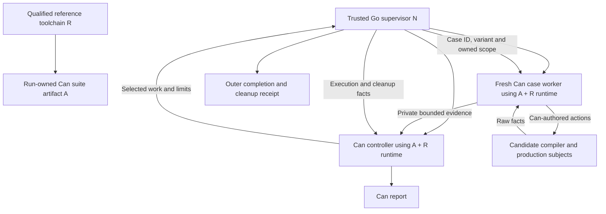

# Native Can tests: initial execution architecture

Status: **initial architecture chosen; implementation and qualification pending**.
The [post-probe design review](native-can-test-design-review-2026-09-30.md)
retains this backend and reconciles the four executed preparatory checks.
PM-N1/N2/F1 support limited mechanics; PM-B1 failed host isolation despite route
protocol evidence. All integrated qualification and harness-retirement gates remain open.
This is the decision after the [completion contract](native-can-tests-completion-contract-2026-09-30.md),
[migration ledger](native-can-tests-migration-ledger-2026-09-30.md),
[authoring design](native-can-test-authoring-2026-09-30.md) and its
[agent-authorship audit](preparation/native-can-test-authoring-2026-09-30/agent-authorship/audit.md).
It supersedes the earlier backend recommendation and statements that initial
backend/bootstrap architecture remains undecided. The subsequent
[shared capability contracts](native-can-test-capabilities-2026-09-30.md) specify
resource operations, observations and diagnostics within this architecture.
Neither document implements the suite or authorizes builds and measurements.

The subsequent [lifecycle contract](native-can-test-lifecycle-2026-09-30.md)
specifies failure/coverage outcomes, interruption/recovery, phase admission and
verified build reuse. Its initial numeric envelopes are policy, not measurements.

The subsequent [hard-case challenge](native-can-test-hard-cases-2026-09-30.md)
retains this backend choice while identifying unqualified C/native linking,
synchronous callback, browser concurrency, descriptor and DB-settlement seams.
Its source findings and bounded future probes are prerequisites to claiming
that the shared capabilities preserve the hardest existing tests.

Preparatory Python/TypeScript instruments are archived research, not components
of the final suite. Their fixture selection, expected bytes, counters, timeout
oracles and verdict reduction must become ordinary Can code before migration
credit. N may retain only general transport, ownership, lifecycle and enforcement
operations; it must not dispatch a stored `PM-*` scenario or compare expected
application results. The revised capabilities specify browser host effects,
actual input settlement versus delivery, fd EOF ownership and inert transport.
Generated candidate ingress still needs its own acceptance before dependent
native coverage can move. This adds implementation dependencies; it does not
require building the full runner merely to write the implementation plan.

## Decision

Use **existing full Can execution, lowered to TypeScript and run by Bun, with
generic native supervision outside the Can processes**.

| Component | Initial choice |
| --- | --- |
| Test language | Ordinary unrestricted Can functions within normal target/effect rules; AI agents are the intended authors |
| Suite compiler/runtime | Explicitly selected, qualified reference toolchain; separate from the candidate role |
| Suite artifact | Compile current Can suite source once per run into an immutable, nonpublishing generation; reuse it for controller and workers |
| Controller | One Can process owns registration, selection, dependency planning, scheduling, expectations/report policy and result reduction |
| Case worker | One fresh Bun OS process per case/variant/attempt, executing the reference-built Can suite; reconstruct the registry locally |
| Native supervisor | Trusted Go launcher/supervisor outside controller and workers; enforce generic limits, own resource lifetimes and transport execution/cleanup facts |
| Candidate | Explicit compiler/runtime/artifact inputs used only as subjects; never silently substituted for the reference suite compiler |
| Initial concurrency | One active live case and one verification worker by default; account for candidate children and native services in the same run budget |
| Future interpreter | Reconsider against the conditions below; neither required now nor excluded forever |

Generated TypeScript is an implementation artifact of Can. It does not retain
an authored TypeScript harness. Can continues to own scenarios, fixture choices,
expected values, retry policy, case scheduling and reports. Native code supplies
general operations and enforcement, not a fixed sequence implementing a former
test under a new API name.

## Why choose this first

The existing compiler/runtime already executes the ordinary Can features agents
must be allowed to use: closures, errors, coordination, fixtures and platform
operations. Reusing them avoids introducing a second implementation of those
semantics as a prerequisite to replacing the tests. The current emitter provides
[production and assertion entries](../../compiler/internal/emit/program_entry.go#L12),
and the driver has [separate-process assertion supervision](../../compiler/internal/driver/supervise.go#L103).
These are concrete foundations, not a claim that a live integration suite already
exists.

This leaves engineering effort on the shared gaps every backend faces: owned
resources, long-lived children, external browser control, independent native/DB
observations, structured diagnostics and honest evidence. A checked-IR
interpreter would still need those operations and external containment.

For agents, one established execution semantics reduces the number of ways a
test can disagree with an ordinary Can program. Canonical source patterns and
structured failures matter more than hiding the generated language. The choice
does not prove the authoring API is optimized; the agent audit remains applicable.

No compilation/startup/load comparison has been performed. Fresh processes are
chosen for explicit state and failure boundaries, not a measured speed claim.
A reusable process pool and same-process Bun workers are deferred: reset rules
and shared-process failures would add obligations before their benefit is known.
No pluggable-backend framework or additional native code generator is needed now.

## Process and responsibility arrangement

The Can controller chooses the work and when it is ready. The supervisor
launches requested jobs only within declared limits; a native semaphore enforcing
the cap is not native case scheduling policy. Native code treats job IDs as
opaque correlation data and does not know which compiler diagnostic, DOM value
or database effect is expected.

Controller and case worker are distinct OS processes. They can use separate
ordinary entry functions dispatched by one Can suite entrypoint. Each worker
loads the same suite generation, reconstructs its static registry and invokes
the selected case. Pass data identities, variant values and scoped resource
references; never serialize a closure or transfer a controller's in-memory handle.
This is a new live-suite entry protocol, not the existing assertion `root=N`
entry disguised as live execution.

Candidate compilers, subject servers and candidate runtime probes run outside
the controller and worker's trusted JS realm. Do not import or evaluate
candidate-generated modules inside the process that compares their results.
Browser subjects run in scoped real browser contexts. Generic native driver
services may live outside workers when they must retain resource ownership after
a worker dies. Their actions and raw observations remain directed by Can.

An owned native resource service under the supervisor must retain enough
authority to close sessions, stop/reap children and reclaim workspaces without
executing the killed case's cleanup code. It can use the existing native
JavaScript/Bun platform operations through reviewed bindings. Resource services
are mechanics, not alternative suite controllers. Their exact protocol is part
of the resource API work; ownership outside the case process is the decision.

## Reference, suite and candidate identities

Use separate roles even when a baseline comparison happens to use identical
bytes:

- **R — reference toolchain:** compiler, emitter, language runtime/catalogue,
  Bun executable and trusted platform bindings used to compile/execute the suite.
- **N — native infrastructure:** outer supervisor and any resource/driver
  services, with their content identities and declared capabilities.
- **S/A — suite source and artifact:** source/fixture/options digests, generated
  artifact digest, selected coverage manifest and verification receipts.
- **C — candidate:** compiler, runtime/catalogue and candidate platform inputs
  under test, plus identities of the subject artifacts it produces.

R compiles the Can controller, case logic and expectations. C compiles fixture
programs and other subjects for the obligations that require compilation. The
report binds all four roles. Content integrity checks do not establish semantic
qualification: current [runtime resolution](../../compiler/internal/driver/runtime.go#L30)
and [generation leases](../../compiler/internal/driver/supervise.go#L203) are
useful identity mechanisms, not proof that the reference is correct.

Qualified R also does not qualify arbitrary changes to S. Development may run
new suite source provisionally, but full qualification must bind to a reviewed
suite/coverage-manifest/expected-vector snapshot with exercised negative controls.
Record reference trust and suite trust separately. Passing attached assertions
does not prove a newly edited oracle is correct, and deleting both a check and
its local plan entry cannot silently rewrite accepted coverage obligations.

Run candidate production artifacts with the runtime/browser target their
contract specifies, recording that executor separately from R's Bun. A generic
native observation probe may use trusted observation code under the candidate
runtime, but its report must identify both the observer implementation and the
runtime observed. Independent native facts cannot be replaced with a production
adapter comparing its own round trip.

Never invoke `candidate canlc run` on the suite to bootstrap it. Current
[`Run`](../../compiler/internal/driver/run.go#L9) builds with that invocation's
compiler before executing; doing so would let C compile its judge. Candidate
ability to compile or rebuild a runner is a legitimate **separate subject**.
Its output is evaluated by the reference-run Can logic and cannot replace that
logic during the same qualification.

Paths alone are not identities. Resolve explicit artifacts and hold validated
leases or equivalent immutable generations throughout use. If inputs change or
required capabilities are absent, invalidate the run instead of following a
mutable path to new bytes. Do not silently select another installed compiler,
runtime or browser when a required one is missing.

The proposed CLI is launched from the explicitly selected reference distribution,
for example `/path/to/reference/bin/canlc test /path/to/tests/suite --candidate
/path/to/candidate/bin/canlc --profile quick --jobs 1`. This command does not
exist yet. The launcher validates its reference manifest; an ambient `canlc` on
`PATH` cannot silently determine the authoritative compiler. Selecting an
explicit configured reference with equivalent identity checks is also valid.

## Normal run and verification scopes

1. The trusted launcher resolves R, N and C, establishes a bounded owned run
   scope before staging, and records their identities. Unqualified reference
   status is explicit and cannot yield full qualification.
2. R checks all suite source. It stages the suite in a run-owned nonpublishing
   generation and, **for the initial bootstrap, executes all offline roots**.
   Record the exact verified root set. Assertions retain their supplied-boundary
   semantics; the later qualified focused path is described below.
3. Start the Can controller from that generation. It validates descriptors,
   independent coverage mappings, selected cases/variants and capability needs.
   It sends bounded worker launch requests to N.
4. Start a fresh worker for each selected attempt, using the same R/A generation
   and a distinct owned case scope. Case functions choose candidate actions,
   observe raw results and emit named evidence through a private bounded channel.
5. N records worker exits and performs/finishes cleanup independently of the
   case reaching its last line. Can combines those facts with its expectation
   evidence and required-check plan.
6. Retain the compact Can report plus N's final completion/cleanup receipt.
   Reclaim execution workspaces and run-owned builds. Incomplete receipts,
   inconsistent identities or failed cleanup prevent complete success.

Once a qualified pre-verification planner exists, a focused development run
checks **all source** but may use a conservative
selected case/helper/fixture assertion closure; ambiguous dependencies require
all roots. Mark the receipt partial and record why those roots were selected.
The dependency planner is missing work, not a current guarantee.

There is a bootstrap ordering requirement: the root-selection planner must itself
have qualified behavior. Use all roots until that planner and its conservative
fallback have passed independent controls. The focused path then runs the
already-qualified planner **before step 2**, cross-checks its root identities
against R's complete checked root inventory, and binds the selection receipt to
the current source/dependency graph. Static membership checks alone do not prove
closure completeness; that remains part of the planner's qualification and
conservative fallback. A newly edited controller cannot grant its own unverified
assertions an exemption by selecting fewer roots.

Full qualification requires the full mandatory-root set, all retained coverage
obligations and every required environment. Partial verification never satisfies
production publication. Existing [assertion selection](../../compiler/internal/driver/assert.go#L34)
checks all declarations before selecting execution, but ordinary
[`Build`](../../compiler/internal/driver/commands.go#L82) verifies all roots and
publishes production output. Therefore implement a distinct nonpublishing suite
path using lower-level staging/execution; current `canlc run` is not this path.

Reuse a compiled suite once within the run and reuse immutable candidate builds
when their source/compiler/runtime/options identities match. Build-corruption
and determinism cases opt out of reuse explicitly. Avoid persistent private full
bundles and source/dependency copies. Installed qualified toolchains are managed
dependencies, not a new disposable checkout for each test invocation.

## Bootstrap and deliberate reference refresh

The architecture selects a **qualified reference toolchain**, not a permanently
frozen suite executable. This permits normal test-source edits to be compiled
with R without automatically trusting the latest candidate compiler.

No exact distribution or commit has been qualified by this design work. First
select an existing accepted installed distribution or independently review and
qualify a baseline through available checks. Record a compact acceptance manifest
with source/build provenance, compiler/runtime/Bun/supervisor/binding digests,
supported capabilities, evidence and known limits. Checksums alone are insufficient.
An unestablished seed is a qualification blocker, not an invitation to call C
the reference. No new cryptographic signing system is required by this decision.

The subsequent [prerequisite inventory](native-can-test-prerequisites-2026-09-30.md)
identifies candidate source `288a38200cd779ff027377cf34f528a782740d54` and verified
local Bun inputs, but finds no accepted R compiler bundle or qualified generic N
executable in the audited locations. Its machine-readable record leaves those
roles null and integrated Can execution admission false; it is an inventory, not
an acceptance receipt. Separately scoped mechanics research can use identified
existing tooling and independent observations with bounded external cleanup;
its evidence cannot qualify R/N or credit migrated Can coverage. The complete
runner is not a universal prerequisite for researching its own mechanics.
Compiler/subject materialization and a nonpublishing live-probe path also
remain pending. Existing host checks may support explicit bootstrap qualification
without becoming the final Can suite or allowing candidate self-promotion.

Before accepting the first runner, verify its Can selection/reduction helpers
and independent seeded controls: wrong observation, early `ok`, missing check,
malformed report, controller/worker death, timeout and cleanup failure must never
produce a complete green result. Existing host checks can contribute transitional
bootstrap evidence while migration is incomplete. They are not the final harness
and their retirement still follows the ledger.

When suite source needs syntax or generic platform APIs R lacks:

1. If possible, exercise the new feature as candidate fixture data while keeping
   the controller expressible by R. This is an evidence strategy, not a language
   compatibility requirement.
2. Otherwise stage a replacement reference R1 separately. Build it with the
   project's appropriate bootstrap tools; do not assume the Can compiler is
   already self-hosted. R remains authoritative for checks it can express.
3. Qualify R1 using predecessor-compatible comparisons, independent fixed/native
   observations, seeded failure controls, and review of new syntax/runtime/binding
   behavior. New features beyond R's expressiveness require an explicit trusted
   bootstrap bridge and recorded assumptions; self-testing does not prove them.
4. Promote R1 only in a separate reviewed acceptance record after that evidence.
   Candidate self-rebuild results alone cannot perform promotion. Keep the prior
   accepted artifact through promotion/rollback, then retire superseded task-owned
   material instead of accumulating full bundles.

If no adequate bridge exists, the affected obligations stay blocked. Never
silently recompile the judge with C or add a hidden foreign scenario to bypass
the gap. Targeted comparisons at reference refresh are appropriate; duplicating
every full suite on every development invocation is not required.

The trusted seed, OS, native infrastructure and reference semantics remain
assumptions. R and C may share defects in compiler logic, Bun, platform bindings
or fixture design. Separate identities limit fresh candidate corruption of the
oracle; they do not establish independent implementations of everything.

Reference and suite refresh records are qualification evidence, not a request
for manual permission before every development edit. Provisional development
runs remain useful, with their trust and coverage limits explicit.

## Evidence transport, failure and resource boundary

Candidate stdout/stderr and subject events are observations, never authoritative
worker messages. Do not inherit the runner's private evidence channel into
candidate children. Record schema/run/job/case/variant/attempt identities and
sequence boundaries. Can validates expectation identities and coverage; native
transport enforces framing and byte bounds before unbounded buffering occurs.
If the channel fills or loses a terminal record, preserve an incomplete execution
fact rather than an empty successful report.

N uses its own monotonic deadlines and bounds run lifetime, case lifetime,
process/service counts, streams, event storage and owned disk. Can chooses limits
within the allowed profile and case-specific readiness predicates; N enforces
the envelope even if Can stops yielding. Time spent reaping and cleanup is also
bounded. A killed worker cannot be responsible for killing its own descendants.
An expected timeout of a candidate subject can be a valid observed result in a
Can case. A timeout of the Can judge itself leaves execution incomplete.

Register ownership before exposure and preserve an outside-worker recovery
record for acquisitions. A process group alone is insufficient if descendants
can detach. Browser connections, DB fixtures and other resources that outlive a
worker need outside-worker cleanup authority; shared installations/services are
not owned merely because a case used them. Recovery checks ownership and liveness
before reclaiming abandoned resources, preserving active or foreign work.

On controller death, N stops new work, contains outstanding jobs and returns a
generic execution-failure envelope with retained partial evidence. It does not
invent per-case expectation verdicts. If N itself dies, the next entry must detect
and reconcile the abandoned owned run before claiming success. A timeout or
unknown cleanup state is not a clean pass.

Consumers require the Can report **and** the matching outer receipt. A Can
`passed` value written before failed cleanup is not final success. The suite's
proposed 0/1/2 dispositions need this report/launcher protocol; current ordinary
[`main` entry behavior](../../runtime/entry.ts#L61) is not a new integer-result API.

### Existing implementation limits that must not be hidden

| Existing mechanism | Source finding | Required live-suite extension |
| --- | --- | --- |
| Assertion worker termination | Supervisor kills/reaps its direct Bun process | Parent-owned descendant/resource containment survives worker/controller death |
| Subprocess cleanup | `process::run` uses detached child groups and scoped cleanup | Integrate outside-worker ownership; worker `SIGKILL` cannot skip the only cleanup path |
| Captured output | Supervisor uses buffers, then truncates forwarded diagnostics | Enforce byte limits while receiving, including private events and controller diagnostics |
| Isolated launch environment | Temporary directories, selected environment and Bun flags | These are not an OS filesystem/network sandbox; define and prove actual containment |
| Temporary cleanup | Current entry cleanup discards removal errors | Report failure, retain compact recovery ownership and safely reclaim abandoned work |
| Assertion protocol | Dispatches assertion root indices | Separate live case/variant protocol and Can-owned controller/reducer |

Source anchors: [worker launch/termination](../../compiler/internal/driver/supervise.go#L240),
[runtime launch/cleanup](../../compiler/internal/driver/runtime.go#L231),
[child spawn](../../runtime/platform/process/spawn.ts#L143),
[child group cleanup](../../runtime/platform/process/wait.ts#L12) and
[shutdown limits](../implementation/shutdown.md#L43).
Choosing this architecture does not qualify those missing guarantees. Exact
OS enforcement, numeric storage/process budgets, lease recovery and platform
capability rejection remain mandatory resource-API gates before live-suite use.

## When to reconsider a full interpreter

Reopen the decision when at least one substantive need is established:

| Trigger | Evidence needed |
| --- | --- |
| A separately funded full Can interpreter/interactive executor is a language goal | A scope and owner covering ordinary functions and platform semantics, not just five test examples |
| Independent execution semantics would detect important shared defects | Specific bug classes and differential controls showing useful independence; identify parser/checker/IR and native bindings still shared |
| Existing execution exceeds acceptable startup, CPU, memory or disk budgets | Bounded measurements attributing cost to suite emission/execution, after within-run reuse and focused verification; distinguish candidate builds, browsers and DB costs |
| Required diagnosis or deployment cannot be achieved satisfactorily with the current path | Concrete unmet contracts and a credible complete alternative, rather than a preference against generated TypeScript |

These trigger investigation, not automatic replacement. A candidate interpreter
must demonstrate equivalent observable Can behavior for all supported normal
helpers: nominal/opaque/callable identity, error payload/occurrence identity,
single evaluation, fixtures and queue consumption, coordination, cancellation,
resource ownership and reachable platform operations. A restricted test DSL,
silent host-harness fallback or partially supported language is not the endpoint.

The interpreter would itself be part of R, independently identified from C.
It would not automatically provide an independent compiler frontend or native
oracle. Production TypeScript/Bun/codegen/browser obligations still require C's
actual artifacts. Preserve the Can controller policy and external ownership/report
contract when comparing executors, without designing a general plugin framework
before a second executor exists.

## What remains to make this architecture executable

The decisions above fix the initial backend, process topology, ownership of
policy and authority relationship. The [shared capability contracts](native-can-test-capabilities-2026-09-30.md)
now define observable resource/diagnostic behavior; remaining engineering gates are:

- The first reference acceptance manifest and controlled refresh procedure.
- Nonpublishing suite staging, live entry/transport schema and verification receipts.
- Proven resource enforcement/recovery on the supported host, including descendants
  and out-of-process browser/DB resources.
- Generic platform bindings and complete canonical Can case/fixture packages.
- Implementing the specified structured diagnostics and independent controls
  proving failures cannot go green.

These are implementation prerequisites within the selected architecture, not a
reason to postpone its backend choice. No harness may be deleted on the strength
of this document. The migration ledger's behavioral and resource gates remain.

## Decision evidence

Two independent source reviews checked execution reuse and bootstrap trust.
Three new fully reworded Jev consultations selected existing Can execution,
fresh case processes and reference-built suite authority. Their selected
probabilities were respectively 0.98/0.99/1.00, 0.92/0.99/0.90 and 1.00/1.00/1.00.
These are advisory outputs, not correctness or performance measurements.
The [consultation record](preparation/native-can-test-architecture-2026-09-30/findings.md)
preserves requests, responses, wording audit and alternative reconciliation.
The [validation record](preparation/native-can-test-architecture-2026-09-30/validation.json)
records document/link checks and source fingerprints, not runtime qualification.
No implementation, compilation, live test, benchmark or new bootstrap
qualification was performed in this decision round.
