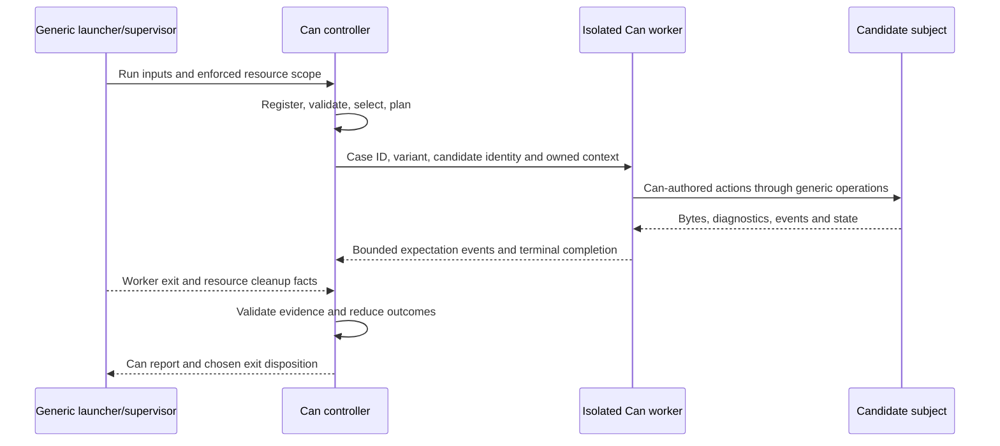

# Writing and running native Can tests

Status: **proposed authoring and execution contract; not implemented or executed;
agent-authorship optimization remains open**.
This is step 3 after the [completion contract](native-can-tests-completion-contract-2026-09-30.md)
and [coverage ledger](native-can-tests-migration-ledger-2026-09-30.md).
The examples explore a library-oriented authoring model. The subsequent
[execution architecture](native-can-test-architecture-2026-09-30.md) selects the
existing TypeScript/Bun backend with external native supervision and a separately
qualified reference toolchain. No migration, build or measurement is authorized
by these documents.

**A test is an ordinary Can function.** An explicit Can registry names the cases;
Can helpers stage inputs, perform actions, compare observations and report
outcomes. **Every concrete Can function requires attached `asserts`, including
live case functions.** Those roots run the real Can scenario with supplied
boundary observations; live cases separately execute in isolated workers.
No new `test` declaration, restricted language subset, reflection or executable manifest is needed for
these examples.

Ordinary functions supply the authoring structure. They do **not** supply missing
platform access by themselves: owned workspaces, ongoing child processes,
external browser automation and independent native observations need APIs.
The five examples below make those requirements concrete.

The subsequent [hard-case source challenge](native-can-test-hard-cases-2026-09-30.md)
identifies missing browser task/callback, native-value, descriptor and database
bindings. Its integrated experiments are unrun; preparatory mechanics now have
[recorded results](native-can-test-preparatory-results-2026-09-30.md). The authoring examples do not prove
that arbitrary Can functions already fit every synchronous foreign callback.

The subsequent [agent-authorship audit](preparation/native-can-test-authoring-2026-09-30/agent-authorship/audit.md)
found that the proposal established a coverage/execution model but had not
optimized its concrete APIs for agents. It revises check identity and focused
verification below, and reopens the context/fixture authoring pattern. The code
examples remain a current-language baseline, not a final implementation API.

The [post-probe review](native-can-test-design-review-2026-09-30.md) adds canonical
authoring requirements without inventing new syntax: give browser input,
upstream contact, response delivery, application witness and final seal distinct
typed facts/check IDs; keep actual input settlement available through disposal.
Use explicit fd-write/EOF/writer-exit observations and session-local raw native
handles. Fixture rows must distinguish successful behavior, deliberately failed
expectations and broken/missing evidence. A permissive helper that treats any
settled click, closed pipe or opaque ID as success would conceal the distinctions
the probes exposed. Ordinary Can functions own all these comparisons. Host
bindings never accept source strings, branch-bearing scenario descriptions or
expected-answer tables. Agent-ready typed packages and diagnostic examples remain
an implementation deliverable; the exploratory examples are not that acceptance.

## Intended author: an AI coding agent

Can is deliberately designed for AI coding agents to write, even when writing
it by hand is harsh for humans. In this document, the test author is an agent.
Human typing convenience and conventional testing-framework familiarity are
not the criteria for choosing the authoring surface.

Evaluate the design by whether an agent can generate a correct case, understand
its local contracts, locate a failure and make a bounded change reliably:

- Prefer explicit types, effects, fixture identities, ownership and expected
  outcomes when they remove inference or hidden state.
- Keep canonical forms predictable. Repeated case declarations and boundary
  fixture rows are acceptable when each states a useful, checkable contract.
- Make diagnostics identify the case, assertion, call site, fixture consumption
  and expected/observed facts so an agent can repair the relevant source.
- Keep edits local and mechanically checkable. Stable IDs and explicit links
  should expose stale dependencies rather than allowing a silent coverage loss.
- Judge helpers and new syntax by semantic clarity, error prevention and repair
  reliability. Fewer lines alone is not a benefit; gratuitous duplication that
  creates inconsistent contracts or excessive context demands is still a cost.

Consequently, mandatory assertions and explicit boundary fixtures are not a
design defect merely because a human would find them tedious. Their value is
whether they catch incorrect agent-written scenarios and make failures easier
to repair. The five examples expose that contract and its missing APIs. They
do not establish that the proposed spelling is optimal for agents; that requires
later correctness evidence, with no agent trial or benchmark authorized here.

## How to read the examples

All code blocks are **design fragments**, with imports and library definitions
omitted where stated. They have been reviewed against current Can syntax, but
have not been compiled. Every `spec`, `expect`, `fixture`, `compiler_probe`,
`proc`, `child`, `peer`, `traffic`, `socket`, `webtest`, `dom`, `native_probe`
and case-owned fixture-module name below is **proposed**, not an existing package.
The API inventory later in this document
separates Can library helpers from required native operations.

Current language features used here include callable records, explicit `near`
captures, `match chain`, bare completion forwarding and `relay call`. Existing
`process::run`, `process::options`, `process::result`, `bytes`, `checks` and
attached `asserts` provide the source-backed starting point. See the
[syntax review](preparation/native-can-test-authoring-2026-09-30/syntax-review.md)
and [observation review](preparation/native-can-test-authoring-2026-09-30/observation-review.md).

## Registering cases

**Revised direction:** co-locate each case descriptor, typed check references,
body and fixture entry points; let the suite registry reference descriptors.
Define each check identity once and reference it from both the declared plan
and the body. Validate the plan against separately retained coverage obligations.
The explicit plan remains essential; deriving it only from executed calls would
allow an early return to erase the evidence requirement. Ownership and mapping
validation belong to Can, with source-aware planning errors before live setup.

The flat registry and literal check strings below are the **baseline for this
comparison**, not the preferred final spelling. Shared typed descriptors are a
proposed library revision, whose complete shape still needs a worked example.

Put the suite in its own Can project. Keep subjects outside its source root:

```text
tests/suite/can.project.json       source_root = src
tests/suite/src/registry.can      explicit case list and profiles
tests/suite/src/compiler.can      ordinary case functions
tests/suite/src/process.can
tests/suite/src/server.can
tests/suite/src/browser.can
tests/suite/src/native.can
tests/suite/src/helpers/          ordinary reusable Can helpers
tests/fixtures/                   positive, malformed and static subjects
```

This is a proposed layout, not a directory migration. A malformed subject must
never become an imported module of the runner. TypeScript or other foreign
source may be a subject or static historical evidence where the ledger permits;
it cannot retain the surrounding scenario or oracle.

One common case signature keeps the registry type-checkable:

```can
record test_case
    str id
    str[] tags
    str[] requires
    int timeout_ms
    str[] required_checks
    callable void (spec::context) emits {spec::failed, spec::broken} body

test_case[] cases = [
    test_case("compiler/capture-type", ["compiler"], ["candidate-compiler"], 60000, ["valid-control", "capture-type"], callable capture_type),
    test_case("process/nonzero-result", ["process"], ["posix-false"], 15000, ["exit-code", "signal", "stdout", "stderr"], callable nonzero_result),
    test_case("server/graceful-drain", ["server"], ["candidate-build", "loopback", "managed-child", "websocket-client"], 90000, ["handler-entered", "shutdown-code", "shutdown-reason", "held-during-shutdown", "response-status", "response-body", "clean-exit", "no-forced-signal"], callable graceful_drain),
    test_case("browser/dirty-reset", ["browser"], ["candidate-browser-build", "browser-driver"], 120000, ["boot", "reset-verdict", "live-value", "live-checked", "live-selection", "page-errors", "console-policy", "network-policy"], callable dirty_reset),
    test_case("native/json-facts", ["native"], ["candidate-runtime", "native-observer"], 30000, ["large-source", "zero-source", "negative-zero", "raw-integer"], callable json_facts)
]
```

The IDs, requirements and illustrative deadlines are Can data. Profile planning,
filtering and matrix expansion are Can functions. Their comparison/selection
logic must have attached assertions. The registry is a package-level value,
not an unasserted function returning callable records. Construction must be deterministic
and perform no live I/O; validate duplicate IDs, invalid requirements and empty
profiles before executing cases. List order defines presentation order, not a
hidden dependency between cases.

Each worker loads the same verified suite artifact, reconstructs `cases` and
selects the requested ID. Only the ID, variant data and execution context cross
the process boundary. **Do not serialize callables or controller resource
handles.** Ordinary captures remain usable within a worker; the registered
callable must be reconstructible from the suite and declared immutable inputs.

`spec::context` is proposed **constructible data**, including case/variant
identity, candidate description, limits, a `str workspace` path and an ordinary
reporting callable. Reusable fixture helpers also receive typed operation
callables, directly or through a context field, when they need case-owned
boundary fixtures. The live reporter captures a constructible channel identifier;
the actual private channel authority stays in the native worker scope. Its own
mandatory assertions supply the write boundary using that data identifier.
Capturing an otherwise unconstructible opaque channel would recreate the
assertion-input problem. An offline context injects a pure no-I/O reporter. The same Can
comparisons and error completions execute in both contexts; there is no branch
that returns success merely because assertion execution is active.

Resource authority belongs to the executor's case scope and native owned
handles, not to copied context metadata. A path string supplies `process::options`
with a working directory; it cannot grant ownership or bypass confinement.
Readable variant metadata includes the browser engine. Do not make context an
opaque argument that assertion rows silently omit: current omission rules apply
only to specific request-scope types.

The effect bound matters: today's Can callable types include the declared error
set. A case exposing `process::timeout` directly cannot be put into the uniform
slot above. Ordinary **Can adapters** translate unexpected operational domain
errors into `spec::broken`, retaining their qualified kind, available fields,
operation and source/cause evidence. Expected errors are matched before that
translation. Standard failures remain standard failures and are classified at
the worker boundary. This is library work, not implicit error coercion or a new
catch-all language rule.

## Helpers and expectations

The proposed `spec::failed` error carries the named `str check`; richer expected
and actual values belong to the evidence event. `spec::broken` retains the
operation, qualified failure kind and available cause fields. Its use does not
erase the original domain error evidence.

Keep pure comparison and live reporting separate. An existing-language helper
can be written and checked today in this form:

```can
fn void require_exit_code
    emits {checks::failed}
    given
        int observed
        int expected
    asserts
        same: 3, 3 => ok
        different: 3, 4 => checks::failed{"unexpected exit code"}
    relay call checks::require(observed is expected, "unexpected exit code")
```

The live library's proposed `expect::int`, `expect::text`, `expect::bool` and
`expect::strings` use ordinary Can comparisons, attach a named observation and
record expected/actual evidence. On mismatch they append a failed expectation
event **before** emitting `spec::failed`. A Can reducer keeps that mismatch in
the case result even if a helper catches the error and later returns `ok`.
There is no native `test_passed` decision. Native transport only moves and bounds
the events. A lost/full/broken event channel makes execution incomplete.

To test a comparator's negative behavior, test its pure result or ordinary error
using `asserts`; do not commit an intentionally failed live expectation to the
same case journal. An expected failure of a subject is observed as data and then
compared. A worker `ok` alone is insufficient evidence for success.

Checks short-circuit by ordinary error propagation. Authors can collect several
pure comparison results and then record them for a richer failure report. The
library does not retry failed cases by default. Bounded polling of readiness is
a Can helper with an explicit deadline and predicate, not a concealed retry of
the whole scenario.

## Mandatory assertions and live execution

There are two executions of the same author-written case body:

- **Attached assertion:** pass a concrete offline context and supply individual
  effect-boundary results through existing `match call` / `when` fixtures. The
  scenario's control flow and expectations actually run. A useful negative row
  changes an observation and expects the corresponding named failure.
- **Live case:** the isolated worker invokes the registered callable with its
  live context. It performs real operations; offline fixture rows are inactive.
  Only this execution can supply live migration/qualification evidence.

`when` belongs to one `match call`; it cannot decorate `match chain`. The expanded
subprocess example below shows both positive and negative roots at the exact
call boundary. Larger scenarios use ordinary case-owned observation helpers
with individual `match call` sites, exported scenario markers and explicit
`link` rows. A root can say `link compiler_io::scripted`; inside that package a
fixture selector says `scenario scripted:`, not a qualified scenario name.
Reusable higher-level helpers call the injected operation functions, so their
mutation/parsing logic still executes while raw file/process results are supplied.
The same case-owned operation wrapper calls the real native operation live.
Generic native libraries contain neither case-specific fixture tables nor case
verdicts. Pure mutation, parsing, comparison and scheduling functions retain
their own meaningful assertions. A fixture must not replace the complete case
with `ok`, or supply away the very comparison/control flow under test.

`spec::offline_context` is a proposed pure Can constructor helper with its own
assertions. Bind the offline reporter and operation callables as package-level
values, then reuse those same values in the helper's actual and expected context
records. Do not assume separately constructed nested callable wrappers compare
equal. A direct context constructor in each root is also valid; it trades the
factory for more repeated fields; choose based on contract consistency and local
reasoning, not hand-typing effort. Constructor/fixture admission remains a small
required implementation check, not a proven result of these uncompiled snippets.
The offline recorder deliberately does no persistent I/O. This checks case
behavior but not live journal delivery; the reporter/reducer need separate
positive and negative coverage, and live execution validates the event channel.
Unsupplied native effects during attached assertions remain errors. There is
no implicit live-effect assertion mode or exemption for registered functions.

For the four longer examples, code shows the **scenario body only**. The
per-example fixture contract specifies the mandatory roots needed around that
body; imports, context/helper implementations and full boundary fixture tables
are still library design work. These excerpts are not standalone Can files.

## Example 1 Compiler rejection

Use a valid project containing `combine` with `near int prefix` and a caller
binding `callable combine with prefix = doubled`, where `doubled` is an `int`.
Make one separate copy whose binding becomes:

```can
callable int (int) emits {} action = callable combine with prefix = "bad"
```

The accepted control comes from the current
[explicit-capture source](/Users/vince/Projects/can-lang/compiler/lsp_g03_test.go:37).
The checker assigns `CAN-CHECK-CAPTURE` to a mistyped explicit capture
[at this boundary](/Users/vince/Projects/can-lang/compiler/internal/check/callables.go:149).
This avoids inventing an unimplemented diagnostic code for the example.

```can
match chain
    call fixture::stage_project(c, "capture-valid") as fixture::project good
    call fixture::replace_once(c, good, "src/main.can", "prefix = doubled", "prefix = \"bad\"") as fixture::edit bad
    call compiler_probe::check(c, good) as compiler_probe::report accepted
    call compiler_probe::check(c, bad.project) as compiler_probe::report rejected
    call expect::accepted(c, "valid-control", accepted)
    call expect::rejected_at(c, "capture-type", rejected, "check", "CAN-CHECK-CAPTURE", bad.replacement_span)
    spec::failed
    spec::broken
    ok => ok
```

The enclosing `capture_type(c)` has a `scripted` assertion with
`call spec::offline_context("compiler/capture-type") => ok link compiler_io::scripted`.
Its case-owned boundary fixtures supply source/file operations and compiler
process bytes; the mutation, report parser, phase/code/span matcher and
expectations execute normally. A negative root supplies a parse rejection
instead of `CAN-CHECK-CAPTURE` and expects `spec::failed{"capture-type"}`; another
supplies a malformed compiler report and expects `spec::broken`. Do not supply
`compiler_probe::check` with a preaccepted verdict while claiming to test its
report parser. The exact fixture/helper declarations remain to be authored.

`replace_once` is a Can helper that requires exactly one match, writes a new
owned project and records the changed byte range. It does not rewrite the good
control. The diagnostic matcher requires the primary span to refer to the
changed file and overlap the replacement expression; it does not arbitrarily
demand that the diagnostic cover the entire replacement string.
This narrow example requires exactly one error diagnostic with that code/phase
and no unrelated error diagnostics. Expected notes or warnings must be listed
explicitly; seeing the desired code somewhere in a broken project is insufficient.

**Proposed compiler observation API:** `canlc check --json PROJECT`, backed by
the existing [CheckSnapshot](/Users/vince/Projects/can-lang/compiler/internal/driver/diagnostics.go:73).
It performs project loading, resolution and semantic checking without assertion
execution, emission or publication. It returns a versioned report with an
accepted/rejected analysis result, phase, diagnostics, severity, codes, primary
and related locations, input digests and compiler identity. Expected diagnostics
remain in Can.

Use project-relative paths and explicitly named coordinates. Preserve the
frontend's existing zero-based UTF-16 line/column convention; if byte ranges are
also exposed, label them and test Unicode conversion rather than conflating the
two. Report parsing and source-span conversion belong to ordinary Can helpers.

Proposed command statuses are 0 for completed accepted checking, 1 for completed
rejected checking, and 2 for invocation/internal/report failure. Can validates
both status and report; mismatches, signals, timeouts and malformed output are
execution errors. Parse-only failure with a different code/phase is a failed
expectation, not the intended rejection. A valid control that also rejects makes
the case fail. Current commands plus stderr matching can be an explicitly
limited intermediate migration, but do not masquerade as this structured API.

**What this exposes:** public structured semantic checking is missing; the
internal analysis is available. The mutation, valid control, span matching and
expectation are ordinary Can work. This example does not prove every negative
compiler obligation in the ledger.

## Example 2 Subprocess result

This case protects a completed **nonzero** subprocess result and its separate
stream/signal fields. It uses a qualified POSIX `/usr/bin/false` with bounded
execution. The complete case fragment below includes the required assertions;
the proposed context, wrapper and expectation library definitions are omitted.

```can
fn void nonzero_result
    emits {spec::failed, spec::broken}
    given
        spec::context c
    asserts
        expected: call spec::offline_context("process/nonzero-result") => ok
        wrong_code: call spec::offline_context("process/nonzero-result") => spec::failed{"exit-code"}
    bytes::buffer empty = call bytes::empty()
    process::options options = process::options(c.workspace, false, [], empty, 4096, 4096, 5000, 250)
    match call proc::run(c, "/usr/bin/false", [], options)
        when
            expected: c, "/usr/bin/false", [], options => ok process::result(empty, empty, 1, "")
            wrong_code: c, "/usr/bin/false", [], options => ok process::result(empty, empty, 0, "")
        spec::broken
        ok process::result result => match chain
            call expect::int(c, "exit-code", result.code, 1)
            call expect::text(c, "signal", result.signal, "")
            call expect::bytes(c, "stdout", result.stdout, empty)
            call expect::bytes(c, "stderr", result.stderr, empty)
            spec::failed
            spec::broken
            ok => ok
```

`proc::run` is a **Can wrapper around existing `process::run`**, adding operation
evidence and error normalization, not another native process implementation.
It preserves nonzero exit codes and signals as raw results. It must not call
`process::require_success` internally: cases can legitimately expect a nonzero
exit. No shell or foreign scenario script is involved. Supplying the wrapper's
result checks this case's comparisons; `proc::run` itself also needs assertions
at the underlying process boundary to check error normalization and evidence.

The source contracts for options, supplied process results and live execution
are visible in [the existing process example](/Users/vince/Projects/can-lang/examples/process/src/main.can:22).
The executable path is a requirement of this proposed POSIX profile; unsupported
hosts are not silently credited with equivalent coverage. The broader ledger
still needs explicit stdin, literal arguments, nonempty/binary streams, signals,
timeouts, output limits and descendant cleanup cases. Empty expected streams in
this small example do not prove that stdout and stderr cannot be swapped.

The `wrong_code` root must fail at the real `expect::int` call. It demonstrates
that supplied successful fixture execution is not the same as a passing test.
Both roots are offline evidence. A live worker must still execute the process;
its report must never relabel a supplied result as live evidence.

**What this exposes:** one-shot execution already exists. The new work is the
Can helper/report layer and supervised case workspace, not new test syntax or
a duplicate spawn implementation.

## Example 3 Server lifecycle

Use a small **ordinary Can subject fixture** compiled by the candidate. Its
`/health` returns 200. Its `/hold` handler announces arrival to a run-owned
loopback peer and waits for that peer's response before returning `finished`.
The peer protocol is fixture input; Can chooses when to respond. No test policy
is embedded in the native peer implementation. The subject also exposes a
WebSocket endpoint, used to observe entry to signal-driven shutdown.

```can
match chain
    call peer::open(c) as peer::handle gate
    call fixture::build_server(c, "drain", gate.url) as fixture::server_subject app
    call child::start(c, app.command, app.arguments, app.inputs) as child::handle server
    call traffic::await_status(c, app.health_url, 200, 3000)
    call socket::open(c, app.socket_url) as socket::handle witness
    call traffic::begin_get(c, app.hold_url) as traffic::pending request
    call peer::next_request(c, gate, 3000) as peer::request arrived
    call expect::text(c, "handler-entered", arrived.path, "/arrive")
    call child::signal(c, server, "SIGTERM")
    call socket::await_close(c, witness, 3000) as socket::closed shutdown
    call expect::int(c, "shutdown-code", shutdown.code, 1001)
    call expect::text(c, "shutdown-reason", shutdown.reason, "shutdown")
    call traffic::is_pending(c, request) as bool held
    call expect::bool(c, "held-during-shutdown", held, true)
    call peer::respond(c, arrived, 200, "release")
    call traffic::finish(c, request, 3000) as traffic::response response
    call expect::int(c, "response-status", response.status, 200)
    call expect::text(c, "response-body", response.text, "finished")
    call child::wait(c, server, 3000) as child::exit exited
    call expect::int(c, "clean-exit", exited.code, 0)
    call expect::text(c, "no-forced-signal", exited.signal, "")
    call peer::close(c, gate)
    spec::failed
    spec::broken
    ok => ok
```

The enclosing `graceful_drain(c)` has an offline `scripted` root linked to
`server_io::scripted`. Its boundary queues supply acquisition, readiness,
WebSocket establishment, handler arrival, signal receipt, close(1001, "shutdown"),
pending HTTP, peer response, HTTP completion and child exit in that order.
Can still chooses every step. Negative roots change the close reason, report the
HTTP request already complete, or return a forced signal; each must reach its
named failed expectation. Local helper assertions also cover operation errors
and queue exhaustion. This supplied trace cannot prove real signal ordering.

`fixture::build_server` is a Can helper: stage fixture data, build with the candidate,
validate build provenance and prepare arguments. It does not start or test the
server behind the author's back. `app.inputs` is explicit child-descriptor data;
the helper can supply a credential snapshot on descriptor 3 where that is the
subject's contract. Descriptor passing must not be replaced with an environment
variable. Bound port allocation/readiness and credential handling are separate
parts of this helper contract, not an assumption that a chosen port is always
free.

The admitted `/arrive` observation establishes that the handler is in flight;
a signal-send receipt alone cannot prove that the server processed the signal.
The current [signal handler](/Users/vince/Projects/can-lang/runtime/platform/server.ts:649)
closes server WebSocket sessions before waiting for resource drainage, and
[session closure](/Users/vince/Projects/can-lang/runtime/platform/websocket.ts:255)
sends code 1001 with reason `shutdown`. Observe that external close while the
held HTTP operation is still pending, then release it. This witnesses entry to
the shutdown path with work outstanding; it does **not** prove TCP admission
already stopped. The fixture must not close that socket through another path.

Waiting for a refused fresh connection before releasing the held handler would
be a bad substitute: the current resource closer reaches `server.stop(false)`
only after active leases drain. The proposed combined fixture still needs
bounded correctness validation, particularly whether scope expiry interrupts
its held peer request. If it does, use a retained-work fixture consistent with
the actual shutdown contract; do not change production shutdown semantics to
make this test pass. The existing independent socket witness resolves the
authoring choice, not that unexecuted fixture validation.

`traffic::await_status` polls using a Can predicate and monotonic deadline;
native HTTP returns facts. The case's child wait deadline and supervisor's hard
deadline are distinct. If graceful stop fails, the test does not pass because
supervision later force-kills the child. The forced kill is execution/cleanup
evidence and the graceful expectation remains failed.

Native resource acquisition registers the process/peer/workspace in an owned
parent scope before exposure. Success, early mismatch, standard fault,
interruption and killed worker all have a cleanup path independent of the case
reaching its last line. Normal explicit close is shown; fallback cleanup must
still record omissions/failures according to the resource contract. Can has no
general `finally`, and adding a closing call at the bottom is insufficient.

Ledger LIFE-008 and LIFE-010/011 require additional startup-failure, replay,
trickle, crash and independent DB checks. They remain separate obligations;
this illustrative gate fixture is not evidence that those product paths work.
The [existing lifecycle helpers](/Users/vince/Projects/can-lang/tests/integration/gate3_matrix_test.go:330)
and [shutdown scenarios](/Users/vince/Projects/can-lang/tests/integration/gate3_matrix_test.go:1795)
ground the need for descriptors, signals, bounded waits and independent effects.

**What this exposes:** managed child, peer/request and external WebSocket client
handles are missing. Can owns the action order and expectations. No new
test-specific runtime lifecycle event is required by this proposed witness.

## Example 4 Browser interaction

Run the current browser-controls Can fixture through the candidate's production
browser build, then drive a selected real engine. This example retains the
dirty-reset behavior from [the host scenario](/Users/vince/Projects/can-lang/tests/integration/browser/controls.mjs:259).

```can
match chain
    call fixture::browser_app(c, "browser-controls") as fixture::site site
    call webtest::open(c, c.engine, site.url) as webtest::page page
    call webtest::await_text(c, "boot", page, "#done", "done", 3000)
    call webtest::fill(c, page, "#f-text", "dirty work")
    call webtest::check(c, page, "#f-check")
    call webtest::select(c, page, "#f-multi", ["a", "c"])
    call webtest::click(c, page, "#b-reset")
    call webtest::await_text(c, "reset-verdict", page, "#v-reset", "reset=start|false|", 3000)
    call dom::value(c, page, "#f-text") as str value
    call dom::checked(c, page, "#f-check") as bool checked
    call dom::selected_values(c, page, "#f-multi") as str[] selected
    call expect::text(c, "live-value", value, "start")
    call expect::bool(c, "live-checked", checked, false)
    call expect::strings(c, "live-selection", selected, [])
    call webtest::close(c, page) as webtest::events events
    call expect::int(c, "page-errors", events.page_errors.length, 0)
    call expect::console_policy(c, "console-policy", events.console_errors)
    call expect::network_policy(c, "network-policy", events.requests, events.blocked_requests)
    spec::failed
    spec::broken
    ok => ok
```

The enclosing `dirty_reset(c)` has `scripted` and negative assertion roots linked
to case-owned `browser_io` scenarios. Supply stage/build/driver boundaries,
including armed-collection evidence, live properties and the completed event
barrier; keep Can await predicates and all comparisons active. Negative roots
include a wrong live value, an unpermitted console message and an incomplete
collection barrier. The last is an execution error, not an empty clean ledger.

The fixture's actual [bootstrap marker](/Users/vince/Projects/can-lang/tests/integration/testdata/browser-controls/src/main.can:369)
is `#done` containing `done`. The library's await helper makes each final equality a named expectation and records
timeout/final value. It does not silently retry the entire case. Browser-engine
versions and served artifact identities are part of the report.

`console_policy` is a Can helper retaining the current exact, trimmed-message
allowlist from [controls.mjs](/Users/vince/Projects/can-lang/tests/integration/browser/controls.mjs:292):

- `Unrecognized Content-Security-Policy directive 'navigate-to'.`
- `Refused to apply a stylesheet because its hash, its nonce, or 'unsafe-inline' does not appear in the style-src directive of the Content Security Policy.`

The native driver returns raw events, including permitted warnings. Can records
raw and unpermitted counts; it does not broadly ignore CSP messages. Network
policy checks blocked requests and every recorded URL: only `127.0.0.1` or
`localhost`, and no `/api/` URL, for this fixture. The expected policy belongs
to Can fixture data, not a driver-wide hidden filter.

The page's `v-reset` is emitted by compiled Can
[in its reset callback](/Users/vince/Projects/can-lang/tests/integration/testdata/browser-controls/src/main.can:237).
Independent `dom::*` observations read native live properties through the
automation driver, bypassing the Can browser adapter under test. An attribute
read cannot replace a property read. The separate native-controls case must
retain the diagnostic distinction: after filling `user edit` and setting the
`value` attribute to `normalized`, live value remains `user edit` while the
attribute becomes `normalized`. A driver mutant that returns the attribute
for `dom::value` must be detected by that control.

The profile expands this case into Chromium, WebKit and Firefox variants where
all three are required. A fresh context belongs to each case. With a shared
remote Firefox service, close the owned context/connection according to its
ownership contract; do not terminate the shared browser. Installations may be
managed/shared dependencies, but sessions and downloaded artifacts are scoped.

Generic driver operations may use fixed implementation code to read a selected
property, synthesize a specified event or fulfill an intercepted request. Can
supplies the sequence, arguments and comparisons. **No `evaluate("JavaScript")`
escape hatch and no unchanged Playwright script qualifies as migration.** More
complex page logic can be a separately compiled Can probe. It must not replace
independent native observations with the same production adapter on both sides.

Before closing the case, the driver must drain bounded event observations through
a defined closing barrier: arm before navigation, stop owned page activity,
drain outstanding asynchronous callbacks and seal a final watermark within a
deadline. Closing a page alone does not finish a request callback that is still
awaiting its response. Late events or an unsealed stream invalidate completeness.
A ledger of zero events is not evidence if collection
was never armed or ended early. Network containment must block disallowed
destinations before contact; post-hoc logging alone is insufficient. Broader
browser cases still need physical versus synthetic input, selection/composition,
request interception, response injection and page/server rendezvous APIs.

**What this exposes:** in-page `browser::*` exists; external automation and these
independent reads do not. Ordinary functions express the case without a browser
testing DSL, but the initial operation list does not cover the entire ledger.

## Example 5 Native runtime observation

Migrate the native JSON-source/negative-zero/raw-integer probe from
[native qualification](/Users/vince/Projects/can-lang/tests/conformance/native.ts:36).
Can chooses inputs and expected outputs. A disposable observation session runs
against the **candidate runtime**, not whichever runtime happened to execute
the test controller.

```can
match chain
    call native_probe::open(c) as native_probe::session session
    call native_probe::parse_json(session, "{\"large\":9007199254740993,\"zero\":-0}") as native_probe::json_observation parsed
    call native_probe::source_at(session, parsed, "/large") as str large
    call native_probe::source_at(session, parsed, "/zero") as str zero
    call native_probe::negative_zero_at(session, parsed, "/zero") as bool signed
    call expect::text(c, "large-source", large, "9007199254740993")
    call expect::text(c, "zero-source", zero, "-0")
    call expect::bool(c, "negative-zero", signed, true)
    call native_probe::raw_json_object(session, "large", large) as str rendered
    call expect::text(c, "raw-integer", rendered, "{\"large\":9007199254740993}")
    call native_probe::close(session)
    spec::failed
    spec::broken
    ok => ok
```

The enclosing `json_facts(c)` has a `scripted` root linked to
`native_io::scripted`: supply a session/parse handle and the four raw facts at
their individual observation calls. Negative roots alter each fact and expect
the corresponding named failure; a missing operation produces `spec::broken`
with preserved kind. Can parsing-path choices and comparisons still execute.
These roots test the oracle. Only the separate live candidate session can
establish that the native runtime actually supplies those facts.

`parse_json` invokes native `JSON.parse` with a fixed observation callback that
records source lexemes keyed by path; it contains no example input or expected
token. `negative_zero_at` reports the native signed-zero fact for the selected
number. `raw_json_object` performs `JSON.rawJSON` and native serialization of the
caller-provided field/token. It does not compare the result. Native handles stay
inside that disposable session and cannot be serialized into another worker.
The Can wrapper exposes failures as explicit operation evidence/`spec::broken`;
low-level missing-API observations are available to negative-control cases.

The JSON document used for reporting never transports `-0` or the large token
as an ordinary JSON number: preserve tokens as strings and signed zero as an
observed boolean or explicitly tagged bits. Otherwise the report channel could
destroy the fact before Can compares it.

Required controls include a rounded-token observation, lost signed zero, wrong
raw serialization and a missing `JSON.rawJSON`. Pure Can report/comparison tests
can verify rejection of altered observations. To prove the actual native path,
use an isolated, generic operation that masks a named native property in the
candidate probe process; Can's qualification logic must then report the missing
API, without a fallback. Never mutate the controller or a shared runtime. The
fault-installation and provenance contract remains required API design.

This is **native runtime qualification**. A separate normal Can codec program
must still be compiled and run to prove production codec behavior. Conversely,
a Can codec round trip is not independent evidence that native source tokens
or raw JSON work. Hostile getters/proxies, thenable assimilation, raw identity
and native call counting need further scoped mechanics; none is solved by this
one JSON example.

**What this exposes:** the oracle and sequence are ordinary Can. The gap is a
reviewed native observation/fault surface whose operations return facts rather
than carrying the old `qualify` implementation and verdicts.

## Fixtures and resource lifetime

| Fixture kind | Authoring and evidence rule |
| --- | --- |
| Attached `asserts` and named `when` rows | Existing offline semantics; reusable helper/scenario logic can be checked with supplied results. Each label retains its fixture identity and queue consumption. No live qualification credit. |
| Static source, JSON, SQL, HTML, bytes and expected vectors | Explicit inputs under fixture roots. Can selects and consumes them; no executable foreign scenario hidden in a manifest or data string. |
| Valid/invalid compiler pair | Separate owned copies, exact mutation count, input digests and source mapping. The runner project remains valid. |
| Live server/browser/database fixture | Ordinary Can setup helpers plus generic native mechanics; scoped handles, explicit endpoint/credential bindings and independent observations where required. |
| Shared read-only candidate build | Reuse within a run if compiler/runtime/source/options identity matches; mutable DBs, pages and source mutations stay case-owned. Build/determinism/corruption cases opt out explicitly. |

Register an owned parent/reservation before materializing child resources so a
crash during acquisition is recoverable. No author writes `rm -rf` in an
after-test shell hook. Native supervision enforces resource containment and
returns cleanup facts; Can decides fixture reuse, planned teardown and report
policy. Failed cleanup prevents clean success even when comparisons passed.
Recovery needs owner/path identity and inactivity proof; uncertain liveness
retains the resource and reports the unresolved state.

Resource settings are part of the selected Can profile. For the initial authoring
examples, one case worker, named per-case deadlines, a ten-minute quick run and
one-MiB case evidence were proposed. The subsequent [lifecycle contract](native-can-test-lifecycle-2026-09-30.md#5-concurrency-and-resource-admission)
now defines the shared phase/concurrency rules and finite quick/larger-job ceilings,
including cleanup reserves and owned storage. They are policy limits, not measured
capacity; host enforcement and complete type-specific admission remain required.
Retain bounded excerpts, hashes and diagnostics rather than bundles/screenshots.
No executions or measurements are authorized by recording these defaults. Heavy
retention still requires explicit expiry and automatic reclamation.

## Listing selecting and running

The coding agent's workflow is: write an ordinary function and its supplied assertion
roots, register its ID/requirements/check inventory, inspect the selected plan,
run a live subset, then read named failures and cleanup evidence. Adding a helper
uses ordinary Can modules and callable/effect rules.

The existing [assertion command](../implementation/assertions.md) can select a
package, declaration and root, for example the proposed suite's `wrong_code`
root. Its command shape is `canlc assert PROJECT PACKAGE DECLARATION ASSERTION`.
That checks supplied behavior, not the real `/usr/bin/false` execution. The
suite project and proposed library still need to be implemented before that
example can be run.

These are **proposed commands**, not commands that exist today:

```sh
canlc test tests/suite --list --profile quick
canlc test tests/suite --profile quick --case compiler/capture-type --candidate /path/to/candidate/canlc
canlc test tests/suite --profile quick --tag process --jobs 1 --candidate /path/to/candidate/canlc
canlc test tests/suite --profile browser --engine chromium --case browser/dirty-reset --candidate /path/to/candidate/canlc
canlc test tests/suite --profile qualification --report /path/to/compact-report.json --candidate /path/to/candidate/canlc
```

The trusted launcher prepares/locates the suite artifact and runs its ordinary
Can entrypoint. The library parses selection, builds the execution plan,
dispatches workers and reduces results. The launcher may provision and enforce
generic limits; it must not become a new Go implementation of case policy.
The trusted runner/executor identity is recorded separately from the explicit
candidate. The architecture decision now fixes reference compilation, separate
Can controller/case processes and generic native supervision; the concrete live
protocol and first reference acceptance evidence remain required work.

**Revised verification contract:** once a qualified pre-verification planner
exists, a focused development run checks all suite source, then verifies the
selected cases and a conservatively established set
of helper/fixture roots. Include callable targets, generic specializations,
scenario providers and shared dependencies; uncertainty requires all roots.
This dependency planner is proposed work. Current `canlc assert` already
separates whole-source checking from selected root execution.
The architecture starts with all-root verification until that planner is
qualified; a newly edited controller cannot decide to omit its own unverified
roots. Reference-toolchain trust and reviewed suite/oracle trust are recorded
separately for full qualification.

Record the exact verified root set and dependency-selection basis, bound to
suite/compiler/executor/options identities. Reuse artifacts within the owned
run; do not introduce persistent full bundles. Mark focused verification and
coverage as partial. Full qualification still requires all mandatory roots,
retained obligations and required environments. Partial receipts cannot satisfy
verified production publication; define a nonpublishing test-execution path.
Source checking remains mandatory, offline evidence stays distinct from live
evidence, and listing confers neither verification nor live-test success.

Proposed selection rules:

- An ID is stable data independent of its function/file name. Unknown IDs/tags,
  duplicate registrations and zero selected cases are usage/planning errors.
- Repeated `--case` values form a union; repeated `--tag` values form a union;
  different selector categories intersect the profile. Exact IDs only initially.
- Matrix variants are data such as `engine=chromium`; report identity is
  `(case_id, variant, attempt)`. Listing shows the expanded variants and declared
  requirements. A function/closure may be reused, but distinct variants keep
  separate selection and evidence identities.
- `--list` does not stage subject builds, open a browser, contact a DB or run a
  case. Locating/compiling the suite itself, if needed, must be reported as such.
- Quick profile initially selects small compiler/process/native cases; browser,
  lifecycle and full qualification have explicit profiles. Their eventual full
  membership must come from the migration ledger, not these five examples.
- Missing required capabilities block selected cases. An engine omitted by a
  filter is unselected; an engine required by the plan but unavailable is blocked.
  There is no unrestricted imperative `skip()` that can turn lost coverage green.
- A successful filtered run is success for its selected scope. It never asserts
  full-profile/full-migration qualification. Default attempts = 1; any later
  opt-in reruns retain every attempt and cannot silently replace failure evidence.

Ordinary helpers can use normal modules, generics, closures and coordination
within their target/effect rules. Running a case in the controller's event loop
is insufficient isolation; an external bound must stop non-yielding workers and
their descendants. Browser-target helpers remain browser code; this proposal
does not erase target restrictions to permit every function in every process.



## Failures and reports

The [lifecycle contract](native-can-test-lifecycle-2026-09-30.md) now specifies
the detailed transitions, subset versus incomplete coverage, retry history,
cross-job qualification and exit/cleanup protocol behind these examples.

There are three independent dimensions: **behavior**, **execution** and
**cleanup**. Preserve all three if they fail together; a cleanup error must not
erase the original mismatch, and a caught mismatch must not disappear behind a
later `ok`.

| Presented outcome | Meaning |
| --- | --- |
| Passed | Valid terminal `ok`, no recorded mismatch, complete required observations, successful worker exit and confirmed cleanup |
| Failed | A Can expectation failed or the case emitted `spec::failed`; retain observed values and the failed check identity |
| Error | Unexpected `spec::broken`/standard failure, crash, timeout, malformed/missing evidence or cleanup failure; retain any simultaneous behavioral failure |
| Blocked | A selected case could not begin because a required capability/dependency was unavailable; qualification incomplete |
| Cancelled or not run | Interruption or explicit stop policy prevented completion; retain the selected cases still outstanding |

Explicit profile exclusions/unselected cases are recorded separately. They are
not passes. A legacy skip translated during migration needs a reason and an
honest coverage effect; all-skipped/blocked/empty runs cannot become successful
qualification.

Each registration supplies a Can-owned required-check inventory; matrix planning
can specialize it by variant before execution. Bind its digest to the selected
ledger obligations and to the report. Check references should reuse shared typed
Can definitions rather than independently typed strings. Reconcile plans with a
separately retained Can coverage manifest derived from the ledger: deleting both
an expectation and its local plan entry must still expose a missing obligation.
The manifest must not be regenerated from passing events. Coverage changes remain
reviewable, and this mechanism cannot prove that an oracle itself is correct.
A successful case requires one final event
for each planned check. Duplicate/unexpected check IDs and wrong evidence scopes
are errors. If a named mismatch short-circuits the case, preserve that failure
and mark subsequent checks `not_reached`; this ordinary failure is not itself a
protocol error. Sequence gaps, invalid terminal records and incomplete cleanup
remain independent errors. Readiness polling produces operation attempts and one
final named check, not repeated successful check events. The browser example's
two awaits therefore declare `boot` and `reset-verdict` explicitly. Resource
acquisitions/cleanup have a separate complete ownership ledger.

Returning early with `ok` leaves missing checks and is an execution error. A
zero-check case needs an explicit alternative obligation such as a validated
artifact comparison; it cannot pass by default. Pure Can reducer assertions must
exercise missing checks, duplicates, caught mismatches, malformed identities,
blocked variants and combined behavior/cleanup failures.

The worker channel is separate from subject stdout/stderr and is not inherited
by candidate children. Messages carry schema version, run ID, case ID, variant,
attempt and ordered sequence numbers. Can validates expected identity, duplicate
terminal records, sequence gaps, malformed payloads and output truncation. The
channel limit failing must remain observable even if the worker cannot send a
final message. Native supervision reports facts; the Can reducer determines
whether the evidence supports the case.

An illustrative **unexecuted** compact report shape:

```json
{
  "schema": "can.test-report.v1",
  "mode": "execute",
  "run_id": "illustration-only",
  "runner": {"suite_digest": "<digest>", "executor_digest": "<digest>"},
  "candidate": {"compiler_digest": "<digest>", "runtime_digest": "<digest>"},
  "selection": {"profile": "quick", "case_ids": ["compiler/capture-type"], "scope": "subset"},
  "verification": {"scope": "partial", "root_ids": ["<selected-case-and-dependency-root-identities>"], "selection_basis": "<conservative-dependency-evidence>", "receipt_digest": "<digest>"},
  "coverage": {"selected": 1, "completed": 1, "blocked": 0, "unselected": ["process/nonzero-result", "native/json-facts"], "qualification": "partial"},
  "cases": [{
    "id": "compiler/capture-type",
    "variant": {},
    "attempt": 1,
    "outcome": "passed",
    "behavior": "passed",
    "execution": "completed",
    "cleanup": "complete",
    "check_plan": {"digest": "<digest>", "required": ["valid-control", "capture-type"], "completed": 2},
    "evidence": [
      {"check": "valid-control", "observed": "accepted", "passed": true},
      {"check": "capture-type", "phase": "check", "code": "CAN-CHECK-CAPTURE", "span_match": true, "passed": true}
    ]
  }],
  "outcome": "passed",
  "exit_code": 0
}
```

The actual report must also bind fixture/input/options digests, capability and
engine versions, evidence scope (live, supplied assertion, native qualification,
production build), durations, limits and bounded diagnostic details. A failure
entry includes source/call site when available, expected/actual, operation/cause
identity, truncation/redaction indicators and cleanup errors. Credentials and
unbounded native error bodies must not be copied into reports. Reports use
Can-authored comparison/aggregation policy; native code may serialize or
transport data but does not supply a case verdict.

For example, an illustrative browser mismatch would read:
`FAILED browser/dirty-reset [engine=chromium] check=live-value expected="start" observed="dirty work"`.
The machine report also retains `execution=completed` and `cleanup=complete`
when those facts hold. If the driver then fails to close its context, retain the
mismatch and report the additional cleanup error; do not overwrite it with a
generic timeout message. None of these illustrative outcomes is an actual run.

Proposed suite exit mapping: 0 = complete success for the declared selected
scope (or successful listing); 1 = behavioral failure with otherwise valid
execution; 2 = planning, blocked/incomplete, execution or cleanup error. Preserve
the conventional interruption status where applicable and always mark coverage
incomplete. The Can controller chooses the ordinary run disposition; a thin
launcher propagates it. This mapping is a proposed suite protocol, not an
existing `main` return-value feature.

The outer supervisor must issue a separate completion/cleanup receipt. If the
controller dies, no valid Can aggregate exists: emit a generic execution-failure
envelope and nonzero status. If outer cleanup fails after a Can report was
written, the run is not a clean success. Consumers require the Can report **and**
the supervision receipt; they cannot accept an earlier behavioral `passed` field
alone. This is enforcement of the generic execution contract, not a native
replacement for Can comparisons.

## API inventory and design readiness

| Surface | Existing basis | Proposed work and required boundary |
| --- | --- | --- |
| Registry/profiles/selection | Callable records, arrays, ordinary functions | Shared typed Can descriptors/check references, independent obligation validation and variant planning; library proposal, language alternatives still open |
| Helpers and comparison | `checks::require`, matching, mandatory attached assertions | Constructible context/reporter and case-owned linked boundary fixtures; Can comparison/evidence library, required-check plans and sticky mismatches |
| One-shot subprocess | `process::run`, bounded streams/deadlines and results | Can wrappers and context/evidence integration; reuse native spawn implementation |
| Compiler rejection | Internal `CheckSnapshot` | General structured semantic CLI; explicit phase/status/coordinate schema and Can matchers |
| Workspace and case events | Files/bytes/I/O plus existing host supervision evidence | Owned acquisition/recovery and bounded private channel mechanics; Can reporting policy |
| Managed child and async request | Current one-shot process and HTTP client | Opaque owned handles, descriptor input, events, signal/wait, pending requests; preserve child/callback leases |
| Server synchronization | Signal path closes WebSockets before lease drain | Generic peer and external WebSocket client, bounded request-state observations; Can choreography; validate the combined retained-work fixture |
| External browser | Current in-page Can browser operations | Driver actions, independent native reads, event lifecycle, interception and containment; no authored JS scenario escape hatch |
| Native observation | Existing qualified native APIs and host probes | Scoped raw-value/identity observations and isolated faults; no encoded expectations or fixed test sequences |
| Reports and launcher | Existing assertion supervision and selected root execution | Conservative verification selection with all-root fallback; nonpublishing live protocol and outer receipt under the chosen reference-built TypeScript/Bun architecture |

**Authoring conclusion:** ordinary Can functions suffice for registration,
composition, setup choices, action sequencing, comparison and result policy in
these examples, using explicit boundary fixtures for their mandatory assertion
roots. This establishes a plausible current-language route, not an optimal
agent-authoring pattern. General Can improvements remain legitimate alternatives
where they improve correctness or repair while retaining normal functions. A complete
implementation still depends on the missing APIs; helper names without defined
contracts would conceal those gaps. Any future syntax proposal must improve
reliable agent authorship rather than merely shortening these examples.

The subsequent [shared capability contracts](native-can-test-capabilities-2026-09-30.md)
define managed ownership, process operations, structured diagnostics, the browser
action/event boundary and scoped native observations/faults. Their logical
operation names clarify the proposed helper names here; neither set is an
implemented package declaration. Before freezing implementation lanes, finish
host enforcement/recovery design, the retained-work fixture, canonical Can
bindings and the full ledger-to-operation mapping. Native identity, late work,
database independence and interception need complete coverage, not just these
five samples. Today's public APIs do not yet express the entire ledger.

Before freezing the authoring API, complete the canonical package and diagnostic
contract described in the [agent audit](preparation/native-can-test-authoring-2026-09-30/agent-authorship/audit.md).
Compare it against any justified general-language alternative. Agent correctness
and repair benefits remain hypotheses until later bounded evaluation; this
documentation round does not authorize those runs.

## Design consultation and review

Three initial Jev consultations were prepared with all explanatory prose
reworded and the facts/alternatives held constant. All preferred ordinary Can
registration, typed observation mechanics, recorded mismatches and structured
compiler checking. The support varied, especially for structured diagnostics
(0.98, 0.64, 1.00), so agreement is advisory rather than proof.
The [consultation record](preparation/native-can-test-authoring-2026-09-30/jev/findings.md)
contains requests, responses, wording audit and reconciliation of alternatives.
After source review found mandatory assertions and the shutdown ordering, three
additional freshly reworded consultations preferred explicit boundary fixtures
and the external WebSocket witness. Their unanimous advice does not establish
compiler admission or live fixture correctness.
The [source reviews](preparation/native-can-test-authoring-2026-09-30/syntax-review.md)
and [observation review](preparation/native-can-test-authoring-2026-09-30/observation-review.md)
ground the examples. A [second review](preparation/native-can-test-authoring-2026-09-30/review.md)
identified the assertion, browser-warning and report-completeness corrections.
The [documentation validation record](preparation/native-can-test-authoring-2026-09-30/validation.json)
records checked local source links, source hashes and the limited verification scope.
No implementation, compilation, live browser/server/native
probe or performance run was performed for this document.
