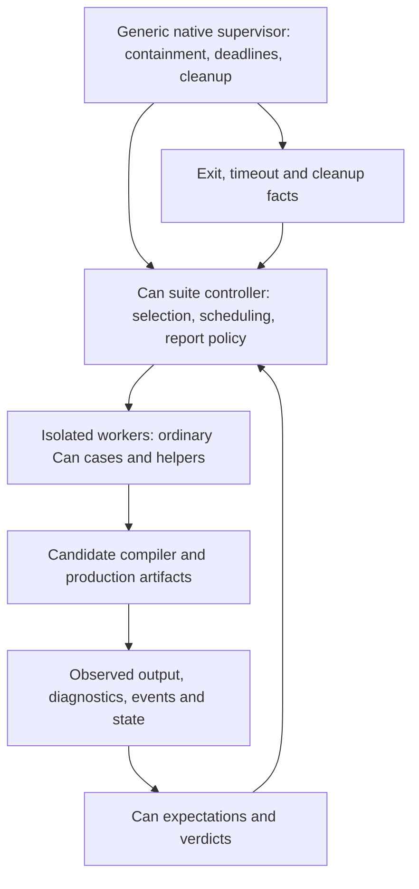

# Execution backends for native Can tests

Status: **research comparison; its initial recommendation is now adopted by the
[execution architecture decision](native-can-test-architecture-2026-09-30.md).**
The decision settles the initial backend, controller/workers and reference trust
relationship. This comparison is retained as rationale, not implementation evidence.
This refines the [suite investigation](native-can-tests-investigation-2026-09-30.md)
after two explicit user clarifications: test execution need not compile to
TypeScript, and test files must support arbitrary normal Can functions. The
requirement to eliminate host test harnesses remains in force.

The [completion contract](native-can-tests-completion-contract-2026-09-30.md)
defines acceptance independently of this backend recommendation.

The adopted starting point is **ordinary Can suite functions using the
existing backend, under generic native process supervision**. A full interpreter
over checked IR is a credible alternative, but it is a second Can execution
implementation, not a small specialized test runner. There is no measured
performance evidence favoring either path. No implementation, build or benchmark
was run for this comparison.

## Three separate decisions

| Layer | Required behavior | What can vary |
| --- | --- | --- |
| Test source | Ordinary Can functions, helpers, fixtures, comparisons and case policy | Registration ergonomics and internal discovery metadata |
| Test executor | Correct Can semantics, bounded execution and observable failures | Current TypeScript/Bun lowering, a complete interpreter, or another complete backend |
| System under test | Exercise the production behavior the case claims to validate | Compiler-negative cases stop at rejection; codegen/runtime cases compile and run production artifacts, including browser artifacts where applicable |

“Native Can testing” therefore describes ownership of test logic. It does not
require native machine-code generation. Generated TypeScript would not be an
authored TypeScript harness; equally, the user has not required it to remain the
test executor.

A focused test DSL or partial evaluator is excluded as the endpoint. Internal
plans can identify cases and invoke their functions, but cannot prohibit ordinary
Can helpers or silently move unsupported behavior into host-authored tests.
Normal target and effect rules still apply: arbitrary functions do not make
browser-only APIs available in a server program or allow live effects inside
offline assertions.

## What the current compiler makes possible

The checker already produces a [checked Program](../../compiler/internal/check/program.go#L36)
containing functions, entry regions, assertions, native declarations and platform
specializations. The [typed IR](../../compiler/internal/ir/regions.go#L18) models
invocations, completion paths and matches; related IR carries closures, captures,
coordination and fixture behavior. Both actual and expected assertion expressions
are [executable regions](../../compiler/internal/ir/assertions.go#L13).

That is a useful starting point for an interpreter: parsing and checking need not
be rebuilt. It is not yet an executable VM or a complete standalone runtime
interface. Platform specialization information also lives in the checked program.
The source scan found no runnable general Can interpreter in the inspected
compiler implementation.

The existing emitter already uses the same checked program for
[production and assertion entries](../../compiler/internal/emit/program.go#L10).
The Go driver already provides [bounded isolated Bun workers](../../compiler/internal/driver/supervise.go#L103).
Those are concrete reusable components. The assertion-specific
[entry protocol](../../compiler/internal/emit/program_entry.go#L12) would still
need a distinct live-suite protocol; the existing supervisor is not already the
requested integration runner.

## Backend alternatives

| Direction | Main benefit | Principal cost or limitation |
| --- | --- | --- |
| Existing backend with generic native supervision | Full ordinary Can execution uses the current compiler/runtime; external process lifetime remains enforceable | Keeps Bun and suite compilation; requires suite protocol, ownership APIs and observation bindings; runner and subject share an execution implementation |
| Full Go interpreter over checked IR | Suite bodies need no TypeScript emission; could later provide a second execution implementation for differential checks | Must implement all reachable language and platform semantics; still needs isolation and missing platform APIs; no established speed or footprint advantage |
| New native codegen backend | Native suite executable and a potentially reusable production language target | Adds compiler lowering plus runtime/platform work; no evidence yet justifies this wider project solely to migrate tests |

A full interpreter need not mimic every internal JavaScript representation. It
must preserve observable Can contracts. The implementation burden includes:

- Numeric behavior, short-circuiting and single evaluation. Current comparison
  lowering distinguishes [float identity, deep equality and strict identity](../../compiler/internal/emit/expressions.go#L167).
- Captured functions, nominal values, opaque/callable identity and assertion
  equality. Assertion matching has [additional identity rules](../../runtime/assert/runner.ts#L33);
  ordinary Go structural equality is not a substitute.
- Domain and standard failures with preserved occurrence identity, completion
  forwarding, fixture selection/consumption and raw exchanges.
- Observable coordination outcomes, failure propagation and resource ownership.
  Current [coordination](../../runtime/coordination.ts#L73) integrates native
  promises with owners and assertion contexts. Launching goroutines alone does
  not specify an equivalent contract.
- Every supported native/platform operation reachable from a normal test helper,
  either through legitimate bindings or another fully specified implementation.

A restricted interpreter may be a development milestone, but cannot be called
the completed test backend. Nor can unsupported functions quietly revert to
host test procedures. These obligations explain the engineering recommendation;
they are not a benchmark or an estimate of implementation duration.

## Proposed execution and ownership boundary

Can chooses which case to run, its inputs, expected observations, retries if any,
ordering, required capabilities and coverage policy. Native code may enforce
generic worker limits, perform OS operations, carry reports and reclaim owned
resources. It must not hard-code cases, test sequences, service-specific
readiness decisions, expected values or pass/fail comparisons from the old suite.

If the controller itself dies, the outer supervisor must return an execution
failure with incomplete evidence; absence of a Can verdict cannot become success.
Enforcing this generic execution contract is distinct from deciding whether a
compiler diagnostic or browser observation satisfies a test. Review this boundary
explicitly so a “supervisor” does not become a renamed host test harness.

Live cases remain ordinary effectful Can code. Attached assertions stay offline:
the current [process boundary](../../runtime/platform/process/spawn.ts#L283)
deliberately rejects live subprocess calls in assertion contexts. Use assertions
to check pure suite logic, and isolated executable cases for live observations.

The same suite source and behavior could eventually use a complete interpreter.
Specify a small execution/report contract now; avoid building a pluggable backend
framework before there is a second executor. The platform gaps identified in the
main investigation—owned workspaces, managed children, browser automation and
independent native/SQL observations—exist under every backend option.

The later architecture decision makes this topology concrete and records current
supervisor gaps, a nonpublishing suite path and controlled reference refresh.
Those contracts supersede the provisional wording in this comparison.

## Trust and qualification

Keep the trusted controller's compiler/runtime or interpreter identity separate
from the candidate compiler and its outputs. A known-good controller reduces the
risk that the candidate miscompiles its own checks. It does not eliminate common
bugs in shared language semantics, fixtures or expected vectors. An IR interpreter
would additionally share the parser/checker/IR with production compilation.

Passing an interpreted suite cannot, by itself, qualify production TypeScript/Bun
emission. Cases that protect emitted behavior must still build and execute the
production artifacts. Browser-target behavior must still run in the relevant
browser. Preserve raw independent observations and seeded failures for the
oracle itself.

The live-suite contract must distinguish complete, partial, skipped and blocked
runs. Zero selected cases cannot count as a complete pass. Do not copy the build
summary's [vacuous empty-root success](../../compiler/internal/driver/commands.go#L177)
into integration-suite reporting.

## What would justify choosing the interpreter instead?

A separately desired full Can interpreter, interactive execution or differential
semantics oracle could justify the investment beyond this test migration. Another
reason would be a demonstrated unacceptable cost in compiling/executing the suite
that bounded improvements to the existing path cannot solve. Neither has been
established here. The presence of emitted TypeScript alone does not establish
where startup, CPU or disk costs originate.

For the current goal, first design the unrestricted Can suite contract and a
bounded vertical slice using the existing runtime and external supervision. The
slice should cover a normal helper with nontrivial error/coordination behavior,
candidate compilation, an expected compiler rejection, an isolated timeout and
owned cleanup. It must expose real production output to Can-owned expectations.
Implementation and performance measurements remain deferred.

## Review evidence

A focused independent source review reached the same starting recommendation.
Three new Jev requests compared these backend alternatives under the clarified
full-Can requirement. All selected supervised reuse of the current backend, with
probabilities 1.00, 1.00 and .93. The classifier cannot inspect the repository or
research independently; it received the facts and alternatives above. Agreement
is advice, not proof, and does not resolve the platform API gaps.

The [consultation record](preparation/native-can-tests-investigation-2026-09-30/backend-followup/findings.md)
links every saved request, response and pre-send wording audit. These are new
consultations; the earlier authoring-surface votes did not compare execution
backends and are not used as evidence for this backend choice.
