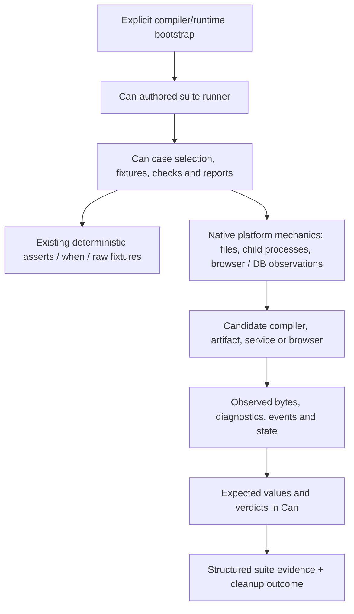

# Replacing /tests with native Can testing

Status: **investigation and brainstorming, not an implementation plan or a
completed migration.** The user clarified that the endpoint must eliminate the
host test harnesses too. Launching existing Go tests or Playwright scripts from
Can does not satisfy that requirement.

The [completion contract](native-can-tests-completion-contract-2026-09-30.md)
now records the required endpoint, scope, classification rules and final evidence.
It does not declare any migration work complete. The subsequent
[architecture decision](native-can-test-architecture-2026-09-30.md) selects the
initial TypeScript/Bun execution path with generic native supervision and a
reference-built Can suite separate from the candidate.

The [coverage migration ledger](native-can-tests-migration-ledger-2026-09-30.md)
maps individual tests, delegated oracles, fixtures and external callers to
proposed replacements and deletion evidence. It is the input to subsequent
capability design and implementation planning.

The [test authoring design](native-can-test-authoring-2026-09-30.md) follows that
ledger with five Can examples, registration, helpers, mandatory supplied
assertions, live fixtures, selection and report contracts. It identifies missing
APIs; its originally open backend question is now settled for the initial
implementation by the architecture decision.

The subsequent clarification requires **arbitrary normal Can functions** in test
files and permits an execution backend other than TypeScript. The
[backend follow-up](native-can-test-backends-2026-09-30.md) compares a complete IR
interpreter, another codegen backend and reuse of the current backend under
generic native supervision. A restricted testing DSL is not the endpoint.

The promising direction is a suite runner written in ordinary Can, using native
assertions to test its own deterministic logic and real execution to test the
compiler, CLI, services and browsers. Current Can already supplies much of the
one-shot process/file/JSON machinery. Complete migration still needs resource
lifetime, process-control, browser and independent native-observation design.
Replacing all tests with ordinary attached `asserts` cannot retain the present
coverage because those assertions deliberately reject live platform effects.

Workspace: `/Users/vince/Projects/can-lang`. Inventory captured from HEAD
`5804b6865897d34952c93429ac0feb10d63105b9`, reading working-tree source. Concurrent
grouped-error/label work was visible; its files were not edited by this research.
The [source inventory](preparation/native-can-tests-investigation-2026-09-30/source-inventory.json)
records hashes and counting method. The grouped syntax draft is not assumed
validated or required for the proposed runner.

Three parallel investigations covered suite inventory, current Can capabilities
and host integration boundaries. Their findings were reconciled against source.
The [Jev evidence](preparation/native-can-tests-investigation-2026-09-30/jev/findings.md)
contains three fully reworded consultations. No tests, compiler builds, browser
runs, benchmarks or implementation experiments were executed during this round.

## 1. What the requested endpoint means

For this proposal, Can owns case registration/selection, scenario order, fixture
setup choices, expectations, comparisons, verdicts, reporting policy and suite
scheduling. Ordinary compiler and native platform implementations remain the
language substrate. A primitive may launch a child, expose observed bytes or
operate a browser; it must not contain a former test's sequence and expected
answer under a new function name.

This is an explicit interpretation of harness elimination, not a claim that Bun,
the Go compiler, browser engines or database servers must be rewritten in Can.
If the desired endpoint also forbids any new native primitive implementation,
the current Can surface cannot express all existing tests. That stricter target
would require dropping coverage or substantially expanding self-hosted platform
support; it must not be silently treated as achieved.

Static JSON, SQL, binary inputs, malformed source fixtures and historical reports
are data/evidence, not host test harnesses. They need a disposition, not mechanical
translation into Can statements. No backwards-compatibility obligation requires
preserving old generated layouts, snapshots or historical checks as current gates.
Preserve the meaningful behavior each test protects instead.

The initial scope is repository `/tests`, not every `_test.go` or `.test.ts` in
the whole repository. External suites are relevant where `/tests` delegates to
them or they import `/tests` support. Those dependencies must be resolved during
migration; changing a command's caller does not migrate the delegated test logic.
The effective scope includes the external orchestration and oracle code that
supplies `/tests` coverage. It is defined by those obligations, not just paths.

## 2. Inventory: 224 files, not 224 tests

Method: `git ls-files -z tests`, then working-tree byte/hash and physical-line
counts. Ignored browser dependencies and incidental `.DS_Store` files are not
part of the authored inventory. Textual test declarations are counted; dynamic
subtests and browser check loops are not expanded into an invented case total.

| Family | Tracked files | What is actually there |
| --- | ---: | --- |
| `integration` | 119 | 67 Go files, 115 normal Go tests and one `TestMain`; 19 browser `.mjs` files, 12 TS files, four Can fixtures, SQL and other assets |
| `failure-conventions` | 38 | 11 normal Go tests and one `TestMain`; 20 Can files across positive/comparison/negative projects |
| `host-discrimination` | 29 | Three Go tests, seven Bun test files, six TS implementations, manifests and evidence |
| `authoring-policies` | 22 | Six Can sources in baseline/reference pairs plus manifests/registries/evidence; no runner in this family |
| `baseline` | 11 | 12 Go tests, one shell runner, historical registry/report/candidate data |
| `support` | 2 | Temporary-cache implementation and five Go tests |
| `conformance` | 2 | Native Bun qualification implementation and Bun tests |
| `browser-controls` | 1 | Evidence document |

Totals: **76 Go files, 30 Can files, 27 TypeScript files, 19 `.mjs` files,
47 JSON, 15 Markdown, six SQL, and one each shell/HTML/binary/lock file**.
There are **146 normal Go test functions, two `TestMain` functions, 40 textual
`t.Run` call sites and 58 `test(` calls across eight Bun test files**. These are
source counts, not a runtime coverage or pass count. Physical lines are 26,987 Go,
2,445 Can, 4,606 TypeScript and 4,508 `.mjs`.

Much of the real Can corpus is outside `/tests`. The maintained-project sweep
discovers `std`/examples and invokes their assertions, then adds checks for
evidence, repeatable build IDs and unwanted output
([stdlib_test.go](../../tests/integration/stdlib_test.go#L199)). Removing that
Go function without migrating its extra checks would reduce coverage even if
all attached assertions kept passing.

Similarly, the authoring-policy files describe comparisons whose agent trials
remain unrun ([README](../../tests/authoring-policies/README.md#L11)). They must
not become fictitious passing native test cases merely to preserve a file count.
The host-discrimination [README](../../tests/host-discrimination/README.md#L3)
also calls its implementations isolated, unadmitted prototypes. Separate the
current contracts worth migrating from the historical comparison experiments;
archive experiments explicitly instead of maintaining a second test framework
for an obsolete prototype.

## 3. What Can already supports

| Duty | Existing mechanism | Important boundary |
| --- | --- | --- |
| Deterministic source behavior | Attached `asserts`, lexical `when`, FIFO rows, scenarios and templates | Real application logic executes; supplied calls do not prove live platform behavior |
| Provider/wrapper behavior | Raw exchanges and origin-specific failure injection | Exercises request/adapter behavior without claiming live-service quality |
| Failure checks in normal code | `checks::require` | Can own pass/fail decisions outside assertion mode too |
| One-shot tools and CLI tests | `process::run`, `process::result`, `process::require_success` | Keep the raw result for expected failures; do not automatically require zero exit |
| Staging/source inspection | `files::*`, path APIs, codecs, bytes and JSON | No existing owned temporary-workspace primitive was found |
| Normal HTTP checks | Named `fetch http::response<bytes::buffer>` | Gets final status, normalized headers and delivered body, not physical wire behavior |
| Database/storage/client calls | Existing SQL, S3 and WebSocket surfaces | A production adapter used on both sides is not automatically an independent oracle |
| Assertion supervision | `canlc assert`, selectors, deadlines and `--assert-jobs` | Works over a loaded project graph, not a repository integration-case registry |
| Browser application behavior | Browser-target Can and `browser::*` | In-page APIs are not external browser automation |

Concrete examples: [native slice](../../compiler/testdata/current/assertions/native-slice.can#L4),
[fixture templates](../../compiler/testdata/current/templates/main.can#L27),
[raw/wrapper fixtures](../../compiler/testdata/current/wrap/main.can#L10),
[checks](../../compiler/testdata/current/checks/main.can#L4),
and [process example](../../examples/process/src/main.can#L21).

`process::run` already exposes separate stdout/stderr, exit code and signal, plus
cwd/environment/stdin, output caps, deadline and termination grace. It uses native
`Bun.spawn`, owns the child process group and reaps it
([spawn implementation](../../runtime/platform/process/spawn.ts#L143)). This is
enough machinery to investigate Can-authored compiler/CLI tests without inventing
a foreign-function escape hatch.

The same operation refuses live execution under an assertion context
([boundary check](../../runtime/platform/process/spawn.ts#L283)). A useful
existing example explicitly uses a supplied subprocess during `assert`, then
executes `/bin/echo` during `run`
([process_test.go](../../tests/integration/process_test.go#L16)). That separation
is a strong starting point for the new runner.

`canlc run` first verifies assertions and builds/publishes the program, releases
the writer lock, then runs main
([run.go](../../compiler/internal/driver/run.go#L9)). A suite can therefore test
its pure planning/result-decoding logic with ordinary assertions before running
live cases. Candidate fixtures must be separate projects; invoking the runner
project recursively would be a design error.

Two documentation discrepancies matter to this investigation:

- The older [platform specification](platform-testing-spec.md#L24) excludes
  command execution, but current `process::*` implementation and the
  [B1-04 contract](../implementation/evidence/2026-09-23/b1-04/contract.md) support
  it. The old absence claim cannot justify a new process API from scratch.
- [assertions.md](../implementation/assertions.md#L22) says roots are sequential;
  current [CLI](../../compiler/main.go#L37) and
  [supervisor](../../compiler/internal/driver/supervise.go#L34) support jobs up to
  64, default at most four. Stable identities/report order do not imply serial
  execution. The replacement should keep explicit resource limits.

These discrepancies were recorded, not edited as part of this investigation.

## 4. The gaps that a faithful migration must solve

### 4.1 A real suite protocol and failure model

The native assertion runner already supplies isolated workers, timeout/reaping,
full/partial reports and root selection
([assert.go](../../compiler/internal/driver/assert.go#L34)). It does not provide
the full repository's case registry, multi-project run policy, required-service
selection, live result aggregation or distribution-build sharing.

A Can suite needs stable case IDs, selection/listing, pass/fail/skip/blocked
distinctions, expected versus observed results, and full/partial coverage scope.
A required missing service or zero selected cases must not masquerade as a full
green run. Keep `real-can`, supplied/raw fixture, target-conformance and live
evidence separate. Redaction and bounded logs need to survive the rewrite.

Run potentially hanging/failing live cases in separate child processes under
the Can coordinator. Do not invoke every case in the coordinator's own event
loop and assume its timer can preempt arbitrary code. The parent owns the case
workspace and observes exit/timeout before final cleanup and reporting; the
outer launcher still needs a bounded termination policy for the coordinator.

Use static registration in Can or explicit manifest-backed case projects first.
Do not assume arbitrary function lookup by a discovered name is already a Can
feature. A later `canlc test` launcher can improve usability while invoking the
Can-authored scheduler; moving scheduling back into a new Go harness would miss
the user's endpoint.

### 4.2 Cleanup and owned test workspaces

Current suite infrastructure provides per-run caches, build reuse with hash
verification, concurrency limits, cleanup on test failure and abandoned-run
recovery ([harness](../../tests/integration/harness_test.go#L1),
[temporary-cache implementation](../../tests/support/tempcache/cache.go#L44)).
Its tests protect foreign/concurrent paths, symlinks, uncertain liveness,
bounded recovery and contamination. These obligations are part of the migration.

Can has no general `finally`; process termination cannot promise that Can cleanup
ran ([shutdown contract](../implementation/shutdown.md#L4)). Appending
`files::remove` after a test body therefore does not replace `t.TempDir` and
cleanup hooks. Investigate an owned temporary-workspace resource backed by native
filesystem operations, whose parent supervisor can reclaim it after child exit.
Recovery still needs ownership, inactivity and path-identity checks. Resource
mechanics may live in the runtime; suite retention/reuse policy and its tests
belong in Can. Do not claim that an in-process timeout can interrupt a stuck
event loop or that SIGKILL guarantees graceful teardown.

### 4.3 Managed services and exact process behavior

One-shot `process::run` waits for exit. Existing tests additionally start a
server, pass credentials on fd 3, probe readiness, send graceful or crash signals,
wait with bounds, restart and inspect persistent state
([service lifecycle](../../tests/integration/gate3_matrix_test.go#L330)).

Investigate an owned child resource with explicit start, bounded observation,
signal and wait operations, controlled descriptor/stdin setup and teardown.
An environment-variable substitute would not preserve tests of fd-based
credential delivery. Readiness should be an observable bounded condition, not
an invented sleep. Native process groups remain the implementation mechanism;
service-specific choreography belongs to the Can case.

### 4.4 Negative source and compiler diagnostics

Malformed source cannot be an executable module inside the suite's own source
root. Keep it as data in separate fixture projects, mutate/stage those projects,
invoke the candidate compiler and inspect its rejection. Existing owner/negative
tests are already shaped this way
([owner tests](../../tests/failure-conventions/owner_test.go#L87)).

Exit/stderr matching can migrate with current APIs. A public structured semantic
check command would improve code/span/severity assertions and avoid depending
on incidental diagnostic wording. `canlc check --json` is a **proposal**, not an
existing command. Current `parse` is grammar-only; `inspect-types` is
declaration-level. The compiler already has a reusable
[CheckSnapshot API](../../compiler/internal/driver/diagnostics.go#L73).
The CLI should return observations; expected diagnostics stay in Can.

### 4.5 Browser automation and raw network faults

The browser scripts contain real test logic: routing, event observation, fill
and click sequences, DOM/CSP/script checks, console errors and screenshots
([assets](../../tests/integration/browser/assets.mjs#L24),
[controls](../../tests/integration/browser/controls.mjs#L48)). Calling those files
from a Can suite is not a native migration.

Two mechanisms deserve comparison: typed maintained automation operations backed
by upstream Playwright, or a browser-driver protocol client implemented in Can.
Neither mechanism is proven complete by this research. All scenarios, expected
values and verdicts must reside in Can. A native primitive should return DOM,
network or event facts, not `invoice_test_passed`.

The hard probe must include synthetic versus physical input, selection/focus,
request interception, asynchronous observation, page-side operations and
adversarial values. Existing `page.evaluate` callbacks are a genuine gap; hiding
their source inside `bun -e`, JavaScript strings or renamed helper scripts merely
relocates host-authored test logic. Consider typed observations/actions and,
where needed, Can-authored browser-side probe code with a separately reviewed
native mechanism for values safe Can intentionally cannot construct.

Normal fetch envelopes already handle status/normalized headers/body
([fetch contract](ai-io-spec.md#L324)). Remaining network requirements include
malformed request targets, physical header bytes, slow/trickled writes and
disconnect timing ([raw probes](../../tests/integration/gate3_matrix_test.go#L432),
[fault injection](../../tests/integration/gate4_fault_test.go#L205)). Model those
as explicit native socket/fault mechanics, preserving Can-owned schedules and
checks; ordinary normalized fetch is not evidence for raw-wire behavior.

### 4.6 Independent database and native-runtime observations

SQL integration uses raw native drivers for DDL, fault setup and independent
row/RETURNING observations
([F03 driver](../../tests/integration/testdata/sql/f03-live-driver.ts#L271),
[invoice driver](../../tests/integration/testdata/invoice/driver.ts#L41)). Porting
both sides through the same Can SQL adapter can conceal a shared defect.
Can can own the oracle while observing an independent database CLI/protocol or
a narrow native row-query primitive. Test expectations and scenario-specific
setup must move out of the TS driver.

Native qualification is even harder: it checks exact Bun identity/APIs,
async-local isolation, raw JSON tokens, strict equality, Unicode behavior and
thenable boxing, and deliberately removes APIs
([native probes](../../tests/conformance/native.ts#L16),
[missing-API tests](../../tests/conformance/native.test.ts#L12)). Some of these
values and operations are intentionally unavailable in ordinary Can. Running a
Can sort operation proves its exposed contract, not independently that the
intended native operation was used.

The design needs a transparent native observation/fault surface or an independent
tool interface. Keep probe input/sequence and expected outcomes in Can; native
implementations may construct a proxy or inspect a descriptor but must not
contain a hard-coded test verdict. If no satisfactory boundary exists for a
case, record it as unresolved rather than deleting it or falsely claiming a
pure-Can replacement. This is one of the highest-risk design questions.

### 4.7 Distribution, provenance and dependencies outside /tests

Release tests call product `distribution.Build/Release/Install`, construct bad
archives and compare installed artifacts
([release_test.go](../../tests/integration/release_test.go#L22)). Can should call
product CLI operations and own those expectations. Identify any missing CLI or
archive-manipulation primitive; generating the old Go test as a subprocess is
not a solution. Build-once reuse must make an exception when the build itself
is the subject, such as determinism or corruption checks.

The dependency closure crosses the directory boundary:

- [distribution/qualify.py](../../distribution/qualify.py#L128) copies and runs
  both native conformance files, chooses isolation and evaluates status/report
  results. Migrate that qualification scenario and verdict policy into Can too;
  changing only the invoked filenames would leave a host harness. Retain only
  unavoidable generic bootstrap/isolation mechanics outside the Can suite.
- [host/conformance/admission_test.go](../../host/conformance/admission_test.go#L19)
  imports `/tests/support/tempcache`; host live tests share browser dependencies
  and the [Firefox helper](../../host/conformance/live/storage-clipboard.mjs#L17).
- CI [verifier](../../.github/workflows/verifier.yml#L46),
  [release qualification](../../.github/workflows/release-qualify.yml#L53) and
  [TypeScript qualification](../../.github/workflows/tsc.yml#L49) call these suites.
- Several `/tests` functions invoke `runtime/test/*.test.ts`, e.g.
  [process qualification](../../tests/integration/process_test.go#L60).
  A Can wrapper around that Bun test command still delegates its oracle to a
  host suite. Every obligation that currently supplies `/tests` coverage must
  acquire a Can-owned oracle. Independent low-level runtime unit suites may
  remain outside this scope, but their retained Go/TS assertions cannot count as
  the migrated integration oracle. Never use an outside-directory harness to
  satisfy the replacement's acceptance gate.

Do not delete shared helpers before these callers have a legitimate new home.
Updating external integration points is necessary; it does not automatically
authorize rewriting all compiler/runtime/host unit tests across the repository.

## 5. Test authoring options

These choices concern how tests are authored and discovered, not which backend
executes their Can functions. The later
[backend comparison](native-can-test-backends-2026-09-30.md) recommends starting
with existing full-language execution and generic native supervision, while
keeping all test policy in Can. A non-TypeScript executor remains possible if it
implements the complete required Can semantics.

| Direction | Advantages | Costs / questions |
| --- | --- | --- |
| **A. Ordinary Can suite executable** | Uses existing language, process/files/codecs/checks; keeps deterministic assertions intact; Can owns scheduling and checks | Needs suite protocol and resource/observation primitives; packaging/bootstrap and discovery must be designed |
| **B. Explicit live assertion mode** | Reuses named roots, selection and reports; potentially one familiar test surface | Changes a strong current contract; must exclude live roots from default builds, specify fixture/live mixing and keep orchestration in Can |
| **C. Dedicated test declarations** | Can express case discovery and lifecycle directly, separate from application assertions | New syntax/checker/emitter surface before its necessary shape is demonstrated; same platform gaps still exist |

**Recommendation for the next design round: prototype A's architecture on paper
and then through a bounded vertical slice.** Introduce a native suite command as
a launcher when useful, rather than making new syntax a prerequisite. Do not add
`asserts live` merely to remove the current refusal; that would change the trust
and build model while leaving browser/process lifecycle work unsolved.

The native execution boundary should look like this:

Example conversion boundaries, without inventing new source syntax:

- A compiler-negative case stages a bad source file as data, runs the candidate,
  decodes its diagnostics, and calls a Can check against an expected code/span.
- A browser case opens a page, fills/clicks through typed operations, reads DOM
  and request facts, and compares those facts in Can. The browser backend owns
  only the actual upstream automation calls.
- A retry test first verifies the correct program, then changes its fixture or
  implementation deliberately and requires the same test to fail. Merely keeping
  the positive assertion would lose current mutation sensitivity.
- A native boxing test describes inputs and observed native behavior through a
  restricted probe interface and compares the trace in Can. Designing that
  interface is required work, not an already-available feature.

## 6. Bootstrap and oracle independence

A candidate compiler may miscompile the tests that would expose its defect.
Use an explicitly identified, digest-pinned known-good Can runner artifact to
exercise the candidate compiler and its outputs. Keep runner and subject paths
separate in every report. The runner can remain Can source; the distinction is
which compiler produced the executable being trusted for orchestration/checks.

Pinning a bootstrap artifact is not a promise to preserve old source syntax or
generated ABI. Refresh it deliberately when runner source changes, and separately
qualify the candidate's ability to rebuild the runner. Avoid duplicate full
suite runs on every invocation; reserve dual-run comparison for targeted
qualification. The later architecture decision specifies reference selection and
refresh, including blocked coverage when no adequate bootstrap bridge exists.
Prefer an already qualified installed toolchain and one compact runner artifact;
do not retain a full development bundle or source checkout for every runner
revision. Candidate execution workspaces remain temporary and owned per run.

Keep fixed expected vectors, raw observation channels and failure-seeded controls.
Useful controls include a known rejecting source, a known failed assertion, wrong
exit code, malformed/missing report, timeout, unused fixture and cleanup failure.
The runner must demonstrate that these cases cannot produce a full green result.
There is no way to make the complete compiler/runtime/runner stack prove its own
correctness without trusted assumptions; document that boundary instead of
claiming self-hosting eliminates it.

## 7. What to investigate next, in order

1. **Freeze the endpoint and observation boundary.** Inventory every first-party
   executable script, including embedded JS and delegated tests. Decide which
   native primitives are mechanics and which would conceal test logic. Preserve
   data fixtures and explicitly archive obsolete historical gates. Require normal
   Can helpers throughout; keep the choice of executor separate from authoring.
2. **Prove a small complete suite design.** Include one existing deterministic
   assertion project, one expected compile failure, one real subprocess result,
   and an intentionally failing/timed-out child. Require Can-owned registration,
   independent expected results, full/partial report handling, build reuse and
   cleanup. This is a proposed experiment, not an experiment run here.
3. **Settle temporary-workspace and managed-child lifetime.** Include interruption,
   forced termination, stale recovery, contaminated cache and concurrent foreign
   paths. Do this before bulk conversion, not after many tests depend on an
   unsafe cleanup convention.
4. **Design structured compiler/tool observations.** Prefer product CLI surfaces
   returning diagnostic/build/install data to test-only calls that return pass.
   Keep malformed fixtures outside the runner source root.
5. **Run narrow browser/native-probe feasibility work.** Cover the difficult
   callback/interception/adversarial and direct-Bun cases first, not only click
   smoke tests. Decide typed Playwright primitives versus Can protocol control
   from concrete parity evidence. No performance campaign is required.
6. **Create an obligation-by-obligation migration ledger.** Map each old oracle
   to a Can case, evidence level, primitive dependencies, expected-failure
   control, and retirement condition. A file or root-count match is insufficient.
7. **Migrate by independent capability family.** One-shot compiler/CLI/format and
   source contracts first; then service/database/network lifetimes, browser
   matrices and native/distribution qualification as their dependencies become
   available. Remove each old harness once its obligations have equivalent
   evidence; temporary comparison is a migration technique, not permanent
   backwards compatibility.
8. **Finish caller migration and deletion verification.** Rewire CI/distribution/
   host dependencies, prove no Can suite shells out to former test scripts, and
   verify complete versus skipped coverage and cleanup under failure. Then the
   host harnesses can actually be retired.

Likely independent implementation areas later are the Can suite/report model,
compiler diagnostic CLI, owned resources/child control, browser automation,
and native-observation bindings. Their shared contracts need agreement before
assigning parallel writers. This document deliberately does not manufacture a
full task DAG before the uncertain platform boundaries are settled.

## 8. Jev advice and remaining uncertainty

All three fresh consultations favored the ordinary Can suite executable with
probabilities .94/.93/.84. All favored a known-good runner with .97/.80/.98.
Typed browser-driver primitives were preferred with .55/.62/.65, but confidence
was only .32/.43/.47. There was no selected-option disagreement; the browser
uncertainty prompted the additional source inspection described in the
[consultation record](preparation/native-can-tests-investigation-2026-09-30/jev/findings.md).

These are classifier recommendations from supplied evidence, not proof of
feasibility. The code supports the ordinary-suite direction; it does not yet
prove complete browser/native-probe coverage or a sound new lifetime API.

The strongest open questions are: the exact Can/native observation boundary;
owned temporary directories and child descriptors/signals; remote browser
callbacks and hostile values; independent native/SQL oracle access; and bootstrap
artifact refresh. None is resolved by renaming directories or wrapping current
Go/TS harness entrypoints.

Research deliverables are this document, the compact file/hash inventory, the
[backend follow-up](native-can-test-backends-2026-09-30.md), and three
request/response sets for each of the two design comparisons. No temporary build, dependency copy, private cache,
live service or browser session was created. No source/test implementation was
changed by this investigation.
