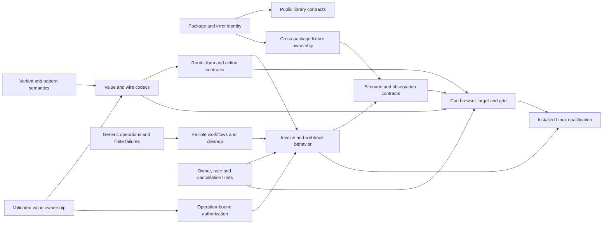

# Design dependencies and parallel preparation lanes

24 September 2026 · provisional P4.3 map. An arrow means that the question on
the right needs an explicit contract or evidence from the question on the left.
It does **not** order implementation or select a mechanism. The identity and
secondary task-token objective in the [evaluation protocol](evaluation-protocol.md)
apply to every lane.

The arrows are interface dependencies, not global stage barriers. For example,
the browser team can research DOM, storage, event and target-capability options
while server actions are unresolved, but it cannot freeze a typed action API
before route, wire, failure and authorization contracts are known. Linux packaging
research can proceed immediately; claiming qualification must wait for the
installed service and browser scenarios it promises to support.

| Lane that can proceed now | Information it must hand off | Decisions it cannot close alone |
| --- | --- | --- |
| Core pattern, variant and value design | Nominal identity, exhaustiveness, construction/decoding/`with` rules and exact counterexamples | User-visible pattern and construction spelling; codec/public-package consequences |
| Independent package and assertion design | Qualified import identity, diagnostic/error identity, intentional scenario activation and retained lexical queue ownership | Public value identity, full product-observation layer |
| Generic helper and cleanup trial | Best current two-caller helper, outward finite errors, visible operation requirements and double-failure behavior | Any generic syntax, public error-bound policy and service error handling |
| Server invoice and webhook trial | Operation-bound actor check, version/idempotency, route/form/wire/status contracts, durable fault observations | Rich client state model, Linux release claim |
| Browser grid and native capability research | Client-only dependency closure, event/state/disposal and offline promise, DOM and wire observations | Final action shapes, server authorization and error mapping |
| Native AI, bulk and authoring costs | Workflow-specific failures/agent costs, catalogue and native-lowering constraints | Broad language additions from line count or taste alone |
| Linux distribution research | Named target, native/Bun provenance, isolation/build/verify gaps, shutdown matrix | Qualified release until integrated scenarios pass on installed bits |

The [core](core-evidence.md), [packages and assertions](packages-assertions-evidence.md),
[server](server-evidence.md), [browser](browser-evidence.md),
[lifetime/deployment](lifetime-deployment-evidence.md), and
[AI/support](ai-support-evidence.md) packets establish present behavior and
gaps. Each design packet must cite its sources and mark illustrative syntax.
Jev receives the researched alternatives and counterevidence; its classifications
do not settle user syntax or replace executable trials. Final implementation
ordering will be derived only from the consolidated accepted design and its
acceptance cases.
